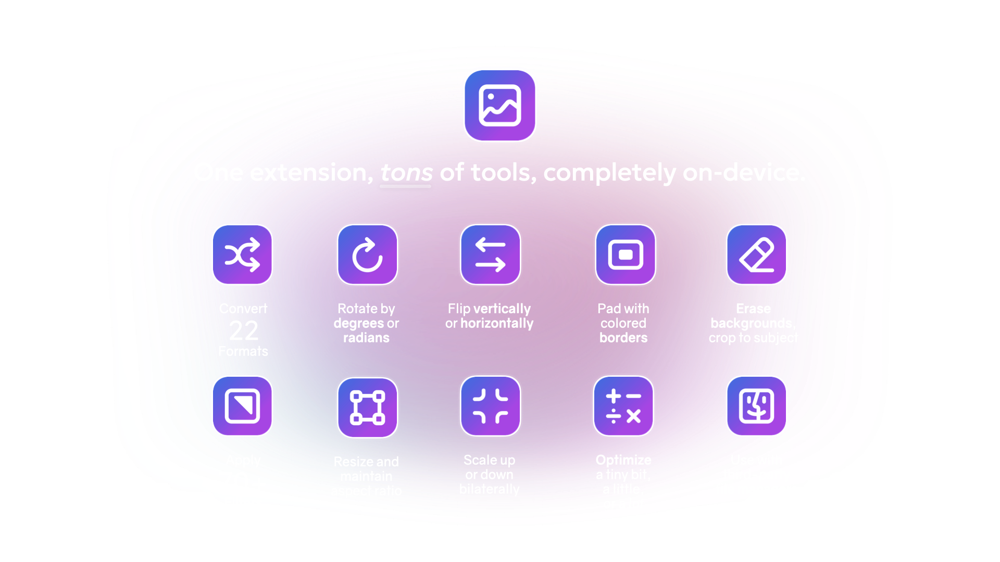

# Image Modification

Apply filters and transformations to various image formats, and convert between them. Create new images by specifying their dimensions, colors, and patterns. Operate on selected files or on images in the clipboard.

## Features

- Convert between many different image formats, including WebP, SVG, and AVIF
  - WebP conversion supported by [cwebp and dwebp](https://developers.google.com/speed/webp/docs/precompiled)
  - SVG conversion supported by [Potrace](https://potrace.sourceforge.net)
  - AVIF conversion supported by [libavif](https://github.com/AOMediaCodec/libavif)
- Rotate, flip, scale, resize, and pad images by applying SIPS commands
- Apply filters and distortions such as Bokeh Blur, Noir, X-Ray, and more
- Real time filter previews
- Remove backgrounds using native, on-device processing
- Rotate, flip, and apply filters to the pages of PDFs
- Optimize images using JPEG compression, [svgo](https://github.com/svg/svgo), and other strategies
  - PNG optimization supported by [PNGOUT](http://www.jonof.id.au/kenutils.html)
- Perform realtime image manipulation on images in the clipboard
- Strip EXIF data from images using [ExifTool](https://exiftool.org)
- Operate on selected images in Finder, Path Finder, HoudahSpot, NeoFinder, QSpace Pro, ForkLift, and more to come

## Commands

- Apply Image Filter
  - Apply various filters to the provided images using Apple's CIFilters
- Convert Images
  - Convert selected images from their current format to another.
- Create New Image
  - Create a new image by selecting the dimensions, color, and pattern.
- Flip Images Horizontally
  - Flip selected images horizontally.
- Flip Images Vertically
  - Flip selected images vertically.
- Optimize Images [Amount]
  - Decrease image file size by reducing complexity.
- Pad Images [Amount] [Color]
  - Pad images by the specified number of pixels using the provided color (defaults to white).
- Remove Background [Replacement Color] [Crop To Subject]
  - Remove the backgrounds from selected images using Apple's Vision framework.
  - Optionally replace the background with a solid color.
  - Optionally crop the image to the subject.
- Resize Images [Width] [Height]
  - Resize images proportionally by specifying either width or height.
  - Resize images precisely by specifying both parameters.
- Rotate Images [Degrees]
  - Rotate images clockwise by the specified amount.
- Scale Images [Scale Factor]
  - Scale images proportionally by the specified factor.
- Strip EXIF Data (Disabled by Default)
  - Remove EXIF data from the provided images.

Visit the [GitHub project](https://github.com/users/SKaplanOfficial/projects/10/views/1) to view upcoming additions and improvements.

Filter thumbnail image credit: <https://unsplash.com/photos/UBA_W3_LsOk>
