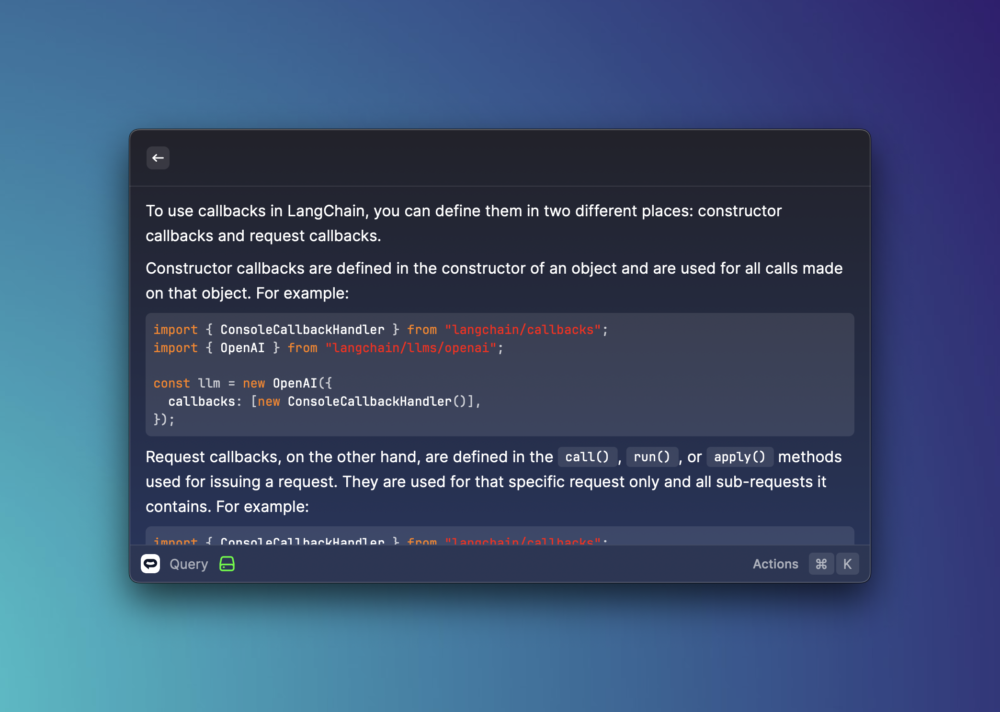

<h1 align="center">SiteSpeakAI</h1>

<h3 align="center">
Train a chatbot on any website or documentation, then get answers in your command bar.
</h3>

# Features

### Get instant answers

Train a chatbot on any website content or documentation, then query it from your command bar.

# How to use

This extension requires you to have a [SiteSpeakAI](https://sitespeak.ai) account and API token to query your trained chatbot(s). You can get your API token from your [account page](https://sitespeak.ai/user/api-tokens).

Once you have this, you'll need to add your API token, Chatbot ID and Visitor Id in the extension settings.

> All the preferences value will be stored locally using the [Raycast Preferences API](https://developers.raycast.com/api-reference/preferences)

# Preferences

All preferences properties list that can be customized through `Raycast Settings > Extensions > SiteSpeakAI`

| Properties     | Label         | Value    | Required | Default | Description                                                              |
| -------------- | ------------- | -------- | -------- | ------- | ------------------------------------------------------------------------ |
| `apiToken` | API token | `string` | `true`   | `empty` | Your SiteSpeakAI API Token                                              |
| `chatbotId`     | Chatbot ID     | `string` | `true`   | `empty` | ID for the chatbot you would like to query                                                   |
| `visitorId`    | Visitor ID    | `string` | `true`   | `empty` | A unique ID used to group conversations together in the SiteSpeakAI inbox |

# Author

Created by [Herman Schutte](https://github.com/hermanschutte)