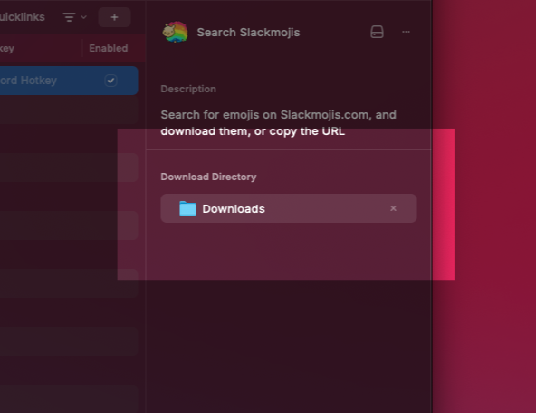

# Slackmojis Search

Search for emojis on Slackmojis.com and download them to your computer.

## Features

| Feature | Description | Hot Key |
| --- | --- | --- |
| Download | Download the emoji to a designated folder | `Enter` |
| Open in Browser | Open the emoji in the browser | `⌘ + ↩️` |
| Copy URL | Copy the URL of the emoji to the clipboard | `⌘ + .` |

## Changing the Download Folder

The default download folder is `~/Downloads`.

To change the download folder, open the extension settings and update the `Download Directory` field with the desired folder path.

