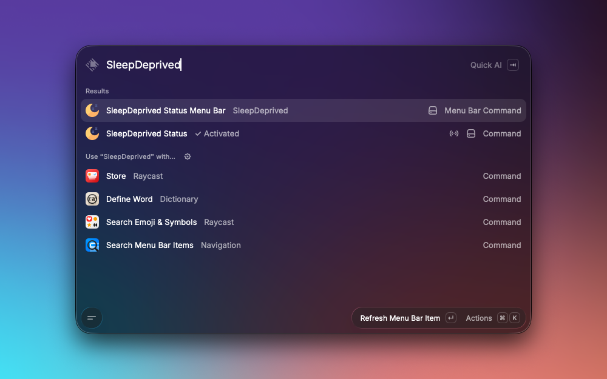

# SleepDeprived

Prevent your Mac from sleeping, even with the lid closed.

SleepDeprived is a Raycast extension for quickly preventing or restoring macOS sleep. It also lets you check the current status and control sleep prevention from the menu bar.

## Installation

1. Open Raycast.
2. Search for **Store** and open the Raycast Store.
3. Search for **SleepDeprived** and select **Install**.

## Usage

After installing, open Raycast and search for one of the commands below.

## Features

### 1. Keep your Mac awake

Run **Deprive Mac of Sleep** to keep your Mac awake, even with the lid closed.

### 2. Restore normal sleep

Run **Let Mac Sleep** to restore normal sleep behavior on your Mac.

### 3. Check the current status

Run **SleepDeprived Status** to see whether sleep prevention is active or inactive. The status is displayed directly in Raycast.

### 4. Control SleepDeprived from the menu bar

Run **SleepDeprived Status Menu Bar** to add a menu bar item with SleepDeprived controls:

- The current activation status.
- **Activate** and **Deactivate** actions.
- A **Remove Menu Bar Icon** action.

The menu bar icon changes to reflect the current status.

## Permissions

macOS may ask for an administrator password when you change the sleep setting. SleepDeprived uses the built-in `pmset` command to apply the change.
