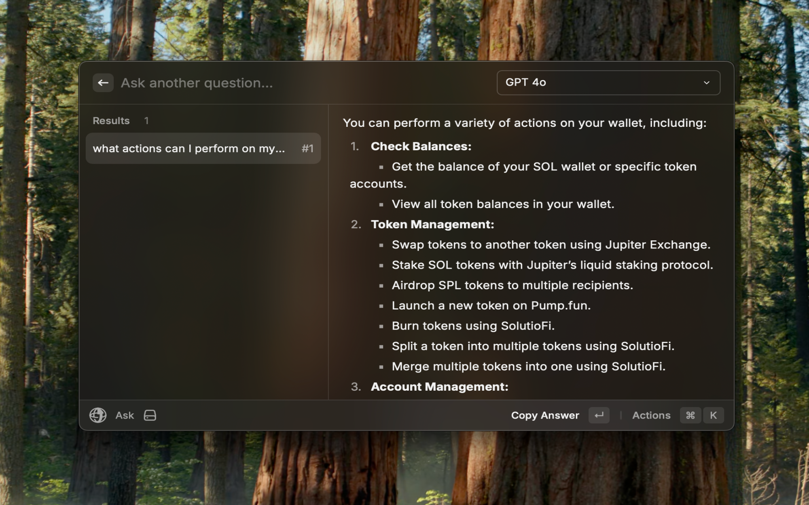
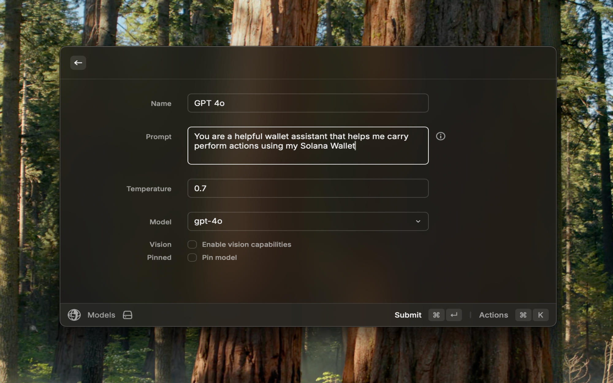
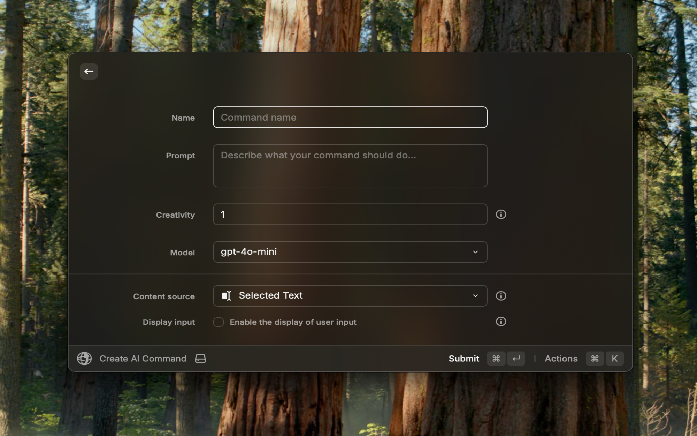
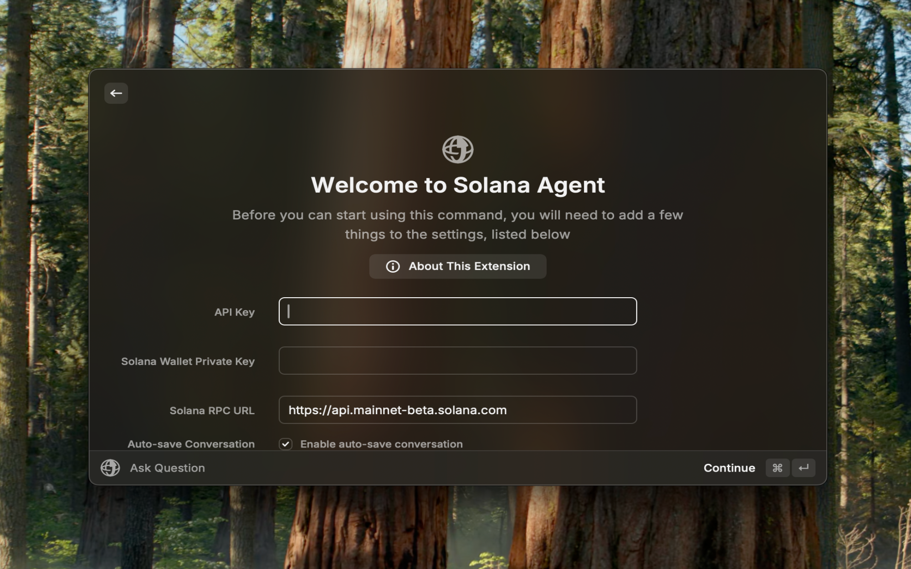

<h1 align="center">Solana Agent</h1>

<h3 align="center">
Interact with the Solana blockchain from Raycast using AI models
</h3>

# Features

### Ask anything, from your favourite thing

Interact with your Solana wallet straight from Raycast. Ask anything about your wallet, balance, carry out swaps, transfers, and more.

### Personalized for you, really

Customize the model to your liking. Create and edit custom engines beyond your creativity.

### Keep continue, with you

Continue talking about everything right where you left off. Be pro without from zero.

### Use AI commands and create your own

Process text taken from anywhere (selected text, clipboard text, opened web page) and
insert the result into the frontmost application or copy it to the clipboard.

# Models

GPT-4o model supports vision capabilities, which can be enabled in the Models Command when creating or editing a model.

### Custom Models

Modify the preferences properties to configure the API Endpoint and use custom models.

# How to use

This extension requires a valid `API key` as your API Key from [OpenAI](https://platform.openai.com/account/api-keys) with a `pay-as-you-go` plan account (**you'll get a `429` error if you're on a `free-tier` account**), a valid base 58 `Secret Key` secret key for your Solana wallet, and a valid RPC URL for the Solana mainnet network.

> All the preferences value will be stored locally using [Preferences API](https://developers.raycast.com/api-reference/preferences)

# Preferences

All preferences properties list that can be customize through `Raycast Settings > Extensions > Solana Agent`

| Properties               | Label                  | Value                               | Required | Default                     | Description                                                                                                      |
| ------------------------ | ---------------------- | ----------------------------------- | -------- | --------------------------- | ---------------------------------------------------------------------------------------------------------------- |
| `apiKey`                 | API Key                | `string`                            | `true`   | `empty`                     | Your personal OpenAI API key                                                                                     |
| `isAutoSaveConversation` | Auto-save Conversation | `boolean`                           | `true`   | `true`                      | Auto-save every conversation that you had with the model                                                         |
| `isHistoryPaused`        | Pause History          | `boolean`                           | `false`  | `false`                     | Pause the history of the conversation                                                                            |
| `isAutoLoadText`         | Auto-load              | `boolean`                           | `false`  | `false`                     | Load selected text from your frontmost application to the `question bar` or `full text input form` automatically |
| `isAutoFullInput`        | Use Full Text Input    | `boolean`                           | `false`  | `false`                     | Switch to `full text input form` from `question bar` automatically whenever you want to ask or type a question   |
| `isAutoTTS`              | Text-to-Speech         | `boolean`                           | `false`  | `false`                     | Enable auto text-to-speech everytime you get a generated answer                                                  |
| `useApiEndpoint`         | Use API Endpoint       | `boolean`                           | `false`  | `false`                     | Change the OpenAI's default API endpoint to custom endpoint                                                      |
| `apiEndpoint`            | API Endpoint           | `string`                            | `false`  | `empty`         | Custom API endpoint                                                     |
| `useProxy`               | Use Proxy              | `boolean`                           | `false`  | `false`                     | Each question request will be passed through the proxy                                                           |
| `proxyProtocol`          | Proxy Protocol         | `http`, `https`, `socks4`, `socks5` | `false`  | `http`                      | Proxy protocol option                                                                                            |
| `proxyHost`              | Proxy Host             | `string`                            | `false`  | `empty`                     | Proxy host value                                                                                                 |
| `proxyUsername`          | Proxy Username         | `string`                            | `false`  | `empty`                     | Proxy username value                                                                                             |
| `proxyPassword`          | Proxy Password         | `string`                            | `false`  | `empty`                     | Proxy password value                                                                                             |
| `useAzure`               | Use Azure OpenAI       | `boolean`                           | `true`   | `false`                     | Use Azure OPENAI rather than OPENAI                                                                              |
| `azureEndpoint`          | Azure Endpoint         | `string`                            | `false`  | `empty`                     | Azure OpenAI resource endpoint                                                                                   |
| `azureDeploymentName`    | Azure Deployment       | `string`                            | `false`  | `empty`                     | Azure OpenAI resource deployment                                                                                 |

---

Made with ♥ from the SendAI team

