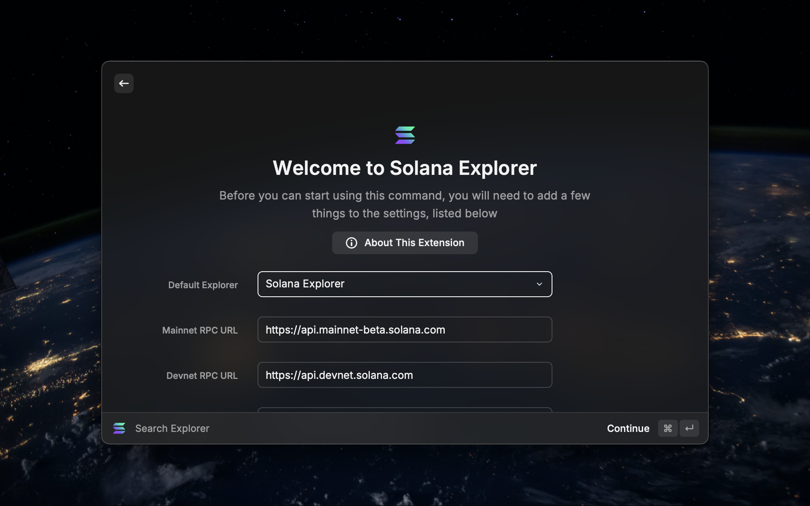

# Solana Explorer for Raycast



A powerful Raycast extension that brings Solana blockchain exploration directly to your fingertips. This extension seamlessly integrates with Raycast to provide instant access to the Solana blockchain, allowing you to search any Solana address to view balances, transactions, and account details. Look up transaction details using transaction signatures/hashes and explore block information and contained transactions. View comprehensive token data including price, supply, and metadata, as well as access token account information and associated mint addresses. Additionally, resolve Solana Name Service (SNS) domains to their corresponding addresses and explore NFT metadata and details.

The extension supports multiple popular Solana block explorers:
- Solana Explorer (explorer.solana.com)
- Solscan (solscan.io) 
- SolanaFM (solana.fm)
- Orb (orb.helius.dev)

With configurable RPC endpoints and network switching between Mainnet, Devnet and Testnet, you have full flexibility in how you interact with the Solana blockchain. The extension provides a native Raycast experience with fast, keyboard-driven navigation and detailed formatted output for all blockchain data.

## Configuration

When you first open the extension, you will be prompted to configure the following:
- Select your default explorer (Eg. Solscan, Orb etc.)
- Configure custom RPC endpoints for each network or use the default ones

You can also change these settings later by going to the extension preferences.

## Features

### 🔍 Smart Search
- **Address Lookup**: Search for any Solana wallet address
- **Transaction Search**: Find transaction details by signature
- **Block Explorer**: Look up block information by block number
- **Token Discovery**: Search for token accounts and view detailed token information
- **NFT Explorer**: View NFT metadata, properties, and details
- **Domain Resolution**: Resolve Solana Name Service (SNS) domains (e.g., `example.sol`)

### 🌐 Network Support
- **Mainnet**: Access the main Solana network
- **Devnet**: Connect to Solana's development network
- **Testnet**: Use Solana's test network
- Easily switch networks with a click

### 🔗 Multiple Explorer Support
- Solana Explorer
- Solscan
- SolanaFM
- Orb

### 📊 Comprehensive Information
- **Account Details**:
  - SOL balance
  - Lamports
  - Account size
  - Owner program
  - Rent epoch
  - Slot information

- **Transaction Details**:
  - Block time
  - Transaction fee
  - Status (Success/Failed)
  - Block hash
  - Instructions
  - Program interactions

- **Token Information**:
  - Token name and symbol
  - Decimals
  - Total supply
  - Fully diluted value
  - Token logo
  - Account details
  - Metadata

- **NFT Information**:
  - Name and symbol
  - Description
  - Image preview
  - Update authority
  - Seller fee basis points
  - Mutability status
  - Primary sale status

### 📱 User-Friendly Interface
- Clean, organized display of information
- Markdown-formatted results
- Quick access to external explorers
- Copy-to-clipboard functionality
- Search history tracking

## Installation

1. Install Raycast from the [Website](https://www.raycast.com/)
2. Open Raycast and press `⌘ + Space`
3. Type "Extensions" and select "Browse Extensions"
4. Search for "Solana Explorer"
5. Click "Install"

## Usage

1. Open Raycast (`⌘ + Space`)
2. Type "Search Explorer" or use the keyboard shortcut
3. Enter your search query:
   - Solana address (base58 encoded)
   - Transaction signature (88 characters)
   - Block number
   - Token account address
   - NFT address
   - Domain name (e.g., `example.sol`)

## Preferences

1. Open Raycast
2. Go to Extensions
3. Find "Solana Explorer"
4. Click the gear icon to open preferences
5. Configure:
   - Default Explorer: Choose your preferred Solana block explorer
   - Network: Select the Solana network (Mainnet, Devnet, or Testnet)
   - RPC URLs: Configure custom RPC endpoints for each network:
     - Mainnet RPC URL (default: https://api.mainnet-beta.solana.com)
     - Devnet RPC URL (default: https://api.devnet.solana.com)
     - Testnet RPC URL (default: https://api.testnet.solana.com)

## Development

### Prerequisites
- Node.js 16 or later
- npm or yarn
- Raycast

### Setup
1. Clone the repository
```bash
git clone https://github.com/dharminnagar/solana-explorer.git
cd solana-explorer
```

2. Install dependencies
```bash
npm install
# or
yarn install
```

3. Start development server
```bash
npm run dev
# or
yarn dev
```

### Building
```bash
npm run build
# or
yarn build
```

### Publishing
```bash
npm run publish
# or
yarn publish
```

## Contributing

Contributions are welcome! Please feel free to submit a Pull Request.

1. Fork the repository
2. Create your feature branch (`git checkout -b feature/amazing-feature`)
3. Commit your changes (`git commit -m 'Add some amazing feature'`)
4. Push to the branch (`git push origin feature/amazing-feature`)
5. Open a Pull Request

## License

This project is licensed under the MIT License

## Acknowledgments

- [Raycast](https://raycast.com/) for the amazing platform
- [Solana](https://solana.com/) for the blockchain

## Support

If you encounter any issues or have suggestions, please [open an issue](https://github.com/dharminnagar/solana-explorer-raycast/issues).