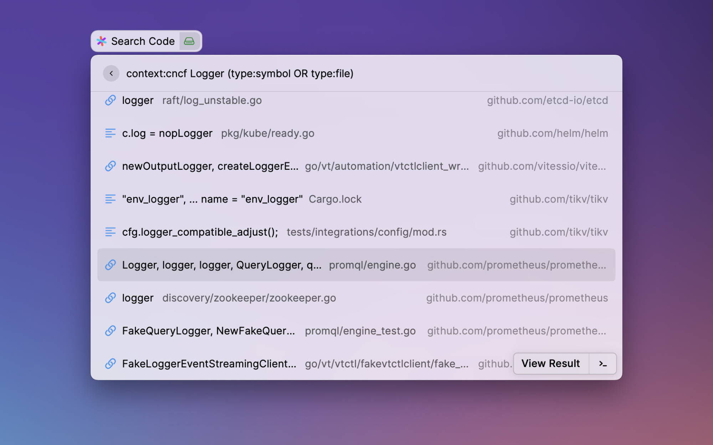
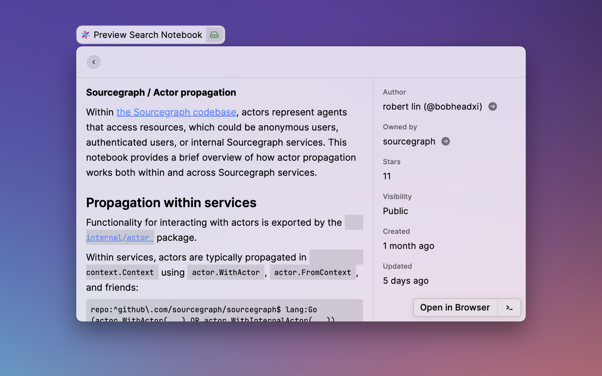
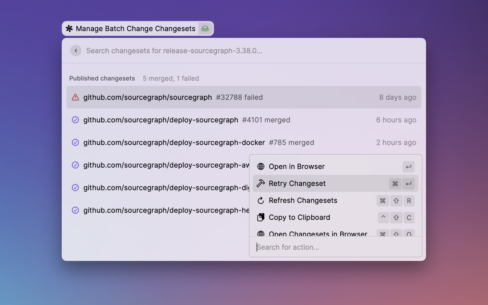

 

  

<h1 align="center">
  Sourcegraph for Raycast
</h1>

  Search code, browse notebooks, and manage batch changes on <a href="https://about.sourcegraph.com">Sourcegraph</a> with <a href="https://www.raycast.com">Raycast</a>.

  <a href="#install"><strong>Install</strong></a> · 
  <a href="#setup"><strong>Setup</strong></a> · 
  <a href="#commands"><strong>Commands</strong></a> · 
  <a href="https://github.com/bobheadxi/raycast-sourcegraph/issues"><strong>Issues</strong></a> · 
  <a href="#changelog"><strong>Changelog</strong></a> · 
  <a href="#contributing"><strong>Contributing</strong></a>

 

## Install

To get started, [install Raycast](https://www.raycast.com/) and [install the Sourcegraph extension from the Raycast extensions store](https://www.raycast.com/bobheadxi/sourcegraph).

Alternatively, you can [install this extension from source](https://github.com/bobheadxi/raycast-sourcegraph/blob/main/CONTRIBUTING.md).

 

## Setup

This extension adds a [variety of commands](#commands) for interacting with [Sourcegraph](https://about.sourcegraph.com).
Some configuration is required to use certain features, most notably the [variants of each command for custom Sourcegraph Instances](#sourcegraph-instance), though you can get started with [Sourcegraph.com commands](#sourcegraphcom) without any additional setup.

### Sourcegraph.com

No setup is required to connect to [Sourcegraph.com](https://sourcegraph.com/search) through the 'Sourcegraph.com' variants of this extensions's commands.
To configure your own [search contexts](#search-contexts), create search notebooks, and more, [sign up for a Sourcegraph.com account](https://sourcegraph.com/sign-up)!

Once you have an account, you can create an access token under the "Access tokens" tab in your user settings on [Sourcegraph.com](https://sourcegraph.com/user/settings).
Copy that access token to the "Sourcegraph.com: Access token" field in the Sourcegraph Raycast extension preferences to authenticate your search queries.

To search your private code, please reach out [get a demo of the single-tenant solution](https://about.sourcegraph.com/demo) or [try out a self-hosted installation of Sourcegraph](https://about.sourcegraph.com/get-started/self-hosted).

### Sourcegraph Instance

To start searching code on a custom Sourcegraph instance (e.g. [self-hosted](https://docs.sourcegraph.com/admin/install) or [managed](https://docs.sourcegraph.com/admin/deploy/managed)), you can set up access through the 'Sourcegraph Instance' variants of this extensions's commands by configuring the "Sourcegraph Instance: Instance URL" and "Sourcegraph Instance: Access token" fields in the Sourcegraph Raycast extension preferences.
You can create an access token under the "Access tokens" tab in your user settings on your Sourcegraph instance.

 

## Commands

### Search Code

Get results as you type on [code search](https://about.sourcegraph.com/code-search) over your code and 2M+ public repositories.

#### Search contexts

[Search contexts](https://docs.sourcegraph.com/code_search/explanations/features#search-contexts) allow you to narrow down your search to code you care about.
To get started, you can try the [public Sourcegraph.com search contexts](https://sourcegraph.com/contexts), or configure your own in your Sourcegraph.com account or Sourcegraph instance's "Contexts" page!

The Sourcegraph Raycast extension allows you to set a default context for your searches in the "Search Code" command preferences.

### Find Search Notebooks

Browse and preview [search notebooks](https://docs.sourcegraph.com/notebooks) straight from Raycast.
Notebooks enable powerful live – and persistent – documentation, shareable with your organization or the world.

To get started, you can try the [public Sourcegraph.com notebooks](https://sourcegraph.com/notebooks?tab=explore), or configure your own from your Sourcegraph.com account or Sourcegraph instance!

### Manage Batch Changes

Browse, view, publish, and merge changesets for [batch changes](https://about.sourcegraph.com/batch-changes) straight from Raycast.
Batch changes automate large-scale code changes to keep your code up to date, fix critical security issues, and pay down tech debt across all of your repositories.

Batch changes is currently only supported on [Sourcegraph Instance](#sourcegraph-self-hosted).

 

## Changelog

The [changelog](CHANGELOG.md) documents all notable updates to the extension.

Updates will be regularly published to the [Raycast Extensions repository](https://github.com/raycast/extensions) from the [`bobheadxi/raycast-sourcegraph` repository](https://github.com/bobheadxi/raycast-sourcegraph).
To try out yet-to-be-published changes, you can [install this extension from source](./CHANGELOG.md).

 

## Contributing

See [CONTRIBUTING.md](CONTRIBUTING.md) if you're interested in contributing to this extension!

Have ideas or suggestions? Please feel free to [open an issue with feedback](https://github.com/bobheadxi/raycast-sourcegraph/issues)!

 
