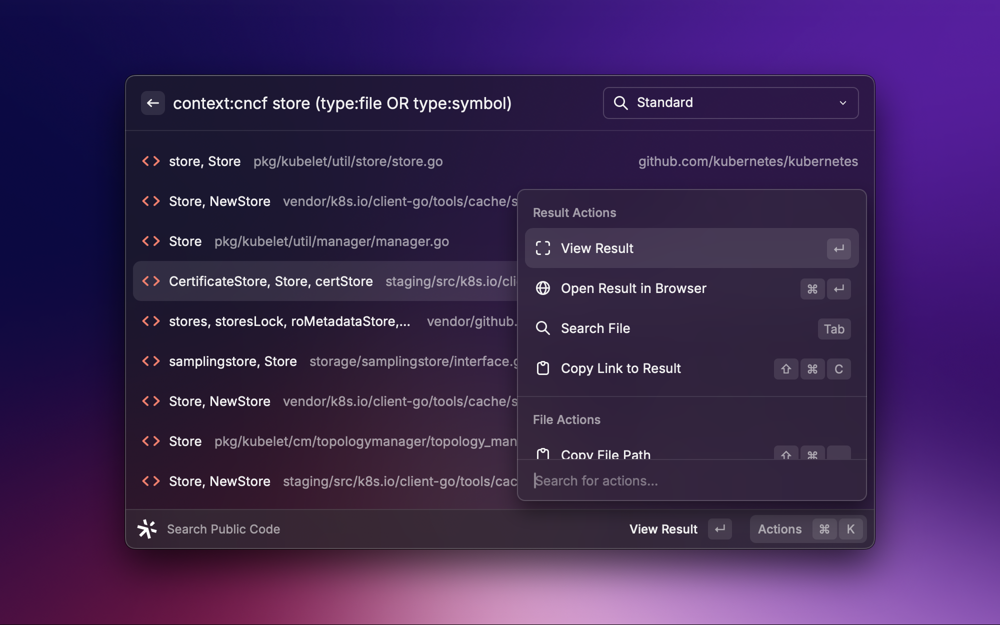
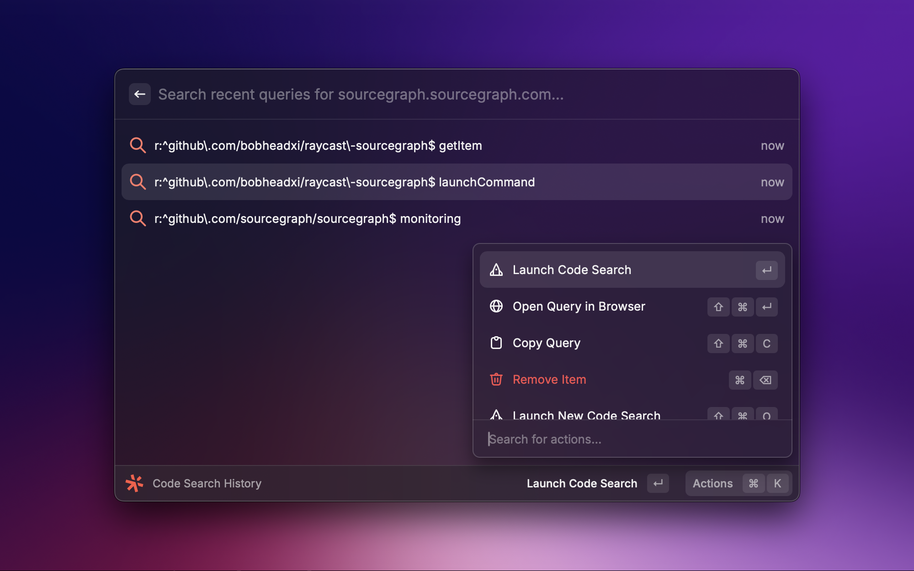
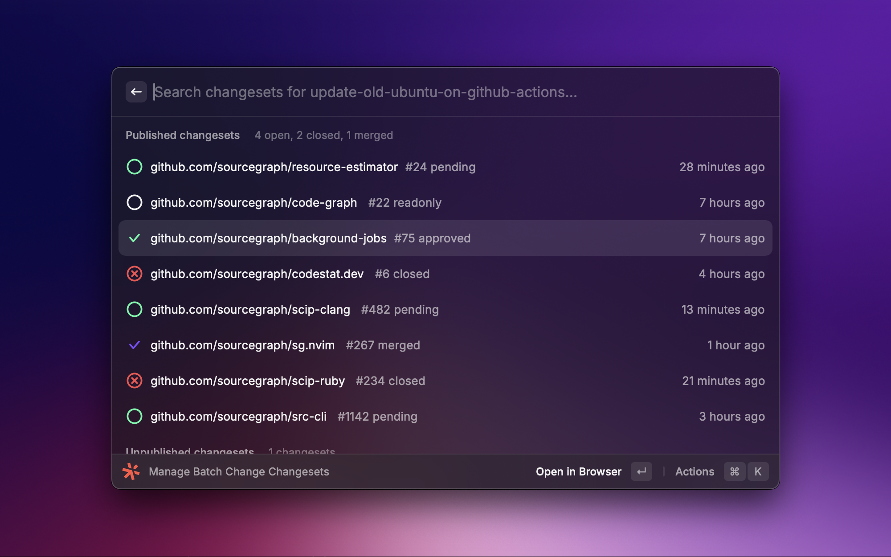

 

  

<h1 align="center">
  Sourcegraph for Raycast
</h1>

  Search code, manage batch changes, and browse notebooks on <a href="https://about.sourcegraph.com">Sourcegraph</a> with <a href="https://www.raycast.com">Raycast</a>.

  <a href="#install"><strong>Install</strong></a> · 
  <a href="#setup"><strong>Setup</strong></a> · 
  <a href="#commands"><strong>Commands</strong></a> · 
  <a href="https://github.com/bobheadxi/raycast-sourcegraph/issues"><strong>Issues</strong></a> · 
  <a href="#changelog"><strong>Changelog</strong></a> · 
  <a href="#contributing"><strong>Contributing</strong></a>

 

## Install

To get started, [install Raycast](https://www.raycast.com/) and [install the Sourcegraph extension from the Raycast extensions store](https://www.raycast.com/bobheadxi/sourcegraph).

Alternatively, you can [install this extension from source](https://github.com/bobheadxi/raycast-sourcegraph/blob/main/CONTRIBUTING.md).

 

## Setup

This extension adds a [variety of commands](#commands) for interacting with [Sourcegraph](https://about.sourcegraph.com).
Some configuration is required to use certain features, most notably the [variants of each command for custom Sourcegraph Instances](#sourcegraph-instance-or-workspace), though you can get started with [Sourcegraph.com commands](#sourcegraphcom) without any additional setup.

### Sourcegraph.com

No setup is required to connect to [Sourcegraph.com](https://sourcegraph.com/search) through the 'Sourcegraph.com' variants of this extensions's commands.
To configure your own [search contexts](#search-contexts), create search notebooks, and more, [sign up for a Sourcegraph.com account](https://sourcegraph.com/sign-up)!

Once you have an account, you can create an access token under the ["Access tokens" tab in your user settings on Sourcegraph.com](https://sourcegraph.com/user/settings/tokens/new).
Copy that access token to the "Sourcegraph.com: Access token" field in the Sourcegraph Raycast extension preferences to authenticate your search queries.

To search your private code, please reach out [get a demo of the single-tenant solution](https://sourcegraph.com/contact/request-info) or [try out a self-hosted installation of Sourcegraph](https://about.sourcegraph.com/get-started/self-hosted).

### Sourcegraph instance or workspace

To start searching code on a custom Sourcegraph instance or workspace:

- [Sourcegraph workspace](https://workspaces.sourcegraph.com/)
- [self-hosted Sourcegraph instance](https://sourcegraph.com/docs/admin/deploy)
- [Sourcegraph Cloud instance](https://sourcegraph.com/docs/cloud)

You can set up access through the 'Sourcegraph' variants of this extensions's commands by configuring the "Sourcegraph: URL" and "Sourcegraph Instance: Access token" fields in the Sourcegraph Raycast extension preferences.
You can create an access token under the "Access tokens" tab in your user settings in Sourcegraph.

For example, you can configure `example.sourcegraph.app` as a URL and go to `https://example.sourcegraph.app/user/settings/tokens/new` to create an access token for use in this extension.

 

## Commands

### Search Code

Get results as you type on [code search](https://about.sourcegraph.com/code-search) over your code and many public repositories.

#### Search contexts

[Search contexts](https://sourcegraph.com/docs/code-search/features#search-contexts) allow you to narrow down your search to code you care about.

The Sourcegraph Raycast extension allows you to set a default context for your searches in the "Search Code" command preferences.

### Code Search History

Browse, manage, and run recent [code searches](#search-code). New searches can also easily be launched from the Code Search History command.

Recent searches are persisted [locally through a native Raycast API](https://developers.raycast.com/api-reference/storage).

### Manage Batch Changes

Browse, view, publish, and merge changesets for [batch changes](https://about.sourcegraph.com/batch-changes) straight from Raycast.
Batch changes automate large-scale code changes to keep your code up to date, fix critical security issues, and pay down tech debt across all of your repositories.

> [!NOTE]
> Batch Changes are currently only supported when connected to a [self-hosted Sourcegraph instance](https://sourcegraph.com/docs/admin/deploy)
or [Sourcegraph Cloud instance](https://sourcegraph.com/docs/cloud).
> To use this command, you must also enable it in the Raycast Sourcegraph extension preferences.

### Find Search Notebooks

Browse and preview [search notebooks](https://sourcegraph.com/docs/notebooks) straight from Raycast.
Notebooks enable powerful live – and persistent – documentation, shareable with your organization or the world.

> [!NOTE]
> Notebooks are currently only supported when connected to a [self-hosted Sourcegraph instance](https://sourcegraph.com/docs/admin/deploy)
or [Sourcegraph Cloud instance](https://sourcegraph.com/docs/cloud).
> To use this command, you must also enable it in the Raycast Sourcegraph extension preferences.

 

## Changelog

The [changelog](CHANGELOG.md) documents all notable updates to the extension.

Updates will be regularly published to the [Raycast Extensions repository](https://github.com/raycast/extensions) from the [`bobheadxi/raycast-sourcegraph` repository](https://github.com/bobheadxi/raycast-sourcegraph).
To try out yet-to-be-published changes, you can [install this extension from source](./CHANGELOG.md).

 

## Contributing

See [CONTRIBUTING.md](CONTRIBUTING.md) if you're interested in contributing to this extension!

Have ideas or suggestions? Please feel free to [open an issue with feedback](https://github.com/bobheadxi/raycast-sourcegraph/issues)!

 
