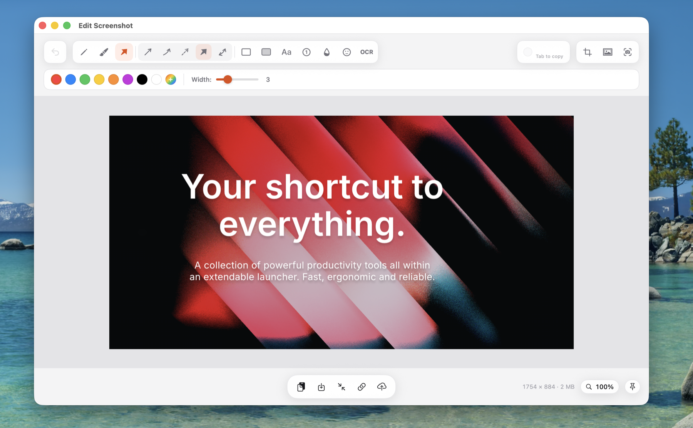
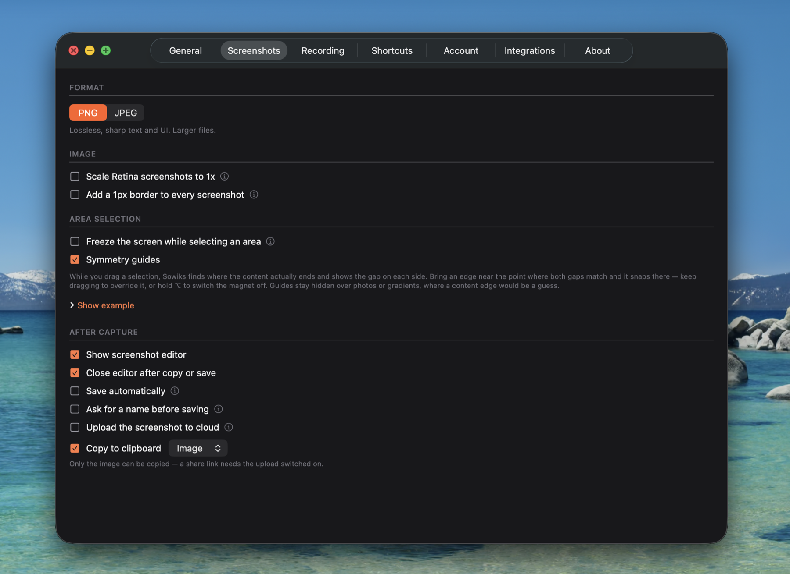
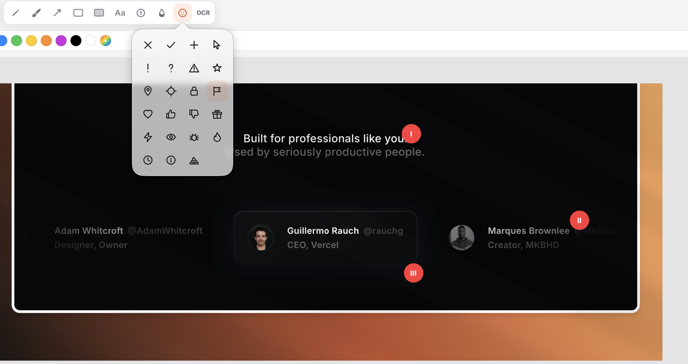

# Sowiks: Screenshot & Recording

Every capture mode in [Sowiks](https://sowiks.com) becomes its own Raycast command. Grab a region, a window, a whole scrolling page, or the text sitting inside an image — `⌘Space`, three letters, `↵`, and the overlay is already up.

Then Sowiks takes over: an editor that makes the shot look deliberate, a link you can paste anywhere, and a screen recorder for when a picture is not enough.

## Setup

1. Install [Sowiks](https://sowiks.com) for macOS.
2. Run any command below. Sowiks asks once whether other apps may control it: choose **Allow**.

That is the whole setup. The choice lives in Sowiks → Settings → Integrations if you ever want to change it.

> **Tip:** give the ones you use daily an alias — `sa` for Capture Area, `sw` for Capture Window — and the overlay appears before Raycast has finished drawing.

## Commands

**Capturing**

| Command                 | What it does                                       |
| ----------------------- | -------------------------------------------------- |
| Capture Area            | Select any region of the screen                    |
| Capture Window          | Point at a window and click — **free forever**     |
| Capture Fullscreen      | The entire screen, one keystroke                   |
| Capture Fixed Size      | An area at a preset size, for consistent shots     |
| Scrolling Capture       | Everything past the bottom of the screen, stitched |
| Capture Text            | Pull text off the screen with OCR                  |
| Capture with Self-Timer | A countdown first, for menus and hover states      |
| Capture Collection      | Several shots gathered into one set                |

**Recording**

| Command                   | What it does                                  |
| ------------------------- | --------------------------------------------- |
| Toggle Screen Recording   | Start, or stop what is running — video or GIF |
| Pause or Resume Recording | Without ending the take                       |

**Everything else**

| Command             | What it does                          |
| ------------------- | ------------------------------------- |
| Unpin All           | Clear every pinned screenshot at once |
| Open Settings       | Sowiks settings                       |
| Open Dashboard      | Your captures in the cloud            |
| Manage Integrations | Connected sites on sowiks.com         |

## What you get after the capture

**Selection that finds the edges for you.** Dragging a rectangle by eye leaves one margin fatter than the other, and you only notice once it is published. Sowiks reads where the content actually ends and snaps the edge to it, showing guides as you drag. Hold `⇧` to suspend the magnet, or turn it off entirely — it never traps you.

**Padding that does not look bolted on.** A screenshot pasted into a document looks cramped, but adding a margin usually means a flat band around the image. Smart extend grows the shot's _own_ background outward, so the breathing room looks like it was always there.

**Backgrounds worth posting.** Gradients, your own images, nine positions to place the shot. Arrows, callouts, numbered steps and blur on top. The difference between a raw screenshot and something that belongs in a blog post or a launch tweet.

**A link instead of an attachment.** Uploading a 4 MB PNG into a chat and waiting for it to preview is a bad way to answer a question. Share to the cloud and paste one link — it opens instantly for whoever you sent it to.

**Straight into WordPress.** Writing a how-to means the same loop over and over: save the screenshot, open the media library, upload, insert. Connect your site once and push the finished image into its media library from the editor, without leaving Sowiks.

**Text out of pictures.** An error message in a screenshot, a code snippet in a video call, a serial number on a receipt. OCR copies it as text you can paste.

## What it costs

The extension is free. Sowiks itself is a paid app with a **7-day trial that starts on your first capture** — no account, no card, nothing to cancel.

**Capture Window stays free forever**, along with the editor, so the extension keeps working whatever you decide. The other capture commands need a running trial or a purchase; once the trial is over, running one opens the upgrade screen instead of quietly doing nothing.

Cloud sharing asks for a free Sowiks account even during the trial — a screenshot in the cloud has to belong to somebody.

## How it works

Each command opens a `sowiks://` URL addressed to the app by its bundle identifier. The extension captures nothing, uploads nothing and reads nothing: it asks, and Sowiks does the work. These commands do exactly what the menu bar and your global hotkeys already do, through the same code.

## Trademark

The extension's source is MIT licensed. The Sowiks name and logo are trademarks of the Sowiks project; the licence covers the code, not the brand.
