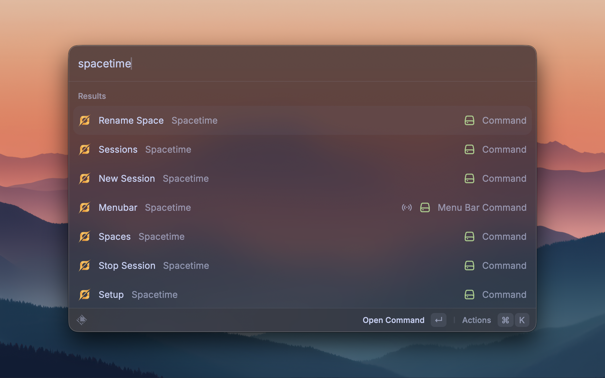

# Spacetime Tracking

Track how much time you spend in each of your macOS Spaces.
Spacetime lives in your menu bar, **records time per desktop** while you work, and lets you name your spaces, **jump between them**, and export your day to a spreadsheet.

##### Built with ❤️ by [Blackbyte](https://blackbyte.space)

## Key features

- ⏱️ **Automatic time tracking** per macOS Space
- 🏷️ **Name your spaces** — real names instead of "Desktop 1, 2, 3…"
- ⌨️ **Quick switching** between spaces using names
- 📊 **Session reports** with a per-space breakdown and percentages
- 📤 **CSV export** — on demand or saved automatically when a session stops
- 🗓️ **Automatic daily session** that starts a fresh session once a day
- 😴 **Idle auto-pause** so time away from the keyboard isn't counted
- 🔒 **Private** — all data stays on your Mac

## Getting started

1. Install the extension.
2. Open Raycast and run **Setup**. It shows a short checklist and a **Run Full Setup** action (press ⌘↵) that turns everything on for you.
3. The first time you switch to a space, macOS asks for **Accessibility** permission — click **Open System Settings** and enable Raycast. This is the only manual step, and you only do it once.

That's it. The Spacetime clock icon appears in your menu bar and starts tracking.

> Tip: if the menu bar icon doesn't show up yet, run the **Menubar** command once from Raycast.

## The menu bar

Click the Spacetime icon in your menu bar to:

- See your **current session**, total time, and the space you're on now.
- See a **per-space breakdown** of where your time went.
- **Start** a new session, or **stop** the current one.
- **Switch** to any space in the "Switch to Space" list.
- Quickly open **Rename Space**, **Sessions**, **Setup**, and **Settings**.

## Sessions

A *session* is one stretch of tracked time (for example, a work day).

- **New Session** — starts tracking. If a session is already running, stop it first.
- **Stop Session** — ends the current session.
- **Sessions** — browse everything you've recorded. Each session shows its total time and a per-space table with a **Percentage** column. From here you can **rename**, **delete**, or **export** a session.
- **Export Last Session** — quickly saves your most recent session as a spreadsheet (CSV).

Only time spent on your **main display** is tracked, and tracking pauses automatically while you're away from the keyboard (see Settings).

## Naming your spaces

macOS calls your desktops "Desktop 1, 2, 3…". Give them real names so your reports make sense:

- **Rename Space** — names the space you're currently on.
- **Spaces** — lists your spaces; select one to rename it (or switch to it).

Your names appear everywhere time is shown — the menu bar, the breakdowns, and your exports.

## Switching spaces

From the menu bar's **Switch to Space** list, or from the **Spaces** command, pick a space to jump to it. Spacetime also sets up **Ctrl + number** shortcuts (Ctrl 1, Ctrl 2, …) so you can switch straight from the keyboard.

> For the numbers to stay in the right order, keep **"Automatically rearrange Spaces based on most recent use"** turned **off** (System Settings › Desktop & Dock › Mission Control). Setup does this for you.

## Saving sessions automatically

Turn on **Save Sessions to Disk** (in Settings) to automatically export every session as a CSV when it stops. Choose the destination folder, and optionally organize files into year/month subfolders (e.g. `2026/07/2026-07-06-15h23.csv`).

## Automatic daily session

Turn on **Automatic Daily Session** to have Spacetime start a fresh session for you once a day — the first time you use your computer. Yesterday's session is closed automatically, so each day stays separate with no action from you.

## Settings

Open Raycast › Extensions › Spacetime Tracking to adjust:

- **Inactivity Detection** — automatically pause tracking when you stop using the computer (on by default).
- **Idle Threshold** — how many minutes of inactivity before tracking pauses (default 10).
- **Keep tracking while media is playing** — don't auto-pause while you're watching a video or presenting (on by default).
- **Automatic Daily Session** — start one session per day automatically (off by default).
- **Save Sessions to Disk** — export each session to CSV when it stops (off by default).
- **Sessions Folder** — where those CSV files are saved (defaults to Downloads).
- **Organize by Year/Month** — sort saved files into year/month folders.

## Good to know

- Your data stays **on your Mac** — nothing is uploaded anywhere.
- Only one session runs at a time.
