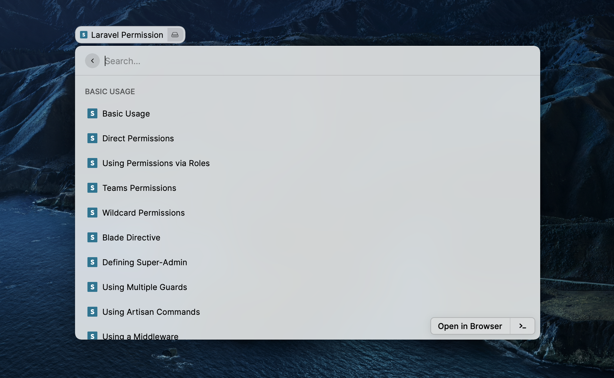

# Spatie Documentation

Easy access commands for Spatie open source packages documentation

---

## Adding a new Spatie package (command)

1. Create a folder containing the links of the documentation page, something similar to `src/documentation/laravel-backup.json`
2. Create a `.tsx` file for the newly added package (command) as in `src/laravel-permission.tsx` which will be used to fetch data from file created in step 1
3. Add the command and the package supported versions to package.json
4. Run `npm run build` to validate your work
5. Don't forget to add your Raycast username to `contributors` in `package.json`
