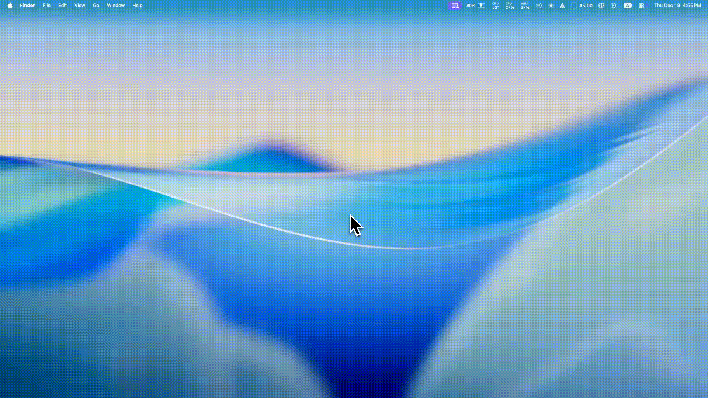

<p align="center">
  
  <h1 align="center">Speak out</h1>
</p>

<p align="center">
  <a aria-label="Raycast Store" href="https://raycast.com/boy-johnny/speak-out">
    
  </a>
  <a aria-label="License" href="https://github.com/boy-johnny/speak-out/blob/main/LICENSE">
    
  </a>
</p>

<p align="center">
  A <a href="https://raycast.com">Raycast</a> extension to quickly look up English word pronunciations with IPA (International Phonetic Alphabet) and audio playback.
</p>


<p align="center">
  
</p>


## Features

- 🔍 **Word Lookup** — Search any English word to get its pronunciation
- 🗣️ **IPA Display** — Shows phonetic transcription in IPA format (e.g., `/rɪˈzuːm/`)
- 🔊 **Audio Playback** — Play pronunciation audio with a keyboard shortcut
- 🌍 **Accent Detection** — Identifies US/UK/AU accents when available
- 📜 **Search History** — Remembers your recent searches for quick access
- 📖 **Part of Speech** — Shows whether the word is a noun, verb, adjective, etc.
- 📝 **Definitions** — Displays brief definitions alongside pronunciations
- 🤖 **TTS Fallback** — For technical terms not in dictionary (e.g., "Supabase", "Kubernetes"), uses macOS Text-to-Speech with multiple accent options:
  - 🇺🇸 US English (Samantha)
  - 🇬🇧 UK English (Daniel)
  - 🇦🇺 Australian English (Karen)
  - 🇮🇳 Indian English (Veena)

## Installation

### From Raycast Store

Search for "Speak Out" in Raycast or [click here](https://raycast.com/boy-johnny/speak-out) to install.

### Manual Installation

```bash
git clone https://github.com/boy-johnny/speak-out.git
cd speak-out
npm install
npm run dev
```

## Usage

1. Open Raycast and search for **"Speak out"**
2. Type any English word (e.g., "resume", "mermaid", "cache")
3. View the IPA pronunciation and press `Enter` to play audio
4. Use `⌘ + C` to copy the IPA

### Keyboard Shortcuts

| Shortcut | Action |
|----------|--------|
| `↵ Enter` | Play pronunciation audio |
| `⌘ C` | Copy IPA |
| `⌘ ⇧ C` | Copy word |
| `⌃ X` | Remove from history |
| `⌃ ⇧ X` | Clear all history |

## API

Uses the [Free Dictionary API](https://dictionaryapi.dev/) — completely free, no API key required.

## Technical Notes

- **Audio Playback** — Uses macOS `afplay` command to play MP3 files
- **Text-to-Speech** — Uses macOS `say` command for words not in dictionary
- **Debouncing** — 300ms delay before API call to avoid excessive requests
- **History Storage** — Uses Raycast's LocalStorage API (stores last 20 searches)

## Feedback

Found a bug or have a feature request? Please open an [issue](https://github.com/boy-johnny/speak-out/issues).

## License

MIT
