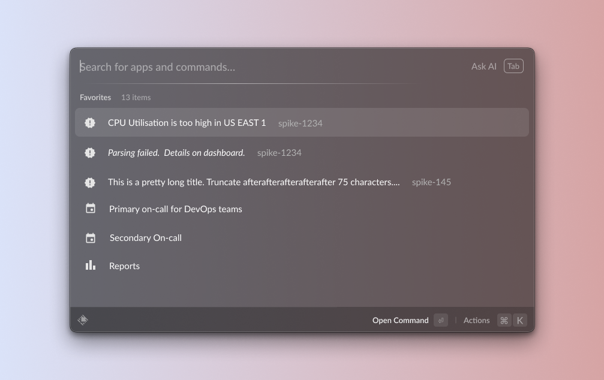

# Spike Raycast Extension




## Overview

The Spike Raycast Extension integrates Spike's incident management and on-call functionalities directly into your Raycast environment. This extension allows you to manage incidents, view on-call schedules, and access your favorites without leaving your workflow.

## Features

1. **Incidents Management**: View and manage open incidents directly from Raycast.
2. **On-Call Information**: Check your on-call status and see who's currently on call.
3. **Favorites**: Quick access to your favorite Spike entities.
4. **Override Management**: Add overrides to on-call schedules.
5. **Menu Bar Integration**: View open incidents from your menu bar.

## Commands

### 1. Incidents

- **Command:** `incidents`
- **Description:** View and manage open incidents.
- **Functionality:** 
  - List triggered and acknowledged incidents
  - Acknowledge or resolve incidents
  - View incident details

### 2. On Call

- **Command:** `oncall`
- **Description:** Check your current on-call status.
- **Functionality:**
  - View your active on-call shifts
  - See when your current shift ends

### 3. Favorites

- **Command:** `favorites`
- **Description:** Access your favorite Spike entities.
- **Functionality:**
  - List all your favorites (incidents, on-calls, escalations, services, integrations)
  - Open favorites in the Spike web application

### 4. Who is on call

- **Command:** `whoIsOnCall`
- **Description:** See who's currently on call across all teams.
- **Functionality:**
  - List active on-call shifts for all teams
  - View on-call user details

### 5. Add an override

- **Command:** `addOverride`
- **Description:** Add an override to an on-call schedule.
- **Functionality:**
  - Select on-call and override user
  - Set override duration
  - Add description

### 6. Open Incidents (Menu Bar)

- **Command:** `openIncidents`
- **Description:** View open incidents from your menu bar.
- **Functionality:**
  - List triggered and acknowledged incidents
  - Quick access to incident details in the Spike web application

## Installation

1. Make sure you have [Raycast](https://raycast.com/) installed.
2. Open Raycast and search for "Spike".
3. Click "Install" to add the Spike extension to your Raycast.

## Configuration

After installation, you'll need to authenticate with your Spike account. Follow the prompts in Raycast to complete the setup.

## Development

To contribute to this extension:

1. Clone the repository:
   ```
   git clone https://github.com/spikehq/raycast-extension.git
   ```
2. Install dependencies:
   ```
   npm install
   ```
3. Run the development server:
   ```
   npm run dev
   ```
4. Import Spike to your raycast

- Open Raycast
- Search for `Import extension`
- Import whole `spike-raycast` folder
