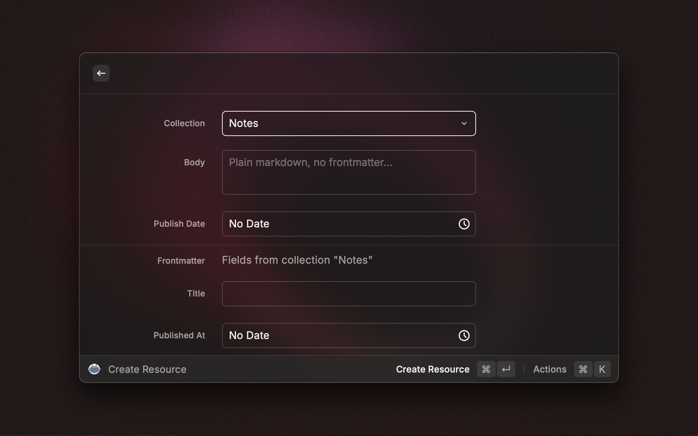

# Spinal

Create drafts and scheduled resources in your [Spinal](https://spinalcms.com) workspace, without leaving Raycast. You can also browse existing resources.

Spinal is a Git-powered CMS for static site generators. This extension talks to the Spinal API. What you create here flows through the normal pipeline: draft in Spinal, push to GitHub, site rebuilds.

## Setup

1. Get an API key in Spinal under **Settings → API**. This requires a plan with API access.
2. Install the extension and set the **API Key** preference.
3. Optional: open Create Resource, pick a collection, and press ⌘D to make it the default. The form preselects it next time.

## Commands

### Create Resource

The form has two parts, separated by a divider: resource settings and collection fields.

- **Collection**: the collection to create the resource in. Fetched from your workspace and cached for an hour.
- **Body**: plain markdown. Do not include frontmatter. Spinal composes it from field values on publish.
- **Publish Date**: leave empty to create a draft. Set a future date to schedule.
- **Frontmatter**: the fields of the selected collection. Text fields, numbers, booleans, date pickers, dropdowns for select fields, and tag pickers for multi-select.

The API creates the resource as a draft or as a scheduled resource. Publishing to your repository happens in Spinal.

Select text in any app before you run Create Resource. The form fills the body with your selection. Assign a hotkey to the command for one-key capture.

### Browse Resources

Pick a collection from the search bar. Each row shows the resource title and a status icon. The title comes from the resource anchor, then the collection's main field, then the filename.

The detail pane shows resource metadata and the collection's frontmatter fields, above the body.

Resources with a publish date group by day: Today, Tomorrow, then the date. Choose **Scheduled** under the **Status** action to see an upcoming agenda, soonest first. Other filters sort newest first. Resources without a date group under "No publish date".

Actions:

- **Open in Spinal**
- **Copy Markdown Body**, **Copy Resource ID**, **Copy Filename**
- **Create Resource in This Collection**
- **Status** filter
- **Refresh** and **Reset Cached Data**
- **Update API Key**

## Notes and limits

- The API supports reading and creating only. The extension cannot edit or publish resources yet.
- The API allows 20 requests per hour per key. The extension caches collections for 1 hour and resources for 10 minutes. Each created resource costs one request.
- The extension stops requests after 30 seconds.
- Spinal ignores field values for unknown field keys. The form shows only fields that exist on the selected collection.
- The extension does not support structured fields (`hash`, `array`) yet.

## Links

- [Spinal](https://spinalcms.com)
- [API documentation](https://spinalcms.com/docs/api-overview/)
