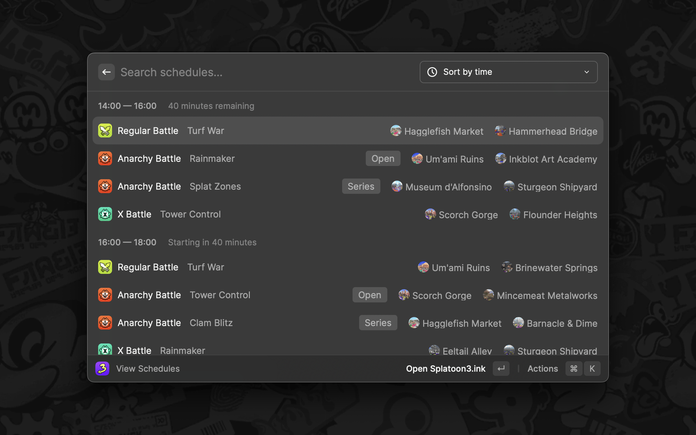

  

<h1 align="center">Splatoon</h1>

View Splatoon’s current schedules.

> Supports Splatoon 2 and Splatoon 3.

## Credits

This extension uses data from [Splatoon3.ink](https://github.com/misenhower/splatoon3.ink/wiki/Data-Access) and [Splatoon2.ink](https://github.com/misenhower/splatoon2.ink/wiki/Data-access-policy).

## Disclaimer

This extension is not affiliated with Nintendo. All product names, logos, and brands are property of their respective owners.
