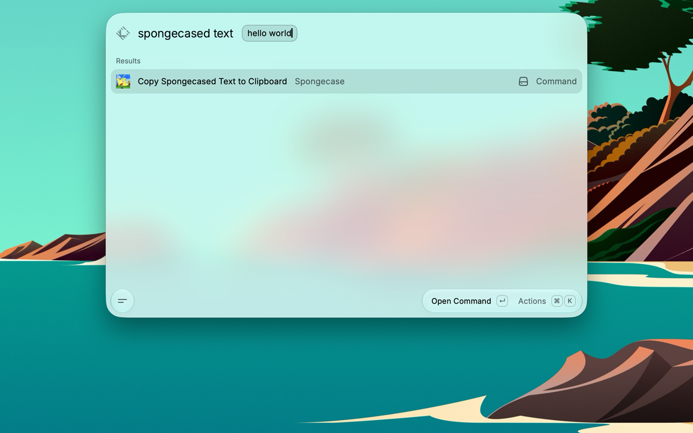

# Spongecase

A [Raycast](https://www.raycast.com/) extension for converting text to
spongecase (aLtErNaTiNg cApS) and copying the result to the clipboard.

This extension is very simple. It provides a single command that takes
a string argument, spongecases it, and copies it to the clipboard.

