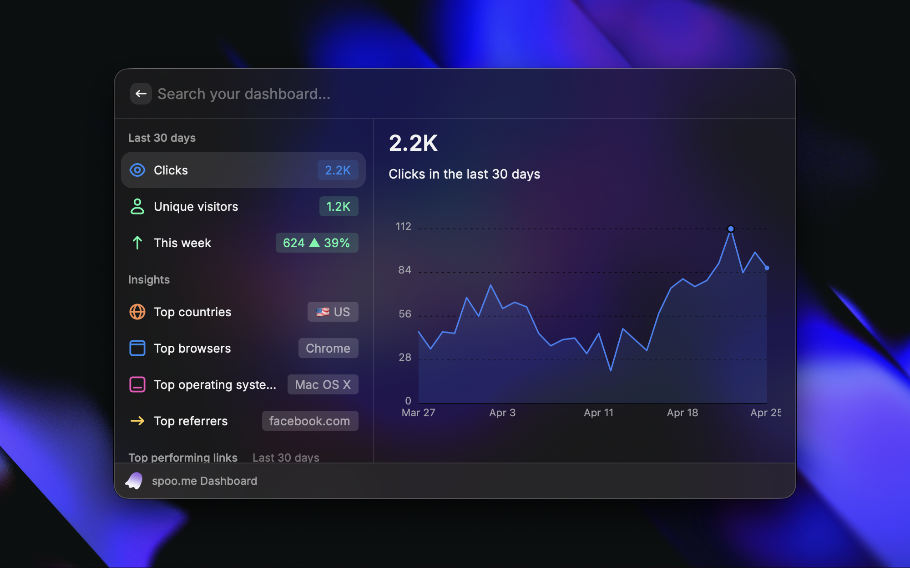

<p align="center">

</p>

<h3 align="center">spoo.me for Raycast</h3>
<p align="center">Shorten, manage, and analyze your spoo.me links without leaving your keyboard 🚀</p>

<p align="center">
    <a href="#-features"><kbd>🔥 Features</kbd></a>
    <a href="#-getting-started"><kbd>🚀 Getting Started</kbd></a>
    <a href="#-how-to-use"><kbd>🎯 How to Use</kbd></a>
    <a href="#-contributing"><kbd>🤝 Contributing</kbd></a>
</p>

<p align="center">
<a href="https://spoo.me"></a>
<a href="https://spoo.me/discord"></a>
<a href="https://github.com/spoo-me/spoo-raycast/blob/main/LICENSE"></a>
</p>

# 🔥 Features

- `Quick Shorten` - One keystroke grabs the active browser tab or clipboard URL, shortens it, and copies the result ⚡
- `Shorten with Options` - Custom alias with live availability check, password, max clicks, expiry, bot blocking, private stats 🎛️
- `My Links` - Search, browse, edit, sort, toggle, and delete all your links with a live analytics sidebar ✏️
- `Dashboard` - Overview of clicks, unique visitors, weekly trends, top countries/browsers/OS/referrers, and top performing links 📊
- `Link Analytics` - Per-link analytics with SVG charts and one-click CSV / JSON / XLSX / XML export 📈
- `QR Codes` - Generate, preview, save, and copy branded QR codes for any link 📱
- `Edit Links` - Update destination URL, alias, password, click limits, expiry, and flags inline ✏️
- `Linked App Auth` - No API keys to paste — sign in through the spoo.me device flow 🪪

# 🚀 Getting Started

### 📋 Prerequisites

- [Raycast](https://www.raycast.com/) 🔍
- [Node.js](https://nodejs.org/) or [Bun](https://bun.sh/) 📦

### 📂 Clone the repository

```bash
git clone https://github.com/spoo-me/spoo-raycast.git
cd spoo-raycast
```

### 📦 Install dependencies

```bash
bun install    # or: npm install
```

### 🚀 Start the dev server

```bash
bun run dev    # ray develop — hot reload
```

The extension appears immediately in Raycast root search.

# 🧪 Local Development

Running spoo.me locally? Point the extension at your dev server:

1. Open **Raycast → Settings → Extensions → spoo.me**
2. Set `API Base URL` to `http://localhost:8000`
3. Restart any open command — all API calls now hit your local server

> [!NOTE]
> The device-auth redirect (`https://raycast.com/redirect/extension`) is already registered in the local `apps.yaml`, so sign-in works end to end against your local instance.

# 🎯 How to Use

1. **Quick shorten** — hit your assigned hotkey (suggested: `⌥⇧S`). The active tab or clipboard URL is shortened and copied.
2. **Create with options** — open `Shorten Link`. Custom alias, password, click limit, expiry, bot blocking.
3. **Browse** — `My Links` with preview sidebar. Edit, toggle, delete, export, QR.
4. **Dashboard** — `spoo.me Dashboard` for aggregate analytics with SVG charts.
5. **Sign in once** — the first run opens a browser to spoo.me for consent. Tokens are stored securely by Raycast and refreshed automatically.

## ⚙️ Preferences

| **Setting**  | **Description**                                            |
| ------------ | ---------------------------------------------------------- |
| API Base URL | Override for local development (default `https://spoo.me`) |
| Auto-copy    | Copy the short URL to clipboard after creation             |
| Celebrate    | Show a celebratory HUD when an emoji alias is generated    |

# 🔌 APIs Used

- `spoo.me` - URL shortening, management, statistics, exports ([docs](https://docs.spoo.me)) 🔗
- `qr.spoo.me` - QR code generation with custom styles ([docs](https://qr.spoo.me)) 📱
- `Linked Apps` - OAuth-style device auth flow for third-party clients 🔐

# 🛠️ Technical Details

- `@raycast/api` + `@raycast/utils` - Raycast extension framework
- `React 18` + `TypeScript 5` (strict) - UI and type safety
- `zod` - Runtime validation at every API boundary
- `bun` - Package management

### Project Structure

```
src/
├── commands/        # Raycast entrypoints (1 file per command)
├── api/             # Thin resource-specific API modules
├── hooks/           # Composable Raycast hooks
├── components/      # Shared UI (AuthGate, LinkForm, LinkAnalytics, …)
├── schemas/         # Zod schemas for every API payload
├── lib/             # Pure helpers (oauth, cache, errors, format, qrcode, svg-chart)
└── constants.ts     # Preferences, cache keys, TTLs
```

# 🙏 Acknowledgements

- SVG chart rendering technique inspired by [GraphCalc](https://github.com/raycast/extensions/tree/main/extensions/graphcalc) by [Dru89](https://github.com/Dru89)

# 🤝 Contributing

**Contributions are always welcome!** 🎉

- Bugs are logged using the GitHub issue system. To report a bug, simply [open a new issue](https://github.com/spoo-me/spoo-raycast/issues/new).
- Make a [pull request](https://github.com/spoo-me/spoo-raycast/pulls) for any feature or bug fix.

> [!IMPORTANT]
> For any type of support or queries, feel free to reach out to us at <kbd>[✉️ support@spoo.me](mailto:support@spoo.me)</kbd>

---

<h6 align="center">

<br>
© spoo.me . 2026

All Rights Reserved</h6>

<p align="center">
 <a href="https://github.com/spoo-me/spoo-raycast/blob/main/LICENSE"></a>
</p>
