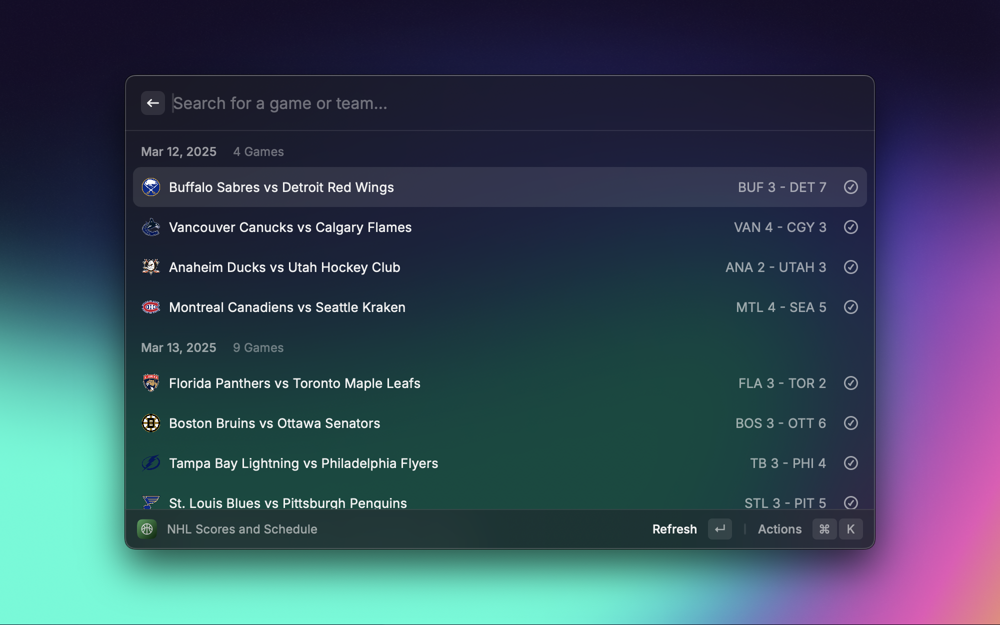

## Sportssync

<<<<<<< HEAD
View scores, games, standings, news, injuries, and transactions across your favorite sports leagues

## Commands:

| **Command**                 | **Description**                                                                                                                                                                                                              | **Status**  |
| --------------------------- | ---------------------------------------------------------------------------------------------------------------------------------------------------------------------------------------------------------------------------- | ----------- |
| **Scores and Schedule**     | Dynamically view live scores, game times, and completed scores (updates dynamically based on the game state). Supports scores from the past 3 days, games for the next 5 days, and today's games.                            | Completed   |
| **Standings Command**       | View team standings and in-depth stats (differs based on the league).                                                                                                                                                        | Completed   |
| **Tracker Command**         | View articles, injuries, and transactions (differs based on the league).                                                                                                                                                     | Completed   |
| **Favorite Team Dashboard** | One command to view completed games, scheduled games, team information, team standings position, injuries, transactions, and injuries (differs based on league, also requires a favorite league, sport, and team for setup). | Next Update |
| **Live Scores Menubar**     | View Live Scores, Game Times, and Completed Scores directly from your menubar. (Requires a favorite league and sport for setup)                                                                                              | Next Update |

## Supported Leagues:

# _Leagues that are fully supported include the following: a scores and schedule, standings, and tracker command_

A raycast extension to view scores, standings, and stats across your favorite sports leagues

## Links

- Raycast Github Repo: https://github.com/daniyalmaster693/sportssync
- Raycast Store: https://www.raycast.com/daniyal_master/sportssync

## Commands:

- Scores and Schedule: Dynamically view live scores, game times, and completed scores (updates dynamically based on the game state)
- Standings Command: View team standings and in depth stats (differs based on the league)
- News Command: View news articles and headlines

## Supported Leagues:

_Leagues that are fully supported include the following: a scores and schedule, standings, and news command_

> > > > > > > contributions/merge-1743277393899

- NHL (Fully supported)
- NBA (Fully Supported)
- WNBA (Fully Supported)
- Men's College Basketball (Only scores and news)
- Women's College Basketball (Only scores and news)
- NFL (Fully Supported)
- College Football (Men's) - (Only scores and news)
- MLB (Fully Supported)
  <<<<<<< HEAD
- F1 (Only scores, standings and news)
- EPL (English Premier League) - (Only scores, standings and news)
- UEFA (Champions League) - (Only scores, standings and news)
- SLL (LALIGA) - (Only scores, standings and news)
- GER (German Bundesliga) - (Only scores, standings and news)
- # ITA (Italian Serie A) - (Only scores, standings and news)
- F1 (Fully Supported)
- EPL (English Premier League) - (Fully Supported)
- UEFA (Champions League) - (Fully Supported)
- SLL (LALIGA) - (Fully Supported)
- GER (German Bundesliga) - (Fully Supported)
- ITA (Italian Serie A) - (Fully Supported)
  > > > > > > > contributions/merge-1743277393899

## Roadmap:

View changelog here: https://github.com/daniyalmaster693/sportssync/blob/main/CHANGELOG.md

<<<<<<< HEAD

- ~~Live Scores Command (Menubar): View live scores and upcoming games, and click on games to set them as the menu bar title, allowing users to view scores with automatic refreshes.~~
- ~~Tracker Command: A command to view injuries and transactions~~
- ~~Past Scores Command: A separate command (or something integrated into the scores and schedules command) to allow users to view scores for previous games (up to a few days)~~
- ~~Favorite Team Command: A single command to follow a specific team~~
- Roster View for Standings Command - In Progress
- Player Profiles from Roster View - In Progress
- Universal Player Search Command
- Article Viewer for Tracker Command (Read Articles directly in Raycast)
- Add to Calendar Action for games
- # Current Leagues Planned: (UFC, Boxing, WWE, Nascar)
- Live Scores Command (Menubar): View live scores and upcoming games, and click on games to set them as the menu bar title, allowing users to view scores with automatic refreshes.
- Stats command: A command to view player stats
- Tracker Command: A command to view injuries and transactions
- ~~Past Scores Command: A separate command (or something integrated into the scores and schedules command) to allow users to view scores for previous games (up to a few days)~~
  > > > > > > > contributions/merge-1743277393899
- Additional Leagues: Please request any leagues that you'd like me to add support for, and I'll look into seeing what I can do.

**_In depth stats, for the scores and schedule command_**

<<<<<<< HEAD

- Play by Play Tracker: A menu to view play by play events during live games - In Progress
- Team Stats and Team Matchups: A separate similar to the play by play tracker, to view individual team stats, leaders, and the season series for upcoming games - In Progress
- Final Team Stats: Another separate menu to view the final team stats after a game has been completed, including team leaders, player stats, and overall team stats - In Progress

## Preferences

To enable the favorite team dashboard and live scores menubar commands, you will need to set a few preferences:

- Favorite Sport
- Favorite League
- Favorite Team

**You must select a league within the sport you choose, and a team within that league, or you will encounter errors.**

## Data Source

All data is sourced directly from the unofficial ESPN Sports API. The accuracy of the data depends on ESPN's public APIs.

## Disclaimer

This is an unofficial Raycast extension and is not affiliated with, endorsed by, or connected to ESPN.

All data is sourced from publicly available ESPN APIs services. Team logos, player images, and other league related trademarks and content are properties of their respective owners and are used for informational purposes only.

# All Rights Reserved.

- Play by Play Tracker: A menu to view play by play events during live games
- Team Stats and Team Matchups: A separate similar to the play by play tracker, to view individual team stats, leaders, and the season series for upcoming games
- Final Team Stats: Another separate menu to view the final team stats after a game has been completed, including team leaders, player stats, and overall team stats
  > > > > > > > contributions/merge-1743277393899
