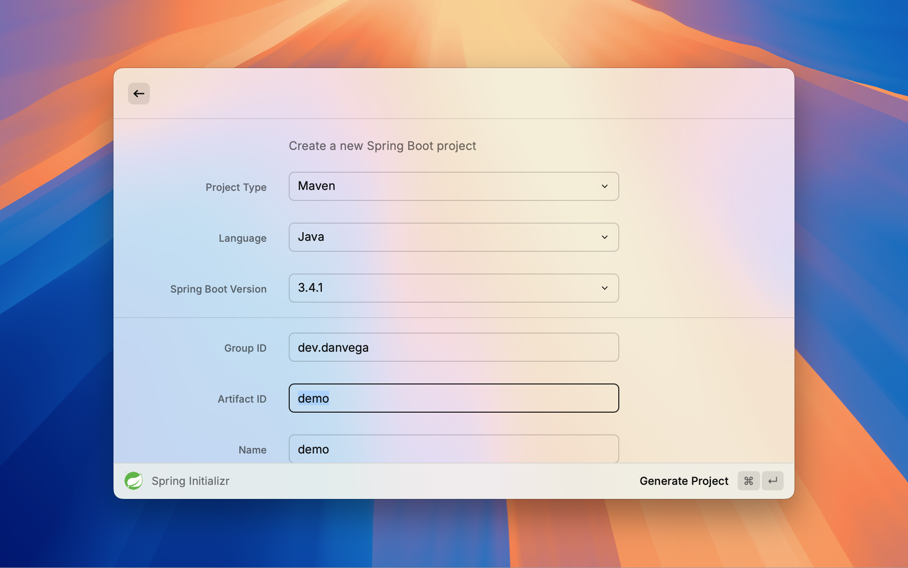

# Spring Initializr Extension for Raycast

Generate Spring Boot projects directly from Raycast, powered by the official Spring Initializr service.

Here is a short preview of the extension

https://youtu.be/uryzwaM-Ciw

## Features

- Generate Spring Boot projects without leaving Raycast
- Support for all Spring Boot versions
- Multiple build tools (Maven, Gradle)
- Multiple languages (Java, Kotlin, Groovy)
- Full dependency management
- Downloads directly to your Downloads folder

## Usage

1. Open Raycast
2. Search for "Create Spring Project"
3. Fill in your project details
4. Select dependencies
5. Generate and download your project

Projects are automatically saved to your Downloads folder.

## Requirements

- macOS
- Node.js 20.x or later
- Raycast

## Author

Dan Vega (danvega@gmail.com)

## License

MIT
