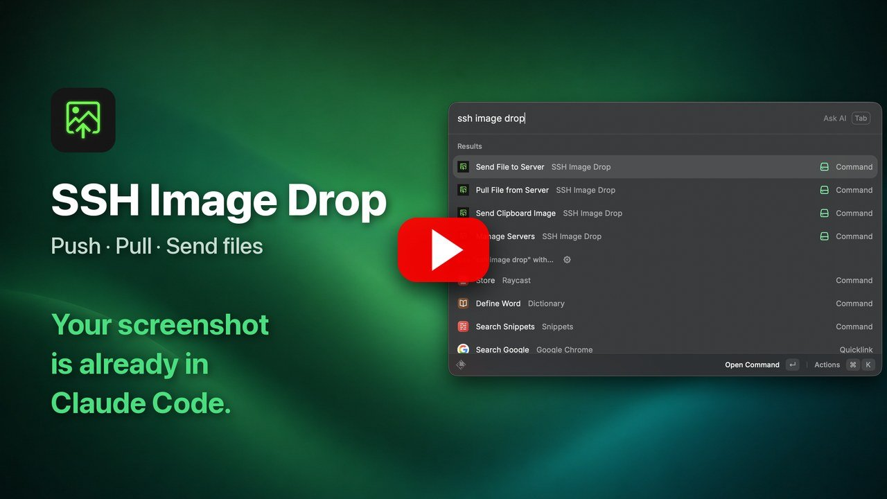

# SSH Image Drop

Send files, folders, and clipboard images to a remote server over SSH with one hotkey — and pull them back. The **remote path** lands on your clipboard, so there is nothing to type. For clipboard images, pick an **Auto-Paste** app in preferences and the path goes straight into it — not even Cmd+V.

Typical use: push config files or skill folders to whichever box your agent runs on, or hand a screenshot to a Claude Code session running on a remote Mac.

## Commands

| Command                   | What it does                                                                                   |
| ------------------------- | ---------------------------------------------------------------------------------------------- |
| **Send File to Server**   | Pick files or folders and a server, hit Enter. Pre-filled from your Finder selection on macOS. |
| **Send Clipboard Image**  | Sends the clipboard image, copies the remote path back.                                        |
| **Pull File from Server** | Takes a remote path from the clipboard, downloads it, reveals it in Finder / Explorer.         |
| **Manage Servers**        | Add, edit, and delete servers. Reads `~/.ssh/config`.                                          |

Bind a server to a hotkey with Raycast's **Create Quicklink**, available on every row of the server picker. There is no host to type: a Quicklink carries the target, and launching without one opens the picker.

Folder transfers ask for confirmation. Pulling `/` or your whole home directory is refused.

## Authentication

| Mode                          | How the password is handled                                                                                                                    |
| ----------------------------- | ---------------------------------------------------------------------------------------------------------------------------------------------- |
| **Stored password** (default) | Kept in the OS credential store — macOS Keychain, or a DPAPI-encrypted file on Windows — and read by an `SSH_ASKPASS` helper on each transfer. |
| **SSH key** (opt-in)          | A dedicated ed25519 key is installed on the server. The password is used once, then discarded.                                                 |

In neither mode does the password reach argv, plaintext disk, LocalStorage, or a persistent environment variable.

## Security

The trust boundary is **your OS user account**: anything running as you can already reach these credentials, by design.

- **Known hosts only.** Every transfer target, in both directions, must be a server you registered, used recently, or have in `~/.ssh/config`. A crafted `raycast://` deeplink cannot point the extension at an attacker's server, and file lists never come from a deeplink — only from the form you submit.
- **Credentials are user-scoped.** The Keychain entry is readable by any process running as you, so transfers need no prompt; DPAPI on Windows behaves the same way. The SSH key is passphrase-less and shared across key-mode servers so transfers stay non-interactive.
- **Injection is blocked.** Remote paths with shell-active characters, control characters, or `..` segments are rejected before reaching `scp`, and the message names the offending character. `scp` runs over SFTP, so no remote shell evaluates your paths.
- **First connection is TOFU.** A new server's host key is accepted automatically (`accept-new`). On an untrusted network, run `ssh user@host` once beforehand to pin it.
- **Clipboard staging.** The image is written to a private temp directory for the duration of the transfer and deleted afterward, including on failure paths.

Pulled files land in your Download Directory (`~/Downloads` by default) — often indexed by Spotlight and synced to iCloud or Dropbox, which is worth knowing before pulling something sensitive.

## Requirements

- macOS 13+, or Windows 11 with the built-in OpenSSH client 9.0+. Transfers force SFTP (`scp -s`) and fail closed on older builds rather than falling back to the legacy protocol.
- **Remote servers must run macOS or Linux.** Windows is supported as the client only.
- Default remote directory is `/tmp/ssh-image-drop`. On a shared server, set a private path in preferences.
- Clipboard images are capped at 20 MB and rejected before the transfer starts, rather than uploading for minutes.
- Auto-paste is opt-in and covers Send Clipboard Image only; file sends and pulls always copy. It pastes into whichever field has focus in the app you picked, and only while that app is frontmost as the transfer finishes — anywhere else the path is just copied.
- Adds one `Include` line to `~/.ssh/config`, with your consent and after a timestamped backup. Managed servers live only in the included file.
- Deleting a server removes its config block and stored password, but not the public key already in that server's `authorized_keys`.
- No telemetry. Nothing leaves your machine except to the server you pick.
- Not supported: IPv6 literals and interactive password prompts. On Windows, pulling a folder containing names that are illegal there (`NUL`, colons) can fail — pull those files individually.

---

Built by [UmiCorp](https://umicorp.kr).

If you find this useful, consider [buying me a coffee](https://buymeacoffee.com/umicorp).
