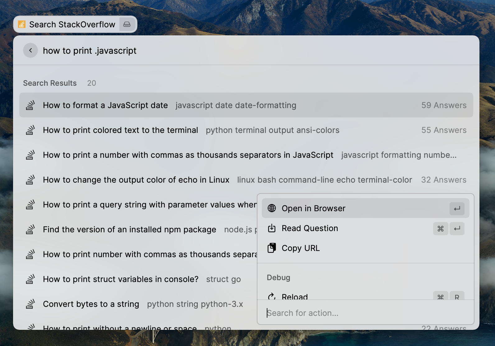

# Raycast Search Stackoverflow

This extension brings [stackoverflow](https://stackoverflow.com/) search to Raycast!

## Features

- search multiple keywords - eg. - "How to Plot Image in Python" etc.
- view question in raycast screen
- search with tags. tags should be prefixed by '.' char. For eg. - "How to Plot Image in Python .python .matplotlib" - Here we want to search specifically for questions with tags python and matplotlib.

## Screenshot

