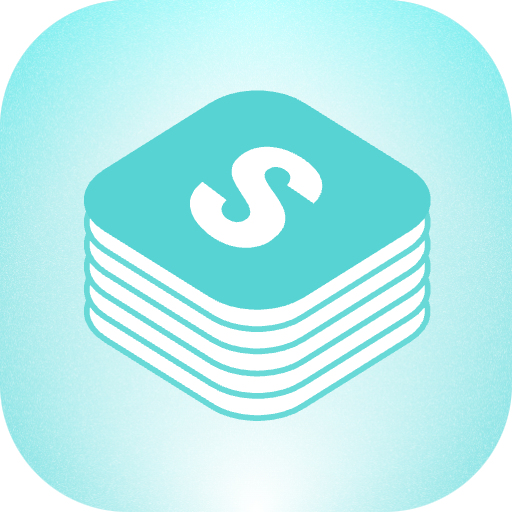

# Stacks

Search and manage your saved resources from Stacks directly in Raycast.

## Features

- **🔍 Search Resources**: Browse and search through all your saved Stacks resources
- **➕ Add Link**: Quickly save new URLs to your Stacks workspace  
- **📱 Multiple Views**: Switch between Grid and List view layouts
- **⚡ Quick Actions**: Open links, copy URLs, refresh data, and more
- **🔒 Secure**: Uses Raycast's built-in preferences for API token storage

## Setup Required

This extension requires an API token from your Stacks account to access your saved resources.

### Getting Your API Token

1. **Login to Stacks**: Visit [betterstacks.com](https://betterstacks.com) and sign in
2. **Open Developer Tools**:
   - **Chrome/Edge**: Right-click → Inspect or press `F12`
   - **Safari**: Enable Developer Menu in Preferences → Advanced, then Safari → Develop → Show Web Inspector
   - **Firefox**: Right-click → Inspect or press `F12`
3. **Find Your Token**:
   - Navigate to the **Application** tab (Chrome) or **Storage** tab (Firefox)
   - Expand **Cookies** → **betterstacks.com**
   - Find the `gqlToken` cookie and copy its value
4. **Configure Extension**:
   - The extension will prompt you for the token on first use
   - Or go to Raycast Preferences → Extensions → Stacks → Configure

## Commands

### Search Resources
Browse and search through your saved Stacks resources with powerful filtering and multiple view options.

**Features:**
- Grid and List view modes
- Real-time search and filtering
- Quick actions for each resource
- Keyboard shortcuts for efficiency

### Add Link  
Quickly add new URLs to your Stacks workspace with automatic validation.

**Features:**
- URL validation
- Support for URL arguments (paste URL directly)
- Clean, minimal interface
- Automatic metadata detection by Stacks

## Privacy & Security

- Your API token is stored securely in Raycast's encrypted preferences
- No data is shared with third parties
- All communication is directly between Raycast and Stacks servers
- Your resources are accessed only with your explicit permission

## Support

- **Issues**: Report bugs or request features via GitHub Issues
- **Stacks Support**: Visit [betterstacks.com/support](https://betterstacks.com/support)
- **Raycast Community**: Join discussions in the Raycast Slack community

## Requirements

- Raycast (latest version recommended)
- Active Stacks account at [betterstacks.com](https://betterstacks.com)
- Internet connection for API access

---

Built with ❤️ for the Raycast community