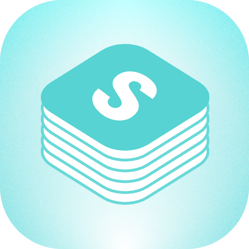

# Stacks Extension for Raycast

Transform your digital footprint into personal intelligence with Stacks.

## Setup Guide

This extension requires an API token from Stacks to access your saved resources.

### How to get your API token:

1. Login to [betterstacks.com](https://betterstacks.com)
2. Open your browser's developer tools:
   - Chrome: Right-click > Inspect or press F12
   - Safari: Enable Developer Menu in Safari > Preferences > Advanced, then Safari > Develop > Show Web Inspector
   - Firefox: Right-click > Inspect or press F12
3. Navigate to the Storage or Application tab
4. Find Cookies > betterstacks.com
5. Look for the `gqlToken` cookie and copy its value
6. Paste this token in the Stacks extension welcome screen

## Features

- **Quick Access**: Find and open your saved links, documents, and more
- **Search**: Easily search through all your saved resources
- **Organize**: View your resources in different layouts (Grid and List views)
- **Actions**: Open links, copy URLs, refresh content, and more

## Commands

- **Search Resources (Grid)**: Browse your Stacks resources in a visual grid layout
- **Search Resources (List)**: View your Stacks resources in a detailed list

## Support

If you encounter any issues or have questions, please visit [betterstacks.com/support](https://betterstacks.com/support) for assistance.

## Privacy

This extension only accesses your Stacks resources with your explicit permission via your API token. Your data is never shared with third parties. The token is stored securely in Raycast's preferences.

## License

MIT