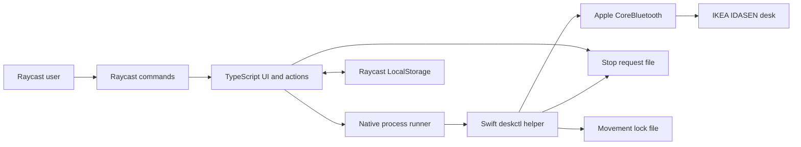

# Architecture

## Overview

The extension separates Raycast user interface code from physical Bluetooth control. A signed Swift helper owns all CoreBluetooth operations.

## Components

### Raycast manifest

`package.json` defines the command entry points and pins the Raycast API to the installed stable runtime.

### Management view

`src/manage-desk.tsx` renders desk status, presets, adjustment actions, custom height input, and recovery actions. It streams native progress into the visible height and toast messages.

### Menu-bar view

`src/desk-menu.tsx` renders an icon-only macOS menu-bar item. Its menu shows the last reported height without opening Bluetooth during startup. It hands movement and save actions to dedicated Raycast commands so work continues after the menu closes. Manual refresh remains available for a current reading.

### Direct commands

The Sit, Stand, Raise, Lower, Stop, Save Sit, and Save Stand entry points call shared functions in `src/quick-command.ts`.

### Domain and persistence

`src/model.ts` defines safe defaults and validates configuration and target heights. `src/storage.ts` stores settings, presets, an explicit desk selection, the last reported height, and a desk-scoped safety acknowledgement through Raycast `LocalStorage`. Each selection has an opaque generation token. Cached events and acknowledgements apply only to that generation, so stale processes cannot change or populate another desk's state.

Movement and status commands require an explicit desk selection. Only discovery can use the Bluetooth name filter. Settings, calibration, restore, and forget operations publish Stop requests before and after changing desk-bound state.

### Native process bridge

`src/native.ts` validates settings, snapshots the selected desk, starts `assets/deskctl`, parses newline-delimited JSON events, and updates desk-scoped cached status.

The bridge uses two support files:

- `stop-request` stores the latest movement request identifier. A newer request cancels an older helper.
- `movement.lock` prevents concurrent movement helpers.

### Bluetooth helper

`native/DeskBLE.swift` discovers nearby desks, connects to the selected desk, resolves required characteristics, reads height, and sends movement commands. It emits `device`, `status`, `progress`, `complete`, and `error` events as JSON lines.

The `discover` operation runs for five seconds. It reports the remembered peripheral, compatible peripherals connected to macOS, and nearby advertisements matching the desk service or name filter. It does not connect to a peripheral or write Bluetooth characteristics.

`scripts/build-native.sh` compiles `arm64` and `x86_64` executables in `.raycast-swift-build`. It combines them with `lipo`, embeds `native/Info.plist`, and applies an ad-hoc signature.

## Movement sequence

1. TypeScript validates the requested target.
2. The bridge snapshots the selected desk and its validated configuration.
3. The bridge verifies the safety acknowledgement for that exact selection.
4. The bridge publishes a unique movement request identifier.
5. An active helper detects the new identifier and stops.
6. The new helper waits up to five seconds for the movement lock.
7. A superseded helper exits without connecting to the desk.
8. CoreBluetooth connects only to the snapshotted desk identifier.
9. The helper reads the current height.
10. The helper wakes and stops the controller before movement.
11. The helper writes the target every 400 milliseconds.
12. Height notifications and explicit reads update progress.
13. The helper sends Stop after two readings within `0.25 cm`.

Movement also stops after cancellation, a stall, a Bluetooth error, or 45 seconds.

## Failure boundaries

- Raycast owns user feedback. The extension owns settings and saved positions.
- The bridge owns process lifecycle and inter-process cancellation.
- The helper owns protocol validation and emergency stop writes.
- The physical controller remains the final stop mechanism.

No layer assumes that a software stop always succeeds.
