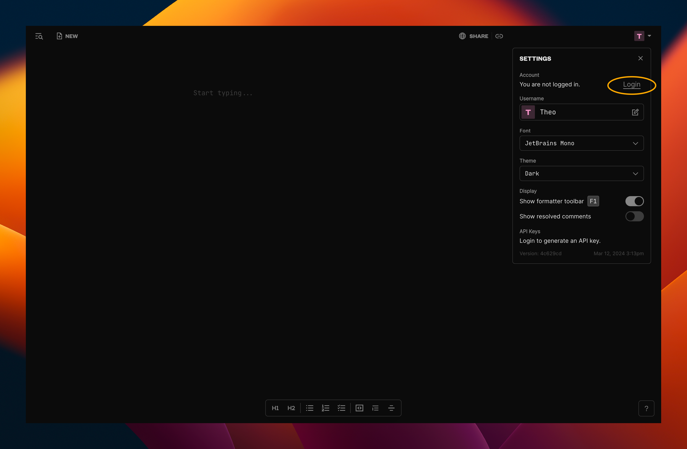
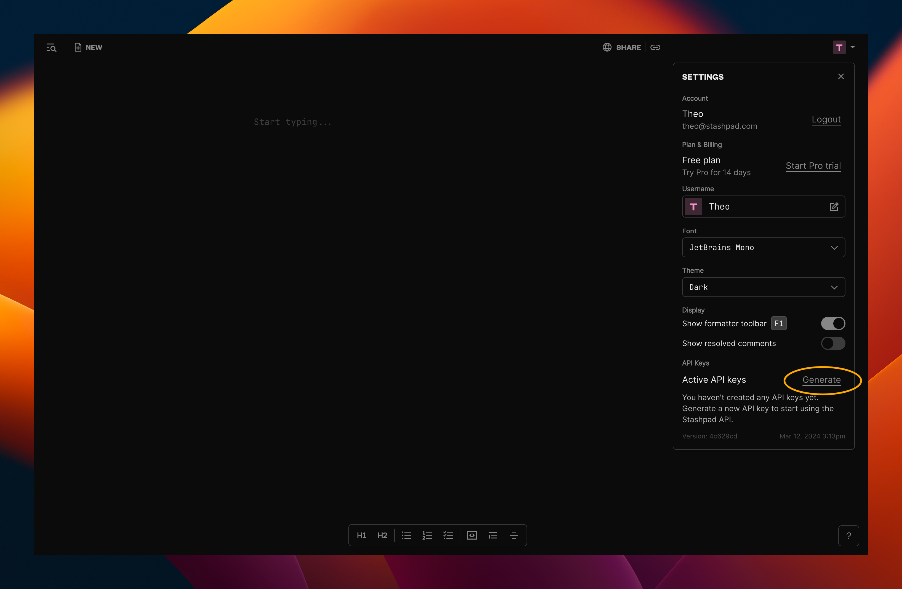
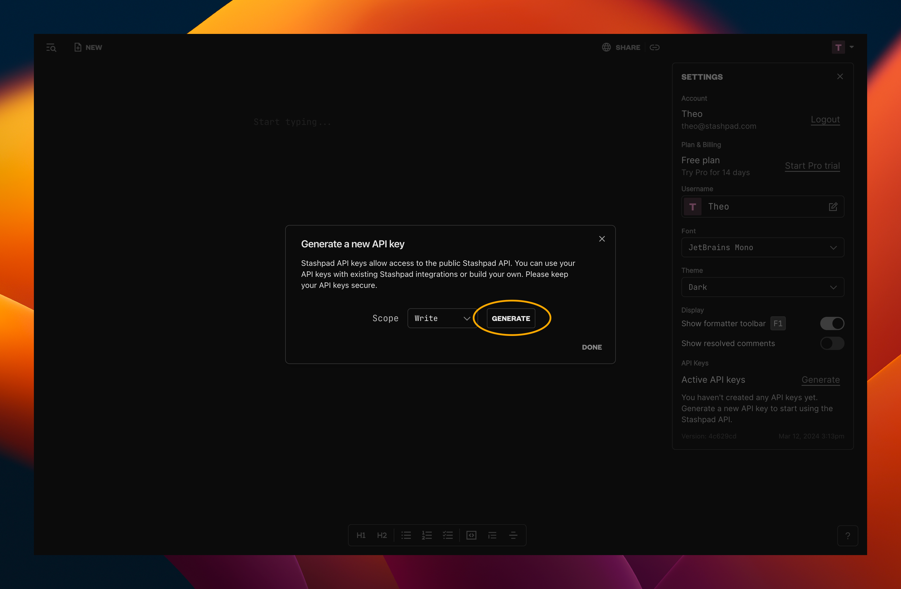
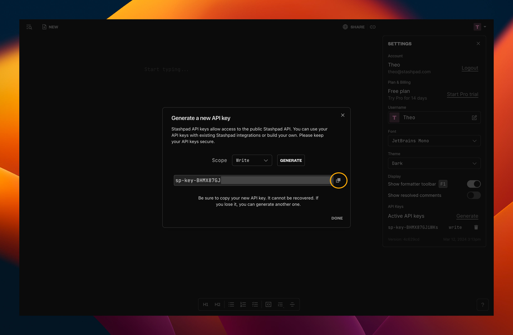

# Stashpad Docs

Create and Search for [Stashpad](https://stashpad.com) Docs.

The Create Doc command creates a new document and opens it in your browser. You don't need a Stashpad Docs account to create documents.

For the Search Docs command, you'll need to provide your API key in order to link your Stashpad Docs account.

### Getting your API Key

Login to your Stashpad Docs account if you haven't already. To do so, open the Settings panel by clicking on your user avatar in the top right and then click on "Login".

Once you're logged in, open the Settings panel, and at the bottom, you'll see an option to generate an API key.

Hit the generate button.

Hit the copy button next to the generated key before closing the modal. 

Paste the key into Raycast, and you're good to go!
