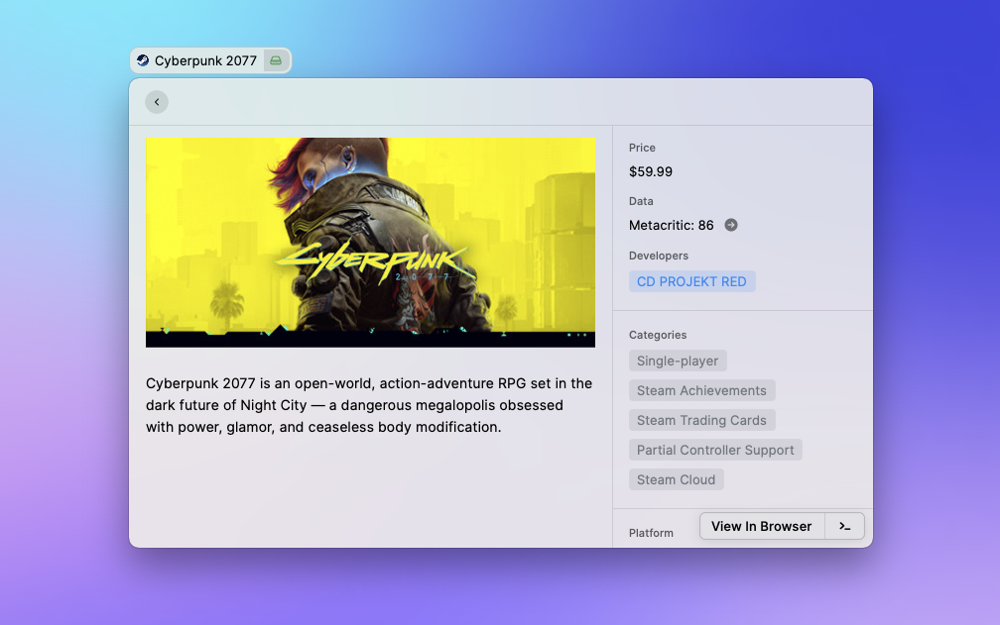
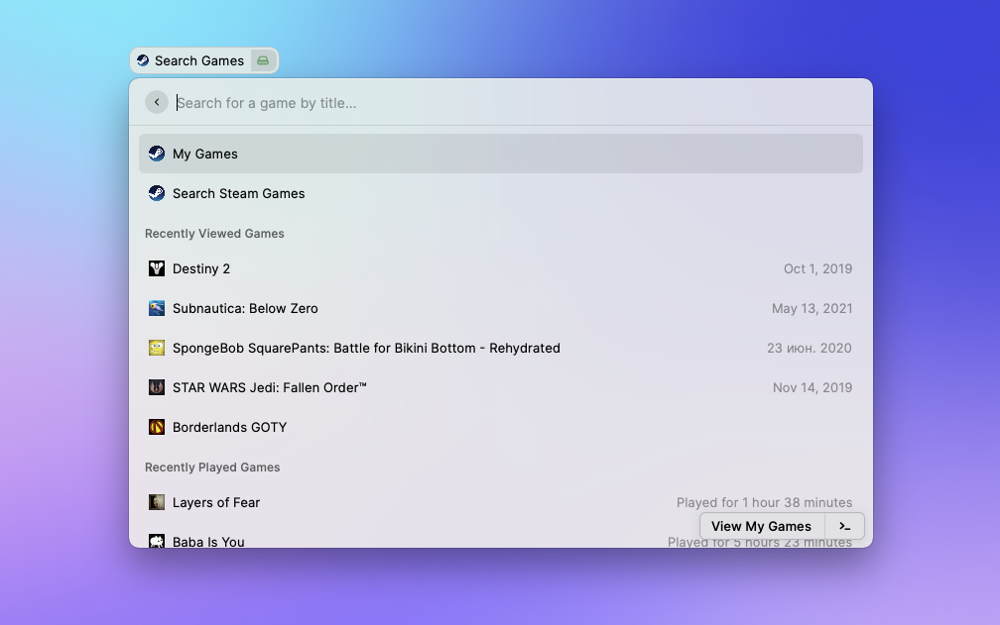

# Steam

Search and view information about any game on steam, as well as games you own.

Get an API token here (optional): https://steamcommunity.com/dev/apikey

Search is powered by this public repo: https://github.com/KevinBatdorf/steam-api

Source repo: https://github.com/KevinBatdorf/steam-raycast

Notes:
- While rare, you may hit the Steam API rate limit. If that's the case, just wait a few moments and try again.
- Sometimes the Steam API sends a random language. There doesn't seem to be any logic to this. Just press escape and try again.
- Sometimes games are removed from Steam yet still show in the API. To avoid extra network costs, the extension will just provide feedback that the game no longer exists.
- Icons will only show if you own the game. Steam doesn't send the icons via the public api.

To run the dev build, you can:

1. Clone the repo
2. Navigate to the directory then run `npm i && npm run build`
3. In Raycast, add the repo via "Add script directory" option on the Extensions
   tab (look for the +)
4. Open an issue here if you get stuck and I'll try to help.

## Features

- Search all games on Steam
- Search only your games
- View details about a game
- Filter your search

## FAQ

- Get an API token here: https://steamcommunity.com/dev/apikey
- What's Raycast? https://www.raycast.com/
- Dev instructions here:
  https://developers.raycast.com/basics/create-your-first-extension
