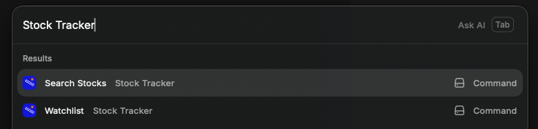
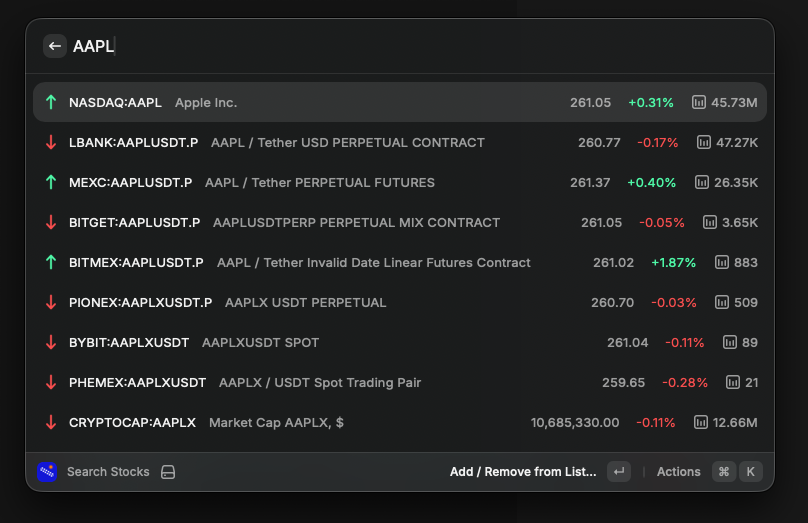
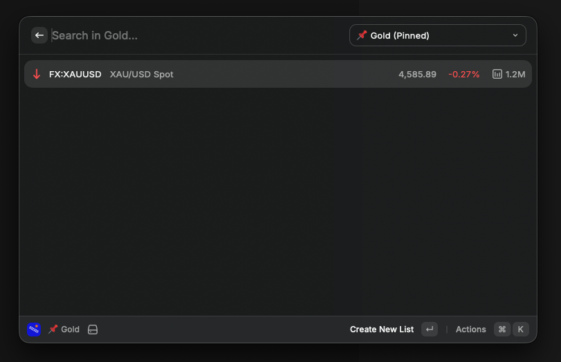

# Stock Tracker

View stock market data in Raycast. Search for individual stocks by name or ticker symbol, and keep track of your portfolio by adding stocks to your list of favorites.

Uses the public Yahoo Finance API, so no authentication or API keys are required.

## Features

- Search for stocks across multiple markets (America, Turkey, Crypto, Forex, etc.)
- Create and manage multiple watchlists
- Pin watchlists for quick access
- View stock prices, changes, and volume
- Customizable column display preferences
- Turkish and English language support
- Add/remove stocks from watchlists
- Copy stock symbols to clipboard

## Usage

### Search Stocks

Search for stocks across all markets. Simply type the stock symbol or company name in Raycast.



### View Stock Details

View detailed information about stocks including price, percentage change, and volume across different exchanges.



### Manage Watchlists

Create and manage watchlists. Pin your favorite watchlist for quick access.



## Commands

- **Search Stocks**: Search for stocks and add them to your watchlist
- **Watchlist**: View and manage your stock watchlists

## Development

```bash
# Install dependencies
npm install

# Run in development mode
npm run dev

# Build for production
npm run build

# Lint code
npm run lint

# Fix linting issues
npm run fix-lint
```

## License

MIT
