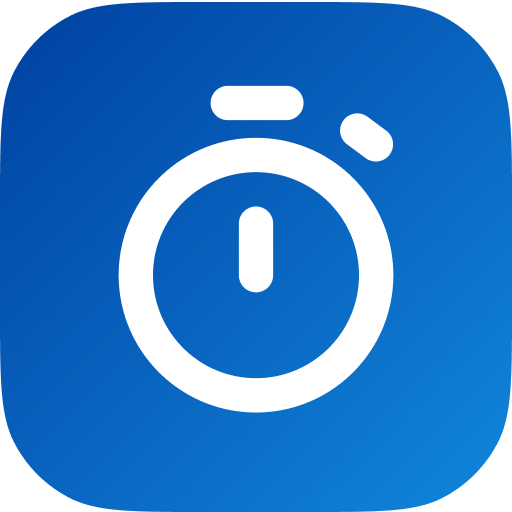

# stopwatch
## why?
In order to track the time it would be handy if you had a little stopwatch at hand I thought. Because raycast is _the tool_ for being handy I thought I would develop a extension for it.
## Get started
Install the extension and enter start or stop stopwatch. After stopping the stopwatch the time will be automatically put into your clipboard so you can quickly use it.

