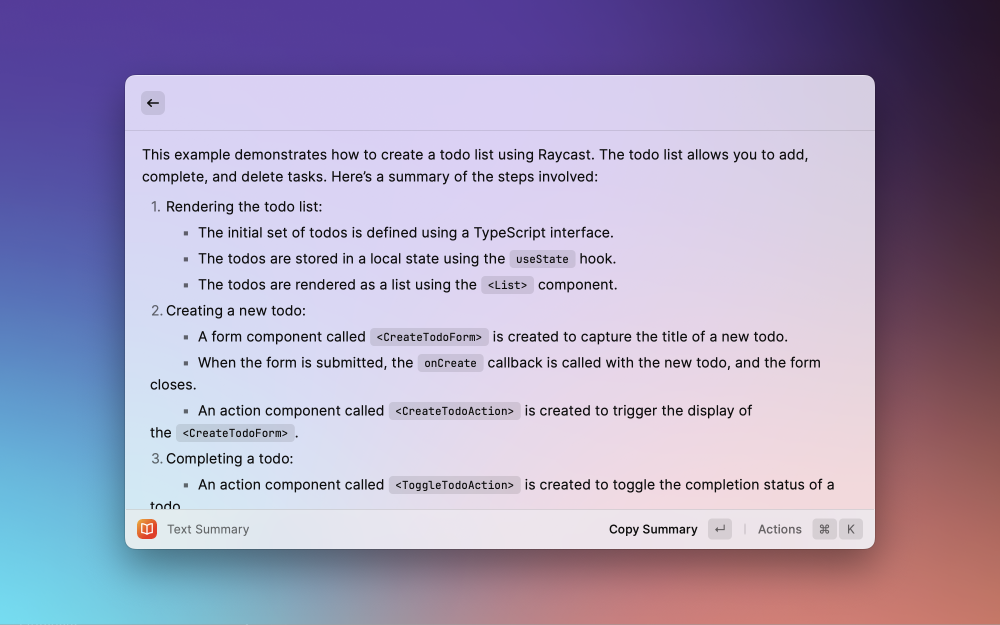
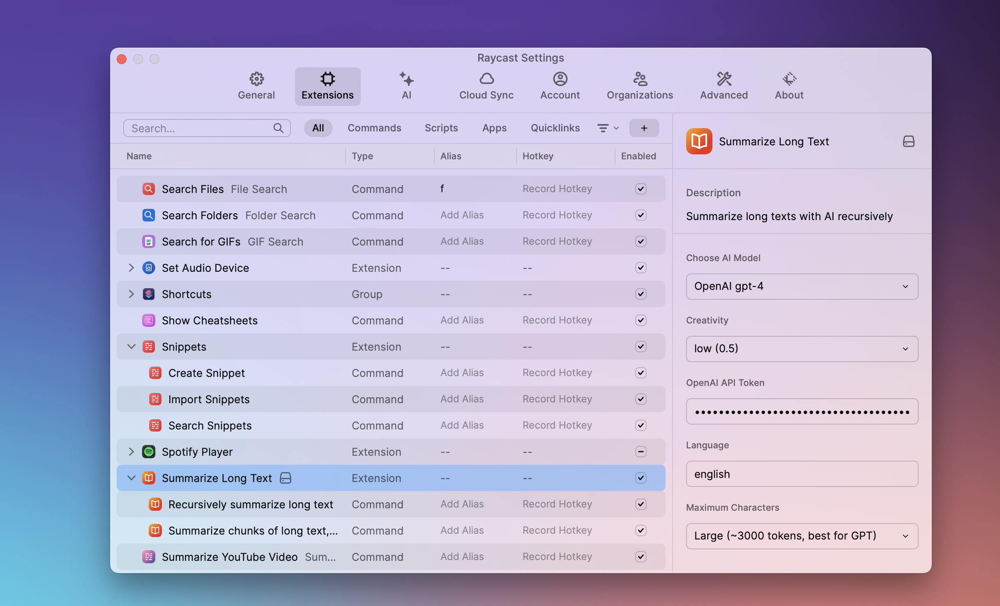

# Summarize Long Text

This tool summarizes long texts that are too large to use with Raycast AI or OpenAI GPT directly. You need to have a [Raycast Pro](https://www.raycast.com/pro) account *or* an [OpenAI API Key](https://platform.openai.com/account/api-keys) to use it.

## 🔨 Commands
There are two commands, both taking selected text as input

`summarizeLongText`: Takes a long text, breaks it into smaller parts and shortens each part. Then combines the shorter parts and creates a final summary.

`summarizeBlocks`: Breaks a long into smaller parts (blocks) and shortens each part. Returns the combined block summaries. Useful to make long texts shorter to fit an AI model, so you can do question and answer interaction with the text.

## ⚙️ Settings
You can set up the tool in several ways:

`Choose AI Model`: Pick between AI models from Raycast and OpenAI (Default: `Raycast AI 4`). *Caution: Using OpenAI costs money each time. The more text and the fancier the model, the higher the cost. Multiple charges can add up if the tool shortens the text in steps.*

`Creativity`: Control how much freedom the AI has when summarizing (Default `Medium`).

`OpenAI Api Token`: If using OpenAI, enter your [OpenAI API key](https://platform.openai.com/account/api-keys) here. (No default value).

`Language`: Set the language for the summary. It can be different from the text, but results may vary. (Default: `English`).

`Maximum Characters`: Decide how long you want the summary to be. Longer summaries may cost more. (Default: `Short`).

## 📸 Screenshots

### Command View

### Results View

### Settings

## 🚀 Contribution and Issues
This is my first project with TypeScript and React. 

If you find problems, please let me know in the "Issues" part of this project page. If you know how to improve this tool, feel free to make changes. 

### TODO
Things i want to do, but haven't managed yet...
<ul>
    <li>MaxChars and Model: Help users pick the right maxChars for their model and check if maxChars fits model cap</li>
    <li>Open in Chat Wait: See if chat can wait for a user to hit "submit."</li> 
    <li>Clipboard and ChatGPT: Make a one-click action to copy result and go to ChatGPT</li>
    <li>Show Pricing: Show pricing in toast (with https://github.com/Cainier/gpt-tokens ?)</li> 
    <li>More Prompts: Support for different prompts (now hardcoded in prompts.ts)?</li>
</ul>

## 🙌 Credits 
A lot of help came from looking at other raycast extensions, especially [Summarize Youtube Video with AI](https://github.com/raycast/extensions/tree/main/extensions/summarize-youtube-video-with-ai) by [iKasch](https://github.com/iKasch/iKasch). I've also had a lot of help from Raycast AI and ChatGPT.