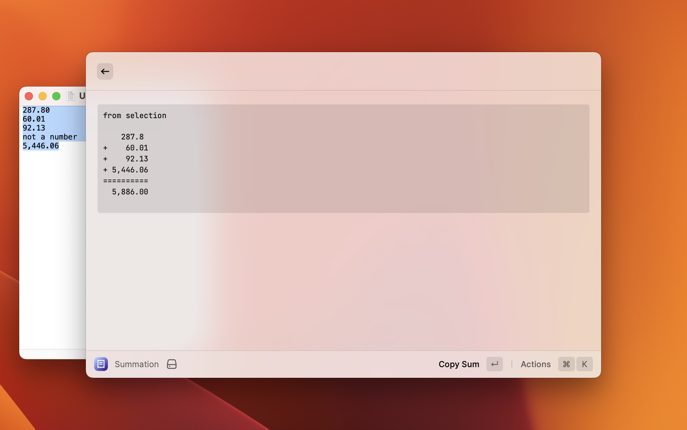
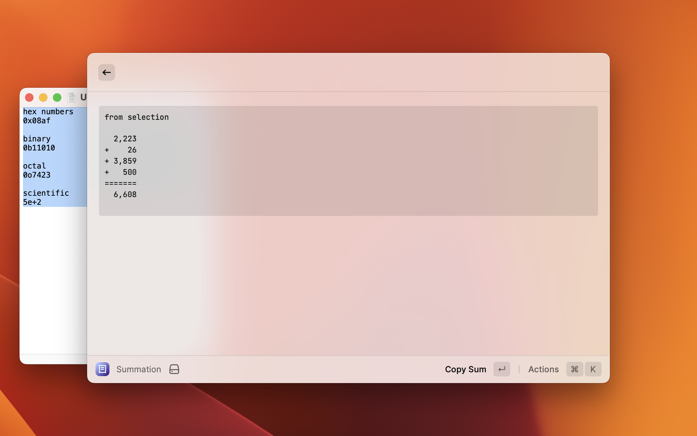

# Summation

Calculate the sum of a list of numbers in the selected text or clipboard.

## Features

* Calculate the sum of the currently selected text
* Calculate the sum of numbers on the clipboard if there is no selected text
* Supports decimal, binary (`0b1001`), octal (`0o7123`) and hexadecimal (`0x08AF`) numbers
* Supports numbers in scientific notation. _e.g._ `12e+2`

