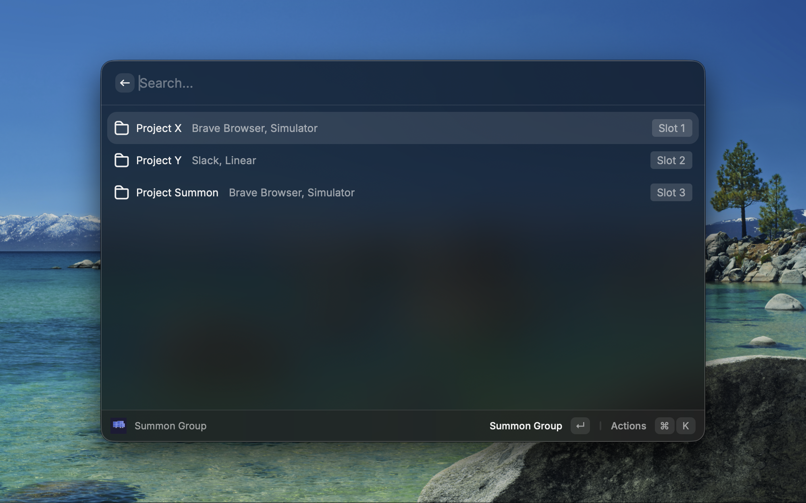
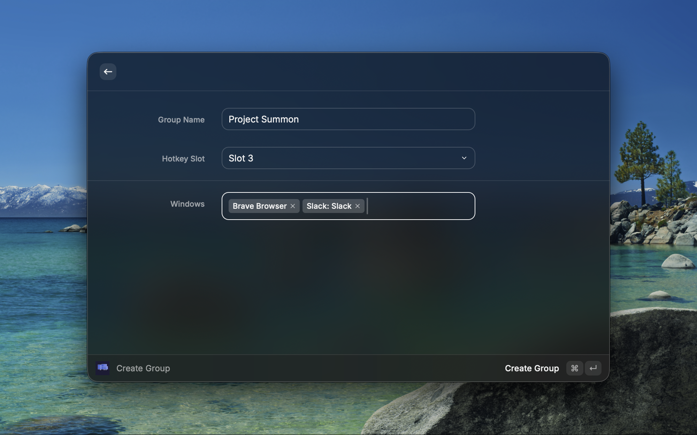

# Summon — Raycast Extension

Summon groups of app windows to the front. Define named groups and switch between them instantly — no manual alt-tabbing through a dozen apps.

| Summon Group | Create Group |
|---|---|
|  |  |

## Features

- **Create Groups** — Pick from all currently open windows and group them into a named group.
- **Summon Groups** — One action brings all group windows to the front, so you jump straight into context.
- **Open Windows** — The Summon Group list shows all open windows below your groups. Type to search by app name or window title and switch to any window instantly — even if it's not in a group.
- **Browser Tabs** — Tabs from Chrome, Brave, Safari, Edge, and Arc appear as searchable items grouped by window. Jump directly to any tab without switching to the browser first.
- **Reorder Groups** — Arrange groups in the list with `Cmd+Opt+Arrow`. The list order doubles as your quick-access order.
- **Smart Window Matching** — Matches windows by ID first, then by title substring, then by bundle ID as a fallback. Handles windows that change titles (e.g., VS Code, browsers).
- **Layout Restore** — Opt-in per group: save and restore window positions and sizes when summoning. Windows return to exactly where they were.
- **App Relaunch** — Opt-in per group: if an app has been closed, Summon offers to relaunch it. After launching, windows are positioned and raised automatically.
- **Snapshot Layout** — Quick action to re-capture current window positions without editing the group. Rearrange your windows, snapshot, and future summons use the new layout.
- **Edit & Delete Groups** — Update window selections or remove groups at any time.
- **Data Migration** — Storage format upgrades automatically across versions, so groups are never lost.

## Commands

| Command | Description | Mode |
|---|---|---|
| **Create Group** | Open a form to name a group and pick which windows belong to it | View |
| **Summon Group** | List all groups, open windows, and browser tabs — summon a group, switch to any window, or jump to a tab | View |

The `Summon Group` command also accepts a `groupName` argument for scripting or Quicklinks.

## Recommended Setup

For the fastest workflow, bind **Summon Group** to a double-press hotkey (e.g., double-tap `Cmd`):

1. Open **Raycast Settings > Extensions > Summon > Summon Group**
2. Set the hotkey to your preferred trigger (double-tap `Cmd` works great)
3. Reorder your groups so the most-used ones are at the top
4. When you trigger the hotkey, the group list appears — press a number key or arrow + Enter to summon
5. Or start typing to search across groups, open windows, and browser tabs

This replaces the old hotkey-slot system with a more flexible approach that scales to any number of groups and doubles as a universal window and tab switcher.

## Layout Restore

When creating or editing a group, enable **Restore Layout** to save window positions and sizes. On summon:

1. Each window is moved to its saved position and resized
2. If a saved monitor is disconnected, the window is raised without repositioning (prevents off-screen placement)
3. Use **Snapshot Layout** (`Cmd+S` in the group list) to update positions after rearranging windows

## App Relaunch

When creating or editing a group, enable **Relaunch Apps** to offer relaunching closed apps on summon:

1. A confirmation dialog lists the closed apps
2. If confirmed, each app is relaunched via its bundle ID
3. Summon waits up to 5 seconds for apps to appear, then positions/raises their windows
4. If declined, only the already-running windows are raised

**Note:** Some apps run in the background without a window (e.g., Docker, menu bar apps). If an app's process is running but its window is closed, Summon sees it as "already running" and cannot recover the window automatically. You'll need to open the window manually from the app's menu bar icon.

## Requirements

- **macOS** (uses macOS-specific window management APIs)
- **Accessibility permission** — The Swift helper uses the Accessibility API to raise windows. macOS will prompt you to grant permission the first time you summon a group. Go to **System Settings > Privacy & Security > Accessibility** and enable Raycast.
- **Xcode Command Line Tools** — Required to compile the Swift helper. Install with:
  ```sh
  xcode-select --install
  ```

## Installation

### From Source

```sh
git clone https://github.com/jamalx31/raycast-summon.git
cd raycast-summon
npm install
npm run build
```

Then open Raycast, run **Import Extension**, and select the project directory.

## How It Works

The extension uses a small Swift helper binary (`swift-helper/window-helper.swift`) that accesses macOS internals:

1. **Window enumeration** — Uses `CGWindowListCopyWindowInfo` and private `CGSCopySpacesForWindows` to list all on-screen windows with their space assignments.
2. **Display/space info** — Uses private `CGSCopyManagedDisplaySpaces` to map monitors to their desktops.
3. **Window raising** — Uses the Accessibility API (`AXUIElement`) to raise specific windows to the front by window ID, title match, or bundle ID.
4. **Window positioning** — Uses `AXUIElementSetAttributeValue` with `kAXPositionAttribute` and `kAXSizeAttribute` to move and resize windows.
5. **App launching** — Uses `NSWorkspace.shared.openApplication` to relaunch closed apps by bundle ID.

Background and agent apps (menu bar utilities, system helpers) are filtered out using `NSRunningApplication.activationPolicy` — only regular foreground apps appear in the window list.

Browser tabs are fetched asynchronously via **JXA** (JavaScript for Automation / `osascript`). Each supported browser (Chrome, Brave, Safari, Edge, Arc) exposes its tab model through the macOS scripting bridge. Tab discovery and switching run in the background so they never block the UI.

These private CGS APIs (loaded via `dlsym` from the SkyLight framework) are well-known and used by many window management tools (yabai, Amethyst, etc.). They may break between major macOS versions.

Groups are stored as JSON in Raycast's support directory.

## Limitations

- **No Mission Control / Spaces switching** — There is no public macOS API for switching between Spaces (virtual desktops). Tools like yabai that can do this require System Integrity Protection (SIP) to be disabled, because Dock.app owns the privileged WindowServer connection for space operations.
- **Cross-space window raising** — Whether a window on another Space gets pulled to the current Space depends on the user's **"When switching to an application, switch to a Space with open windows for the application"** setting in System Settings > Desktop & Dock > Mission Control.
- **Windows are raised, not exclusively shown** — Other windows remain behind the summoned group. This is a raise-to-front operation, not a hide-everything-else operation.
- **Window IDs are ephemeral** — macOS window IDs change when apps restart. The extension falls back to title substring matching, then bundle ID matching when saved window IDs are stale.
- **Menu bar / background apps** — Apps that run in the background or menu bar (Docker, Bartender, etc.) may have their process running while their window is closed. Summon cannot recover these windows because the app reports as "already running." Open the window from the app's menu bar icon instead.
- **Private CGS APIs may break between macOS versions** — The SkyLight framework APIs are undocumented and have broken on macOS 14.5, 15.0, and 15.4 in the past. If the helper stops working after a macOS update, recompiling with `npm run build-helper` usually resolves it.
- **Accessibility permission required** — Without it, the extension can list windows but cannot bring them to the front.
- **Some apps may not support positioning** — If an app doesn't support AXUIElement position/size attributes, the window will still be raised but not repositioned.

## Development

### Prerequisites

- Node.js (latest LTS)
- npm
- Xcode Command Line Tools (`xcode-select --install`)

### Setup

```sh
git clone https://github.com/jamalx31/raycast-summon.git
cd raycast-summon
npm install
```

### Build the Swift Helper

The native helper must be compiled before the extension can work:

```sh
npm run build-helper
```

This compiles `swift-helper/window-helper.swift` and copies the binary to `assets/`.

### Run in Development

```sh
npm run dev
```

This starts Raycast's development server with hot reload for the TypeScript code. Note: changes to the Swift helper require re-running `npm run build-helper`.

### Full Build

```sh
npm run build
```

This compiles the Swift helper and then builds the Raycast extension.

### Lint

```sh
npm run lint
npm run fix-lint
```

### Project Structure

```
├── assets/
│   ├── extension-icon.png       # 512x512 extension icon
│   └── window-helper            # Compiled Swift helper (generated)
├── swift-helper/
│   └── window-helper.swift      # Native macOS helper source
├── src/
│   ├── create-group.tsx         # Create/edit group form
│   ├── summon-group.tsx         # Group list + open windows + summon/reorder
│   └── utils/
│       ├── browser-tabs.ts      # Browser tab discovery/switching via JXA
│       ├── native.ts            # Swift helper bridge (spawn + JSON parse)
│       ├── storage.ts           # JSON file storage with migrations
│       └── types.ts             # TypeScript interfaces
├── package.json
└── tsconfig.json
```

## License

MIT
