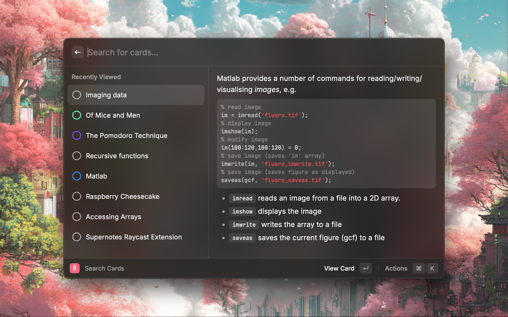

# Supernotes

Interact with [Supernotes](https://supernotes.app/), the knowledge management and note-taking app. Search your card library, preview your cards in Raycast and open a selected card directly in the Supernotes desktop app. You can also quickly create simple cards within Raycast.

## Commands

- **Quick Daily** – send a simple piece of text to your Daily card on Supernotes
- **Send Clipping** – send currently selected text or the clipboard to any Supernotes card
- **Search Cards** – search for cards on Supernotes, and perform various quick actions
- **Create Card** – quickly create a card with a simple name/content form

## Tools

- **create-card** – create a card with a simple name/content form
- **append-card** – append content to an existing card
- **search-cards** – search for cards on Supernotes

## Setup

Please generate a Supernotes API Key from within your 'API & Integrations' Settings in Supernotes. If you require additional help, you can follow [this in-depth guide](https://docs.supernotes.app/en/articles/5257176-api-access).
