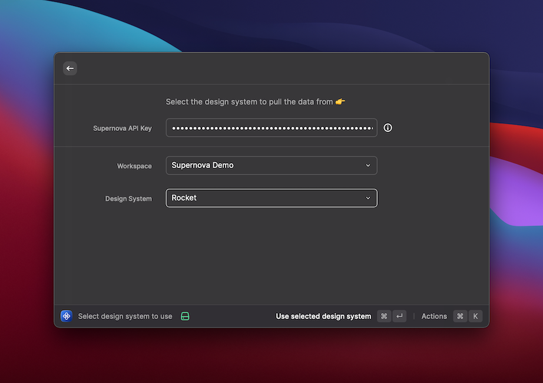

This Raycast extension allows you to access your [Supernova.io](https://supernova.io/) design system contents like tokens, assets and component directly from your command bar. Additionally, you can search through your entire knowledge library using its advanced documentation search and reader.

## Initial Setup

First, you'll need API key to access your design system data. If you've already signed in to Supernova, [continue here](https://cloud.supernova.io/user-profile/authentication), otherwise [sign in](https://cloud.supernova.io/) and navigate to `Profile > Authentication > New Token`. Copy the token from the Cloud and select any Supernova search command inside Raycast to open initial onboarding!

## Selecting a design system

After you have provided your API token, you'll have the option to select a workspace and design system. You have access to all workspaces and design systems that are allowed under your API key. Select one and you can access all your data right away.

If you ever need to change design system, use command `Select Design System` to show this view again.

## Searching for data

You can currently search for `Assets`, `Tokens`, `Components` and `Documentation` from one specific design system. Use `Search Assets/tokens/components/documentation` command to access your data.

## Data Security

All your data are transfered securely using SSL and only live for the duration of you working with the extension. Data are in some cached locally on your machine and your API access key is security locked away in Mac keychain. If you want to remove all data and throw away the API key, use `Logout` command which will clear everything for you.

For additional information about Raycast security in general, [read developer documentation](https://developers.raycast.com/information/security). Finally, our extension is open source, so you can go through the [extension code](https://github.com/raycast/extensions/tree/main/extensions/supernova) yourself.

## Configuration options

You can configure additional behaviors of the extension under Raycast extension preferences (`cmd` + `,` > `Supernova`). There are following options currently available:

### Preferred token name style

When selected, allows you to control how your tokens will named with copied to clipboard. Defaults to `camelCase` which will convert your tokens from `Palette / Light / Red / 50` to `paletteLightRed50`.

### Primary documentation action

When selected, allows you to control what happens when you invoke default action of documentation page. Currently, you can open pages in Raycast as markdown (default) or open your live documentation site.

## Reporting issues & ideas!

Has we forgotten something? Did you find something that doesn't work for you? Let us know and [create an issue](https://github.com/raycast/extensions/issues/new/choose)!

## Authors

This extension was created by [Supernova.io](https://supernova.io/) crew, [Jiri Trecak](https://twitter.com/JiriTrecak) and [Jan Toman](https://twitter.com/HonzaTmn). Reach out if you want to talk about design systems, [Supernova.io](https://supernova.io/) or anything about this particular extension! You can also find us at [Supernova community](https://community.supernova.io), always lurking!