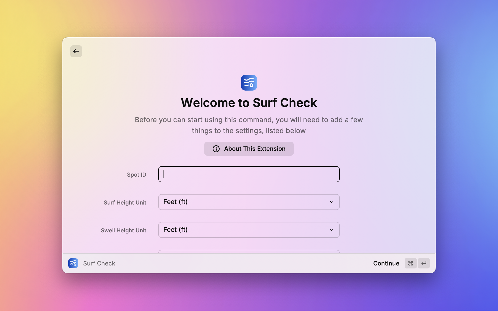
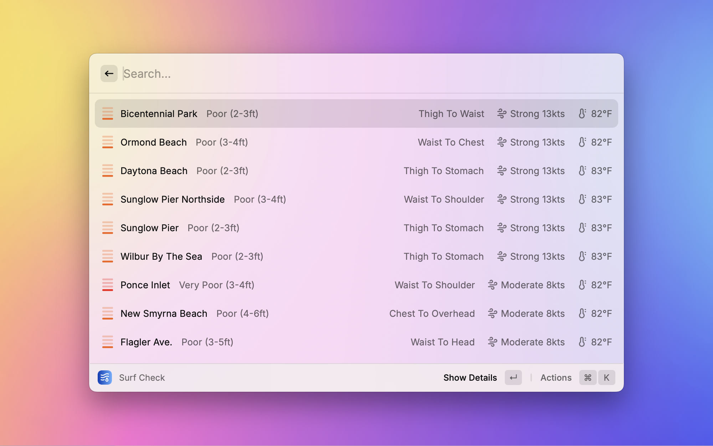
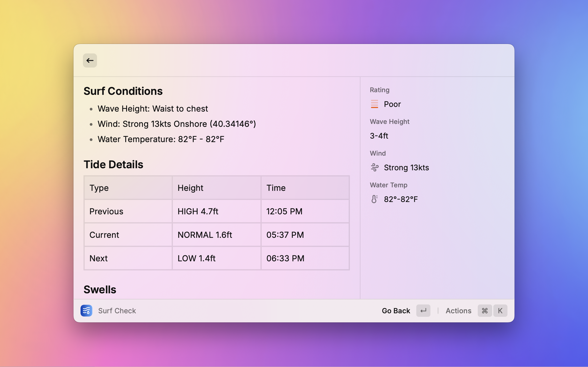

# Surf Check Raycast Extension

## Overview

Surf Check is a Raycast extension that provides quick access to surf conditions and forecasts for your nearby surf spots. Using data from Surfline, this extension allows you to check wave heights, wind conditions, water temperature, and more.

## Features

- View a list of nearby surf spots based on your preferred location (spot ID)
- See at-a-glance information including wave height, wind conditions, and water temperature
- Detailed view for each spot with comprehensive surf data
- Access to forecaster reports and swell information
- Direct links and quick actions to open Surfline reports for each spot
- Customizable measurement units:
  - Surf height (ft/m)
  - Swell height (ft/m)
  - Tide height (ft/m)
  - Wind speed (kts/km/h/m/s)
  - Temperature (°F/°C)

## Screenshots

## How to Use

### Setting Up

1. Install the Surf Check extension in Raycast
2. Set your preferred spot ID in the extension preferences
3. example: https://www.surfline.com/surf-report/lower-trestles/${spotId} | spotId is the numbers at the end of the url
4. Configure your preferred measurement units in the extension preferences:
   - Choose between feet (ft) or meters (m) for surf heights
   - Choose between feet (ft) or meters (m) for swell heights
   - Choose between feet (ft) or meters (m) for tide heights
   - Choose between knots (kts), km/h, or m/s for wind speed
   - Choose between Fahrenheit (F) or Celsius (C) for temperature

### Checking Surf Conditions

1. Open Raycast and type "Surf Check"
2. You'll see a list of nearby surf spots with basic information:
   - Spot name
   - Current conditions (e.g., Fair, Good)
   - Wave height range (in your preferred unit)
   - Wind speed and description (in your preferred unit)
   - Water temperature (in your preferred unit)

### Viewing Detailed Spot Information

1. Select a spot from the list and press Enter
2. The detailed view includes:
   - Comprehensive surf conditions
   - Tide information
   - Swell details
   - Forecaster report (if available)
   All measurements are displayed in your chosen units.

### Additional Actions

- From the spot list or detailed view, you can open the full Surfline report in your browser

## Data Source

All surf data is provided by Surfline. This extension is not officially associated with Surfline.

## Feedback and Support

If you encounter any issues or have suggestions for improvement, please file an issue on the GitHub repo.
