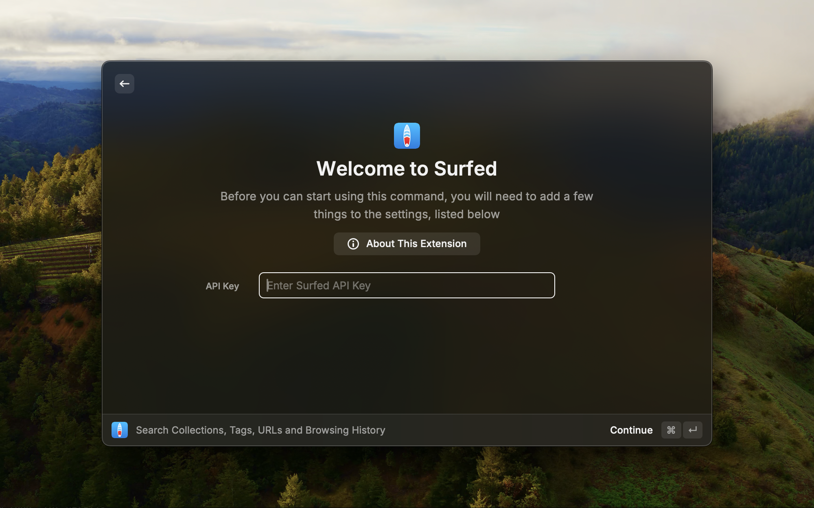
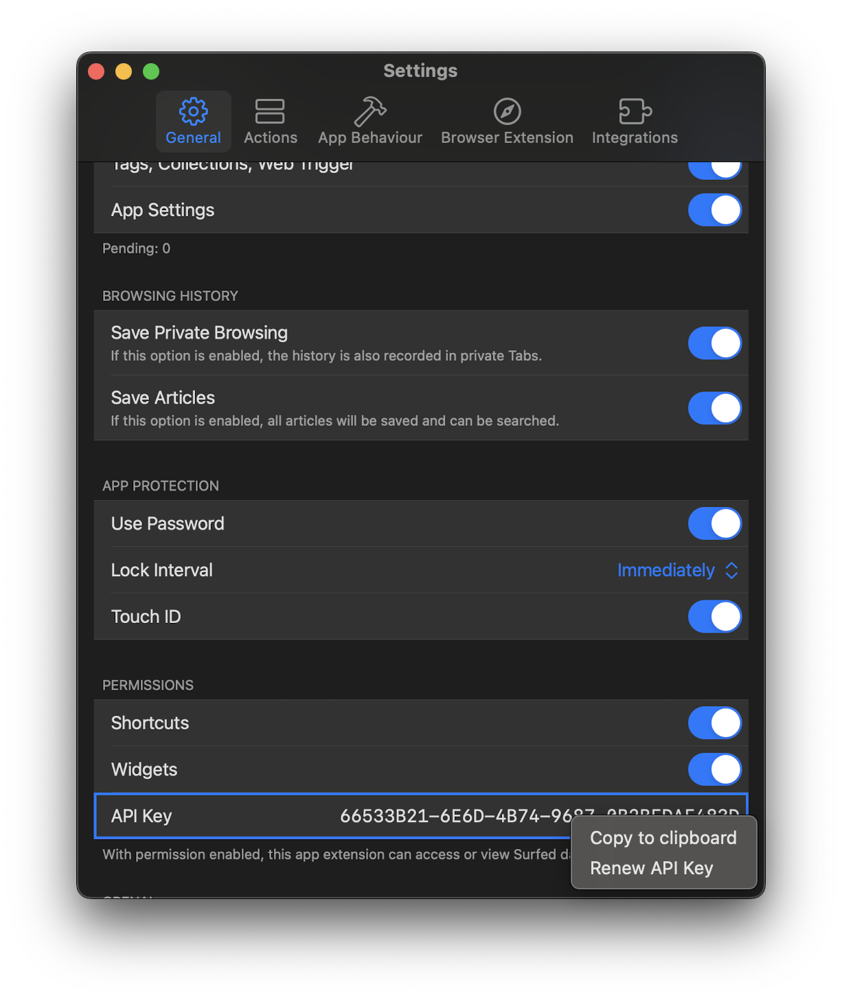

# Surfed

Surfed is a unified browser history and bookmark manager, as well as a web automation tool for macOS and iOS. Search and filter your browsing history using multiple search terms and full-text search.

With the Raycast extension you can search your Collections, Tags, URLs and Browsing History in Surfed and open the link directly in your Browser or Surfed.

For more information about Surfed visit [surfed.app](https://surfed.app).

## Which filter types are available to search in the browser history, websites, tag and collection lists?

### Filter

| **Filter**                                | **Shortcut**          |
| ----------------------------------------- | --------------------- |
| Key Fields (Title, URL, Meta Description) | a:<code>{term}</code> |
| URL                                       | u:<code>{term}</code> |
| Title                                     | t:<code>{term}</code> |
| Meta Description                          | m:<code>{term}</code> |
| Tag                                       | #<code>{term}</code>  |
| Note                                      | n:<code>{term}</code> |
| Article                                   | c:<code>{term}</code> |
| Author                                    | p:<code>{term}</code> |
| Language                                  | l:<code>{term}</code> |

Replace <code>{term}</code> with your search string.
Add a <code>!</code> before the shortcut to negate the filter e.g. <code>!u:{term}</code>.

### State

| Filter       | Shortcut |
| ------------ | -------- |
| Flagged      | :f       |
| Favorited    | :s       |
| Private Mode | :f       |
| Listened     | :l       |
| Listening    | :lg      |
| Read         | :r       |

Add a <code>!</code> before the shortcut to negate the filter e.g. <code>!u:{term}</code>.

### Date and Time

| Filter        | Shortcut               |
| ------------- | ---------------------- |
| Today         | :t                     |
| Yesterday     | :ld                    |
| Current Week  | :w                     |
| Current Month | :m                     |
| Current Day   | :d                     |
| Current Year  | :y                     |
| Last Week     | :lw                    |
| Last Month    | :lm                    |
| Last Day      | :ld                    |
| Last Year     | :f                     |
| Day           | da:<code>{1-31}</code> |
| Month         | mo:<code>{1-12}</code> |
| Year          | ye:<code>{year}</code> |
| Weekday       | wd:<code>{1-7}</code>  |
| Morning       | :tm                    |
| Afternoon     | :ta                    |
| Evening       | :te                    |
| At Night      | :tn                    |

Add a <code>!</code> before the shortcut to negate the filter e.g. <code>!u:{term}</code>.
You can add multiple search terms add once e.g.:
<code>u:foo.bar t:Lorum !c:Ipsum :ld :tm</code>
This searches for <em>URLs</em> containing <em>foo.bar</em>, <em>title</em> containing <em>Lorum</em>, <em>article</em> not containing <em>Ipsum</em> visited <em>yesterday morning</em>.

## Configuration

If Surfed is protected by a password (<code>Use Password</code> enabled in settings), you have to enter the Surfed API-Key (found in  <code>Surfed.app > Settings > API-Key </code>) in the Raycast preferences to get search results.
Otherwise, if Surfed is not protected by a password (<code>Use Password</code> disabled in settings), leave the API-Key setting empty.

Open [Settings](surfed://settings/) in Surfed.app (if the app is installed), copy the API-Key and enter it in Raycast.

