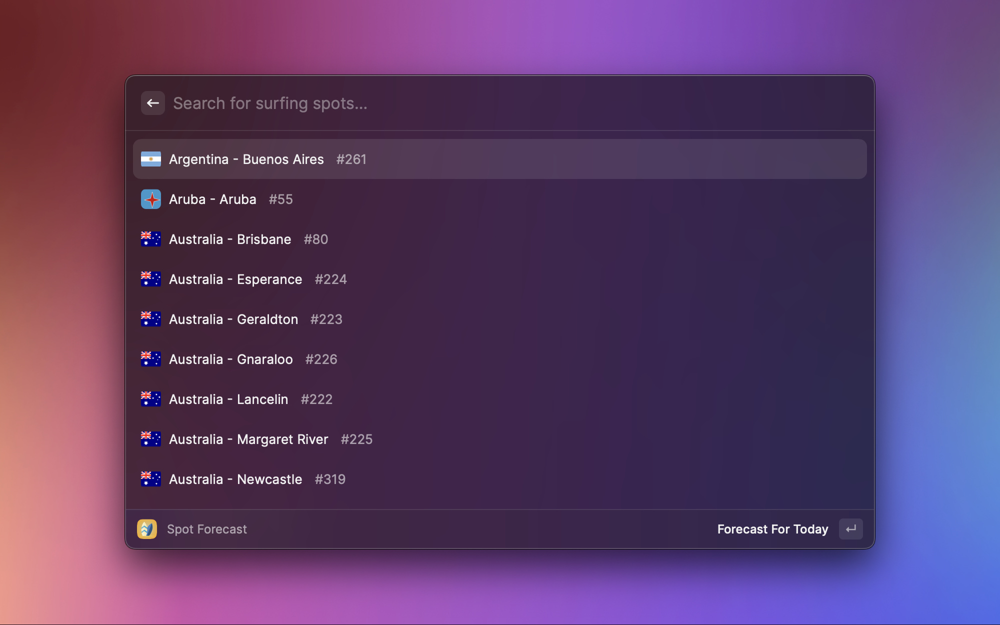
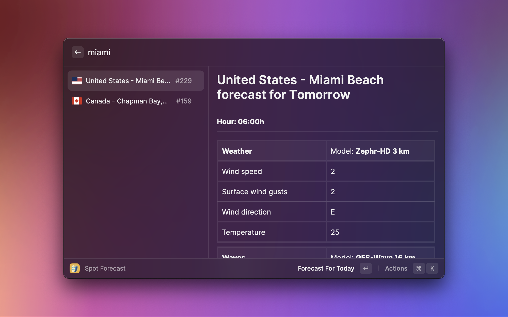
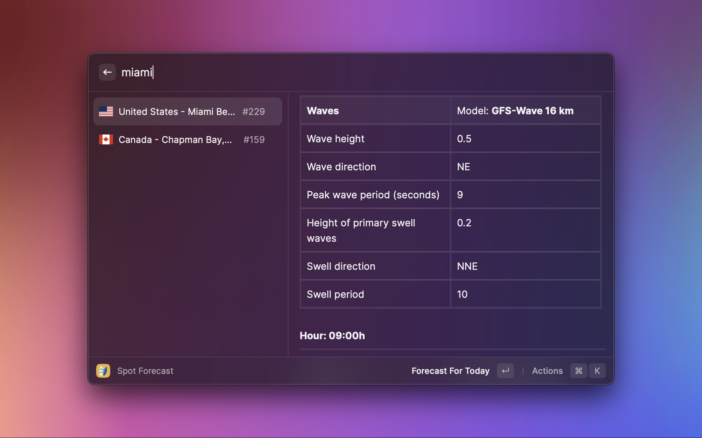
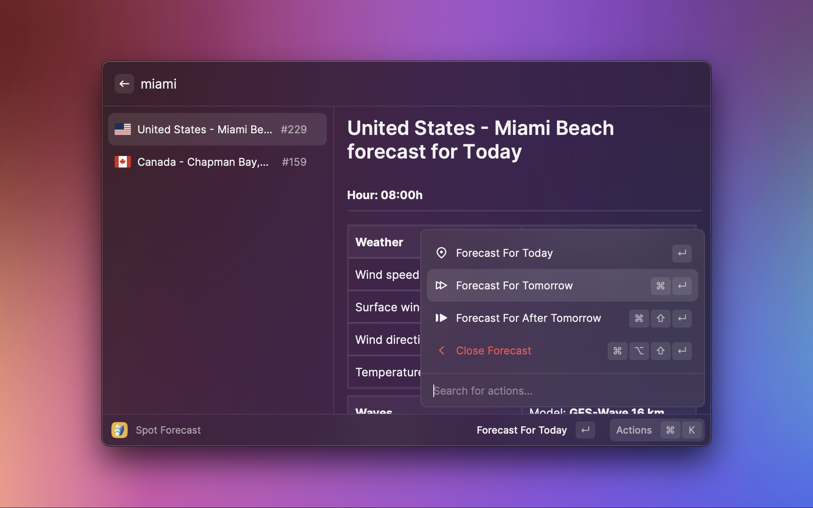

# Surfs Up

Search the weather and the ocean conditions in your favorite surfing spots. We'll let you know if it's good for surfing!

## Where's the data from?

All data is currently being fetched from [Windguru](https://www.windguru.cz). Windguru employs multiple data models for both weather and waves, and depending on the spots chosen by you, different models may be chosen to provide you with weather and wave information.
In future versions of the extension I'm planning to cross different services so that the forecasts may be more reliable. It's a work in progress, but with your feedback we can make it faster.

If you have any tips so that the forecasts for surfing can be better presented to you through the extension, email me at [david.alecrim1@gmail.com](mailto:david.alecrim1@gmail.com) and let's talk!

## Screenshots

# FAQ

## The spot I want is not on the list

Currently Surfs Up only supports the mainstream locations from [Windguru](https://www.windguru.cz). The reason for this is that the sea data coming from these locations is more reliable and there are many other spots in Windguru where sea data isn't even present.
To provide a better service, it was defined that the extension would start with less places, but with more quality data.

## The forecast is not accurate

Unfortunately, forecasts are always prone to failure. Mathematically we're still far from predicting conditions just right about the weather and the sea.
Still, if you believe that the forecast is truly far off, email me at [david.alecrim1@gmail.com](mailto:david.alecrim1@gmail.com) with a screenshot of the forecast so that I can try to improve the forecast provided to you.

## The flag for my country is wrong

I AM SORRY. Please email me at [david.alecrim1@gmail.com](mailto:david.alecrim1@gmail.com) so that I can fix it!
