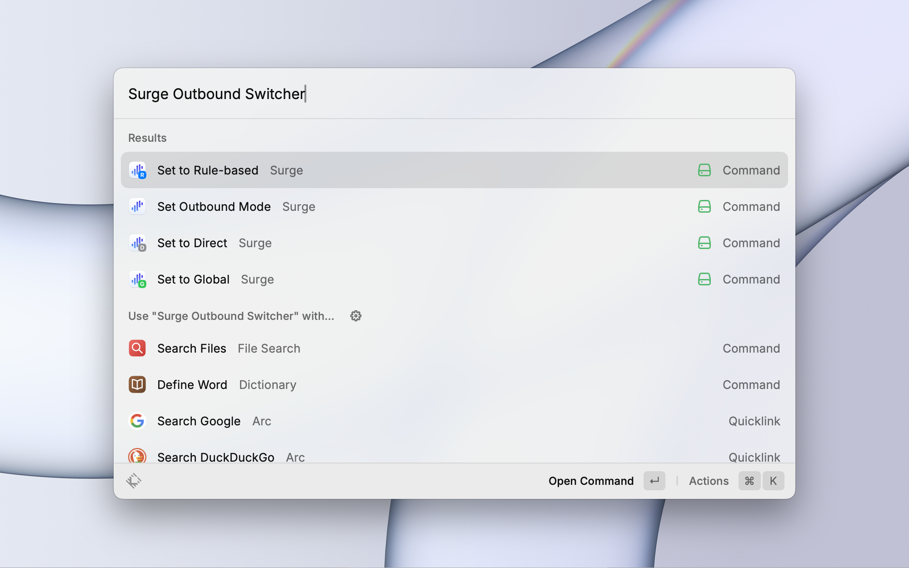

  

&nbsp;

# Surge Outbound Mode Switcher

A Raycast extension for quickly switching Surge's outbound mode without using HTTP API.

## Features

This extension uses AppleScript to communicate with Surge, providing the following features:

- Instant switch to Direct mode
- Instant switch to Global Proxy mode
- Instant switch to Rule-based Proxy mode

## Usage

Search for the following commands in Raycast:

- `Set to Direct`
- `Set to Global`
- `Set to Rule-based`
- `Set Outbound Mode`

## Requirements

- MacOS
- Surge installed and running

## Notes

- Make sure to authorize Raycast to control Surge application using AppleScript.
- Make sure manually activate the Surge menu once after launch.
