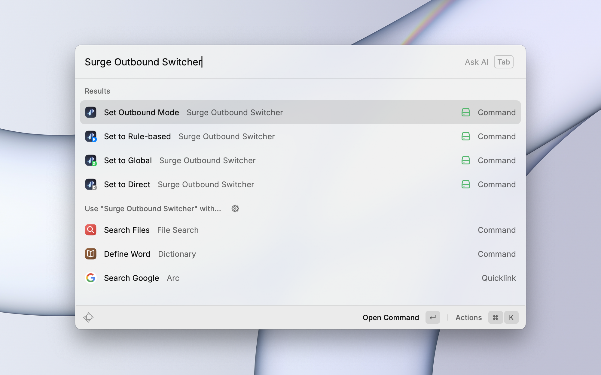

  

&nbsp;

# Surge Outbound Mode Switcher

A Raycast extension for quickly switching Surge's outbound mode without using HTTP API.

## Features

This extension uses AppleScript to communicate with Surge, providing the following features:

- One-click switch to Direct mode
- One-click switch to Global Proxy mode
- One-click switch to Rule-Based Proxy mode

## Usage

Search for the following commands in Raycast:

- `Set to Direct`
- `Set to Global`
- `Set to Rule-Based`

## Requirements

- MacOS
- Surge installed and running

## Notes

Make sure to authorize Raycast to control Surge application using AppleScript.
