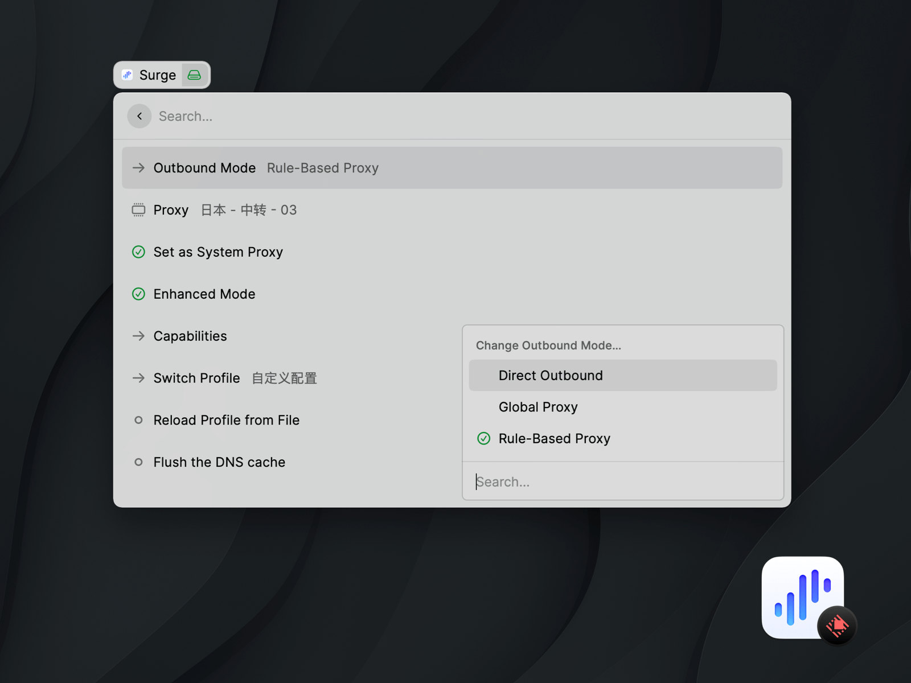
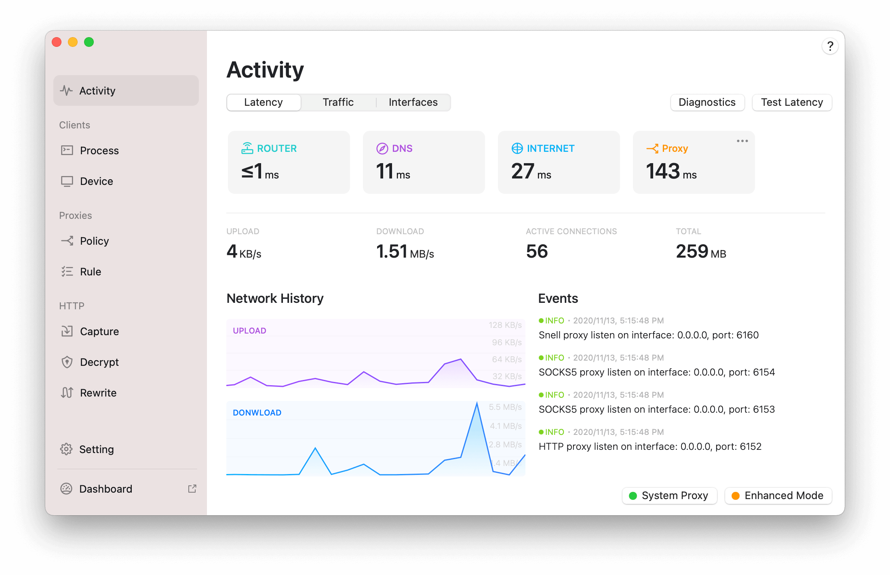

# Surge for Raycast

[Surge](https://nssurge.com/) is a web development and proxy utility. It is designed for developers and therefore requires professional knowledge to use.

**Surge for Raycast** is an **unofficial** launcher extension to help you handle specific Surge features from Raycast app.

## Features

- High Performance, Stability, and Efficiency: Surge can smoothly handle all network traffic with industrial-grade stability using minimum system resources.
- Flexible Rule System: You can write forwarding rules based on a domain name, IP CIDR, GeoIP, etc. Surge can automatically proxy requests to other servers using HTTP/HTTPS/SOCKS5/SOCKS5-TLS/Shadowosocks protocols.
- Proxy Group: You may categorize several proxies as a group, and a policy will be employed in accordance with the grouping. Proxy group can be configured as Auto Speed Test (select policy based on benchmarking URL access speed), SSID (select policy based on Wi-Fi SSID), and manual-select.
- HTTP Rewrite: You can rewrite HTTP/HTTPS requests to another URL using customized rules, or block the requests;
- Enhanced Mode: Surge can set up a virtual network interface to handle all network traffic for applications that do not explicitly support web proxy.
- Click [here](https://manual.nssurge.com/) to find more features...

## Understanding Surge

Surge has officially published an guide book to help you understand it.

- English version: [https://manual.nssurge.com/book/understanding-surge/en/](https://manual.nssurge.com/book/understanding-surge/en/)
- Chinese version: [https://manual.nssurge.com/book/understanding-surge/cn/](https://manual.nssurge.com/book/understanding-surge/cn/)
