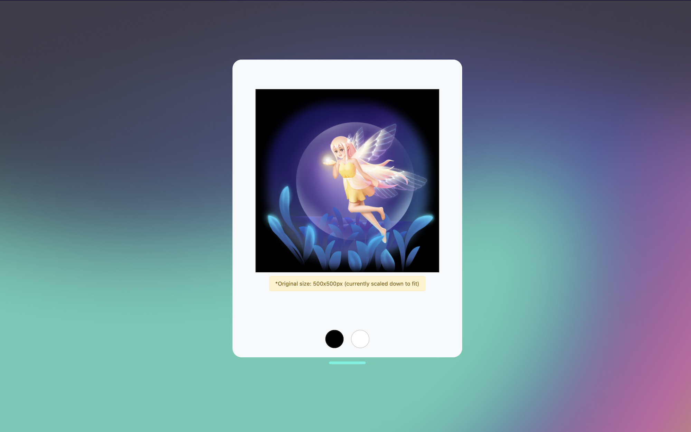

# SVGA Player

Play SVGA animations with ease

# How to use

## Step 1: Configure the Shortcut Key

Configure the SVGA player extension and set up a shortcut key as you like.

## Step 2: Play Animations

you can play animations by:

### Local file

1. Select a SVGA file
2. Press the shortcut key you set up in Step 1
3. The SVGA player will play the animation on the screen

### Clipboard

1. copy a SVGA file or a link of a SVGA file(http(s) only)
2. Press the shortcut key you set up in Step 1
3. The SVGA player will play the animation on the screen

_Enjoy!_

**Note:** Only SVGA Version 2.0 is supported.
