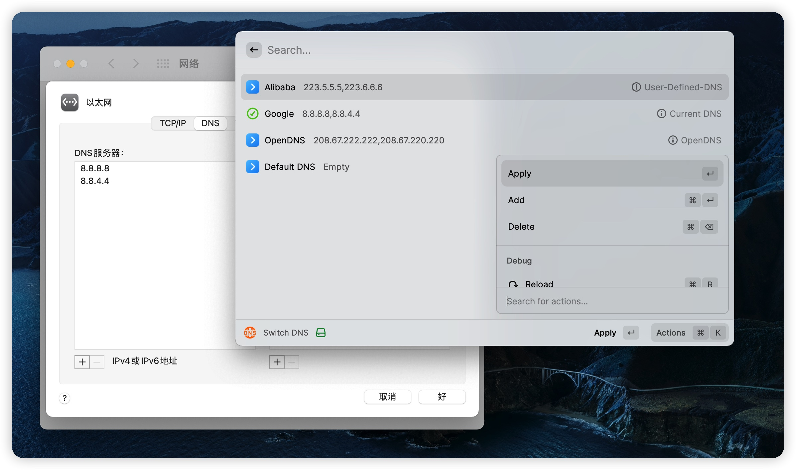

# Switch DNS

Switch DNS quickly

## Use Sudo

The settings provide the option to run switch DNS command with sudo (as root).
If you don't already know what this means or how to do it, you probably shouldn't do it.

## Admin Password

If "Use Sudo" checked, pre-enter admin password for commands.
