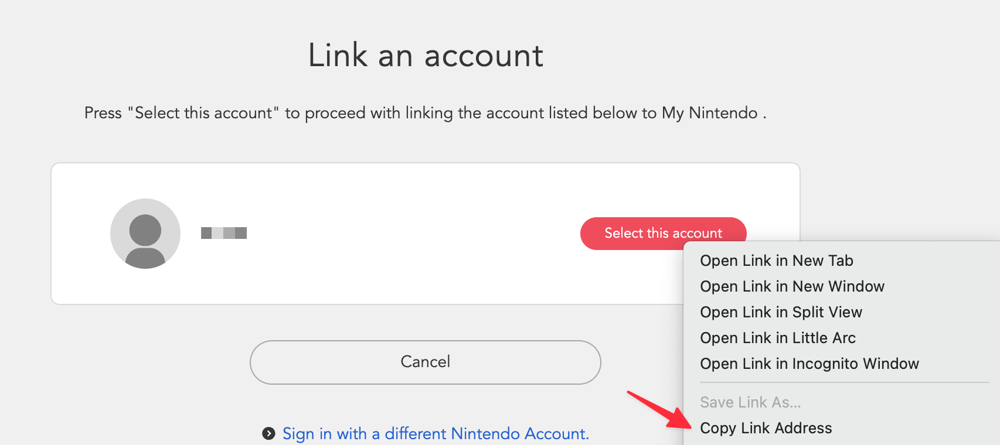

# Switch Game Play History

Browse your Nintendo Switch gameplay history. Including information such as first played time, last played time, and total playtime for each game.

## How to get session token?

1. Run the "get session token" command and press ⌘ + ↩ to open the link.

2. Login to your nintendo account.

3. Right-click on the "Select your account" button to copy the link address.

4. Paste the url into the input in the step 2, and the session token will be automatically fetched.

## Is my session token safe?

The session token is stored purely locally and is never sent to any remote servers or third parties. All network requests related to the session token are directly sent to the official Nintendo website.

## Disclaimer

The method for obtaining the session token used in this system is mainly based on the source code provided by https://github.com/ZekeSnider/NintendoSwitchRESTAPI. Although I have personally used this method and have not encountered any issues related to my Nintendo account, I cannot guarantee that it is completely safe and free from any risk.

Users should be aware that using any third-party tools to obtain the session token may violate the Nintendo user agreement and their account may be subject to termination or suspension. Therefore, users should use such tools at their own risk and understand the potential consequences.

I hereby declare that I shall not be held liable for any issues or damages resulting from the use of this method for obtaining the session token. The user assumes all responsibility and risk associated with using this method.

By proceeding to use this system and the method provided herein, you acknowledge and agree to this disclaimer.
