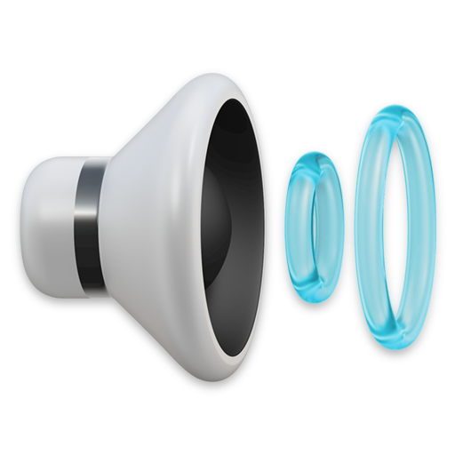

<p align="center">
    
    <h1 align="center">Switch Sound Output</h1>
</p>

A [Raycast](https://raycast.com/) extension that lets you easily switch sound output.

## Download utility
```brew install hladik-dan/utilities/switch-audio```

## Screenshots


