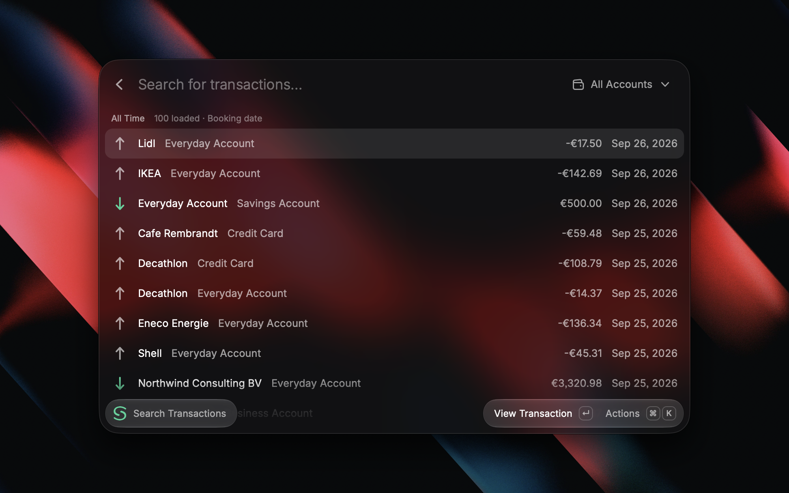
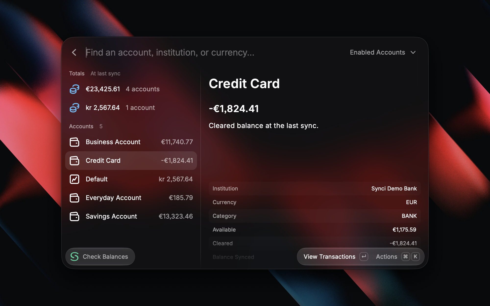
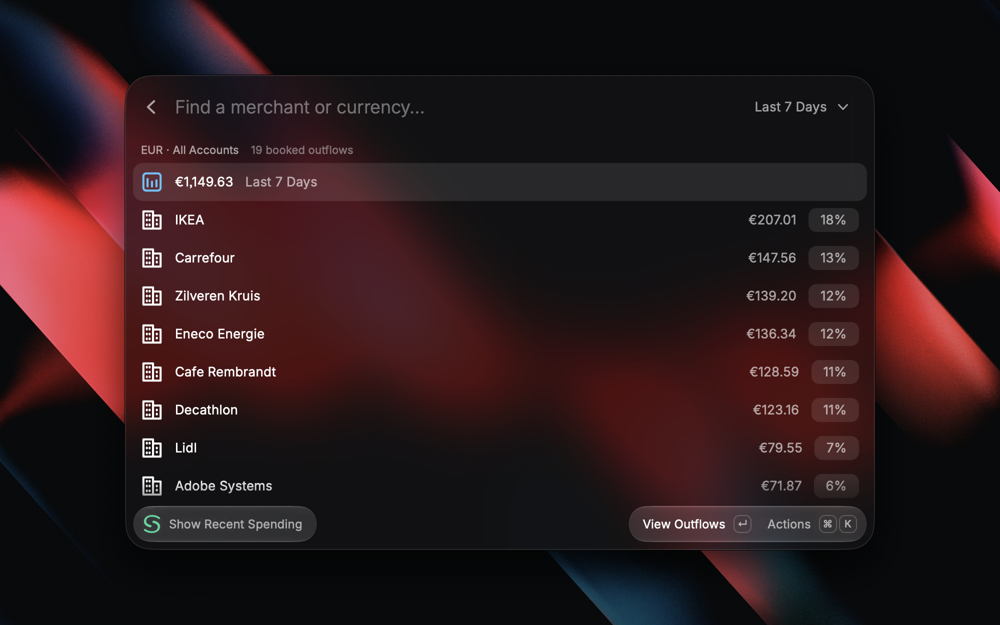
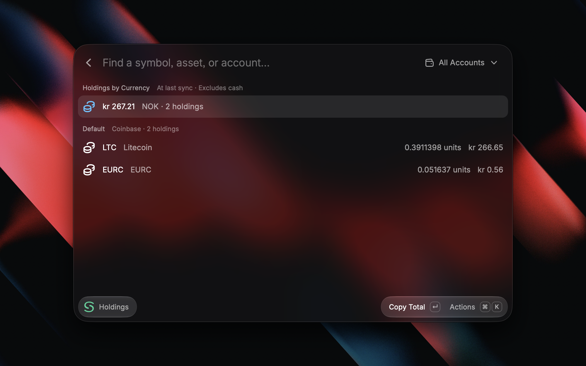
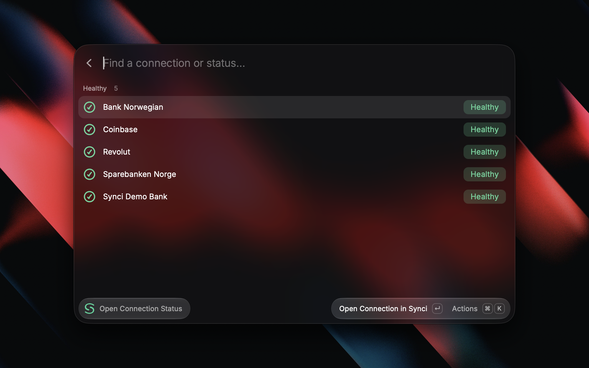
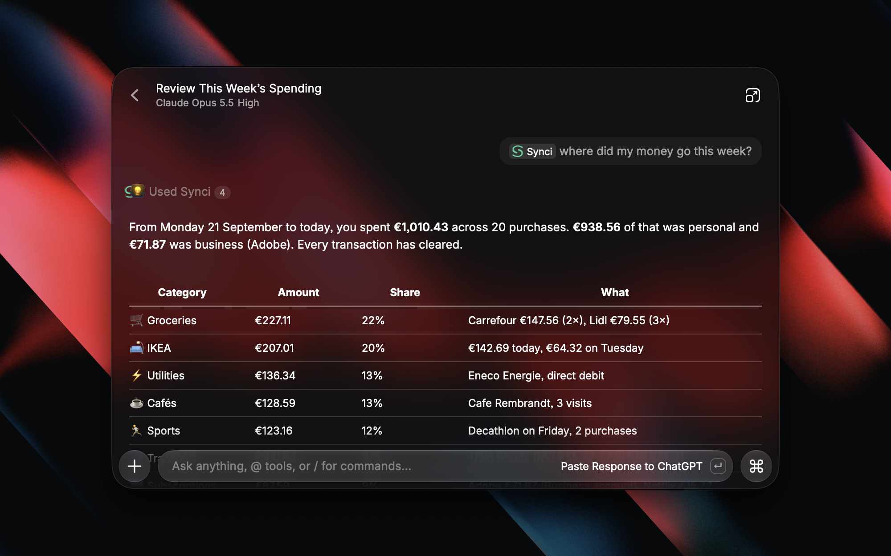

  

<h1 align="center">Synci for Raycast</h1>

Your finances, a few keystrokes away.

  <a href="https://synci.io">Explore Synci</a> ·
  <a href="#get-started">Get started</a> ·
  <a href="https://github.com/synciio/synci-raycast/issues">Feedback &amp; ideas</a>

Bring your bank, investment, and crypto accounts into Raycast. Find a payment, check a balance, explore your spending, or ask a question about your finances without leaving your keyboard.

**Available for macOS and Windows.** Connect your Synci account once to use all six commands and the AI tools.

## Your accounts, within reach

| Command                    | What it does                                                                                                      |
| -------------------------- | ----------------------------------------------------------------------------------------------------------------- |
| **Search Transactions**    | Find payments by payee, description, or exact amount. Filter by account, date, and status, then open the details. |
| **Check Balances**         | See balances across your accounts, grouped by currency, with the latest sync timestamps.                          |
| **View Holdings**          | Explore investment and crypto positions, including quantities, prices, and market values.                         |
| **Show Recent Spending**   | See where your money went over the last week, last 30 days, or this month, with a breakdown by merchant.          |
| **Open Connection Status** | Spot connections that need attention and open Synci to manage them.                                               |
| **Reconnect Synci**        | Update which accounts Raycast can access whenever you need to.                                                    |

<strong>See balances, spending, holdings, and connections</strong>

### Balances at a glance

### Understand your recent spending

### Keep up with your portfolio

### Know when a connection needs attention

## Ask Synci

Open **Ask Synci** in Raycast, or mention **@Synci** in AI Chat. Ask in your own words:

- “How much did I spend at this merchant last month?”
- “What is my account balance, and when was it last updated?”
- “Show my investment and crypto holdings.”
- “Which connections need attention?”

AI tools share your Synci sign-in. You'll need Raycast Pro and an active Synci subscription for this feature. The regular commands work independently of Raycast AI.

## Made for your keyboard

Browse full-width lists, or toggle a side panel for a closer look. Use account and date filters, copy amounts and details, and create Quicklinks to the accounts you check most often. Merchant logos appear when available.

| Action                        | macOS | Windows      |
| ----------------------------- | ----- | ------------ |
| Open actions                  | ⌘ K   | Ctrl K       |
| Refresh                       | ⌘ R   | Ctrl R       |
| Show or hide details          | ⌘ D   | Ctrl D       |
| Change the transaction period | ⌘ ⇧ P | Ctrl Shift P |

You can also assign your own hotkeys and aliases in Raycast.

## Get started

The extension is currently available to [install from source](CONTRIBUTING.md#set-up). A Raycast Store release is coming soon.

1. Connect your accounts in [Synci](https://synci.io).
2. Open a Synci command in Raycast and choose **Sign in with Synci**.
3. Choose the accounts you want to share, then start exploring.

No API keys or personal OAuth app to configure. If you add more accounts later, run **Reconnect Synci** to update access.

## Your data, your choice

You choose which accounts to share. The extension provides read-only access and doesn't move money, place trades, or change your financial records. Sign out from the action menu whenever you need to.

The extension adds no analytics and doesn't save financial records locally. When you use **Ask Synci**, the requested financial data is sent to Raycast AI to answer your question and may remain in your chat history. Raycast's AI privacy settings apply.

Balances and holdings reflect the latest provider sync. Currency totals stay separate. Recent Spending shows booked outflows, which can include transfers and cash withdrawals; pending payments and incoming refunds are excluded.

## Built in the open

Have an idea or found something that could be better? [Open an issue](https://github.com/synciio/synci-raycast/issues) or see the [contribution guide](CONTRIBUTING.md).

[Synci](https://synci.io) · [Documentation](https://docs.synci.io) · [Privacy policy](https://synci.io/privacy) · [MIT license](LICENSE)
