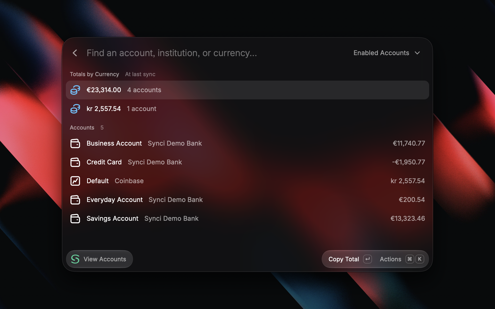
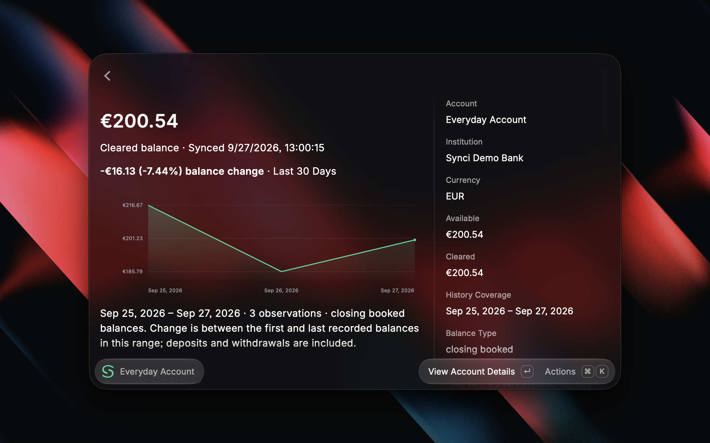

  

<h1 align="center">Synci for Raycast</h1>

Your finances, a few keystrokes away.

  <a href="https://synci.io">Explore Synci</a> ·
  <a href="#get-started">Get started</a> ·
  <a href="https://github.com/synciio/synci-raycast/issues">Feedback &amp; ideas</a>

Bring your bank, investment, and crypto accounts into Raycast. Find a payment, check a balance, explore your spending, or ask a question about your finances without leaving your keyboard.

**Available for macOS and Windows.** Connect your Synci account once to use the six main commands and the AI tools. An optional balance menu bar is also available on macOS.

## Your accounts, within reach

| Command                    | What it does                                                                                                                |
| -------------------------- | --------------------------------------------------------------------------------------------------------------------------- |
| **Search Transactions**    | Find payments by payee, description, or exact amount. Filter by account, date, status, and category, then open the details. |
| **View Accounts**          | See balances by currency, then open an account overview with balance history and recent activity.                           |
| **View Holdings**          | Explore investment and crypto positions, including quantities, prices, and market values.                                   |
| **Show Recent Spending**   | See where your money went over the last week, last 30 days, or this month, with a breakdown by merchant or category.        |
| **Open Connection Status** | Spot connections that need attention and open Synci to manage them.                                                         |
| **Reconnect Synci**        | Update which accounts Raycast can access whenever you need to.                                                              |

<strong>See accounts, balance history, spending, and holdings</strong>

### Balances at a glance

### Explore an account's balance history

### Understand your recent spending

### Keep up with your portfolio

## See how your finances change

Open **View Accounts**, select an account, and press Enter for its overview. Explore recorded balances over 7 days, 30 days, 3 months, a year, or all available history, alongside recent transactions and account details. The details sidebar starts open, and remembers your choice when you show or hide it. History coverage depends on your institution; accounts with too few dated balances show that clearly.

In **Show Recent Spending**, select a currency total and choose **View Spending Chart** to see daily booked outflows for the selected period. Charts are generated locally and adapt to Raycast’s light and dark appearance. Choose **Group by Category** in Actions to explore enriched categories; transactions without enrichment appear under Uncategorized.

Choose **View Account Details** on an account to see the bank details Synci provides, including IBAN, BIC/SWIFT, account holder, and account number. Copy a single field or all available details from the action menu.

On macOS, enable **Synci Balance** in Raycast’s extension settings and turn on **Show in Menu Bar**. Use **Accounts in Total** to select accounts and **Menu Bar Display** to choose a currency or show only the icon. Totals remain separate by currency and reflect the last provider sync. Turn on **Background Refresh** for updates every 15 minutes, or choose **Refresh** in the menu. Click an account to open its overview.

## Ask Synci

Open **Ask Synci** in Raycast, or mention **@Synci** in AI Chat. Ask in your own words:

- “How much did I spend at this merchant last month?”
- “What is my account balance, and when was it last updated?”
- “Show my investment and crypto holdings.”
- “Which connections need attention?”

AI tools share your Synci sign-in. You'll need Raycast Pro and an active Synci subscription for this feature. The regular commands work independently of Raycast AI.

## Made for your keyboard

Browse full-width lists, or toggle a side panel for a closer look. Use account and date filters, copy amounts and details, and create Quicklinks to the accounts you check most often. Merchant logos appear when available, with colorful payee initials as a fallback. Transactions are grouped by date, and each view remembers your sidebar choice. Export loaded search results as CSV, or copy them straight into a spreadsheet. Category filters use Synci’s enrichment: choose a category from the loaded results or enter its exact name to search further back. Narrow the account or period for large histories.

| Action                        | macOS | Windows      |
| ----------------------------- | ----- | ------------ |
| Open actions                  | ⌘ K   | Ctrl K       |
| Refresh                       | ⌘ R   | Ctrl R       |
| Show or hide details          | ⌘ D   | Ctrl D       |
| Change the transaction period | ⌘ ⇧ P | Ctrl Shift P |

You can also assign your own hotkeys and aliases in Raycast.

## Get started

The extension is currently available to [install from source](CONTRIBUTING.md#set-up). A Raycast Store release is coming soon.

1. Connect your accounts in [Synci](https://synci.io).
2. Open a Synci command in Raycast and choose **Sign in with Synci**.
3. Choose the accounts you want to share, then start exploring.

No API keys or personal OAuth app to configure. If you add more accounts later, run **Reconnect Synci** to update access.

## Your data, your choice

You choose which accounts to share. The extension provides read-only access and doesn't move money, place trades, or change your financial records. Sign out from the action menu whenever you need to.

The extension adds no analytics and doesn't cache financial records locally. Full bank identifiers are fetched only when you open account details. Presentation preferences and menu bar account selections are saved locally. CSV files are saved to your Downloads folder only when you choose to export; spreadsheet copying happens only when you select that action. When you use **Ask Synci**, the requested financial data is sent to Raycast AI to answer your question and may remain in your chat history. Raycast's AI privacy settings apply.

Balances and holdings reflect the latest provider sync. Currency totals stay separate. Balance charts keep currencies and balance types separate. Balance change includes deposits and withdrawals and is not investment return. Recent Spending filters by booking date and shows booked outflows, which can include transfers and cash withdrawals; pending payments and incoming refunds are excluded.

## Built in the open

If a command fails, **Copy Error Details** provides a diagnostic report containing the command, platform, Raycast version, time, and failure classification or HTTP status. It excludes credentials, account identifiers, financial records, and raw error messages.

Have an idea or found something that could be better? [Open an issue](https://github.com/synciio/synci-raycast/issues) or see the [contribution guide](CONTRIBUTING.md).

[Synci](https://synci.io) · [Documentation](https://docs.synci.io) · [Privacy policy](https://synci.io/privacy) · [MIT license](LICENSE)
