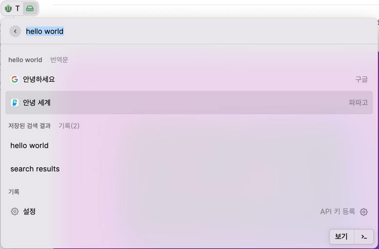

# T
Translate texts

## Available service
- google
- papago - API key is required
  Enable:  
  -> t <Enter>  
  -> Settings  
  -> Select `Issue a token from the bottom menu` from menu  
  -> Input and Save

## Usage
1. t <Enter>
2. type text

## License
MIT