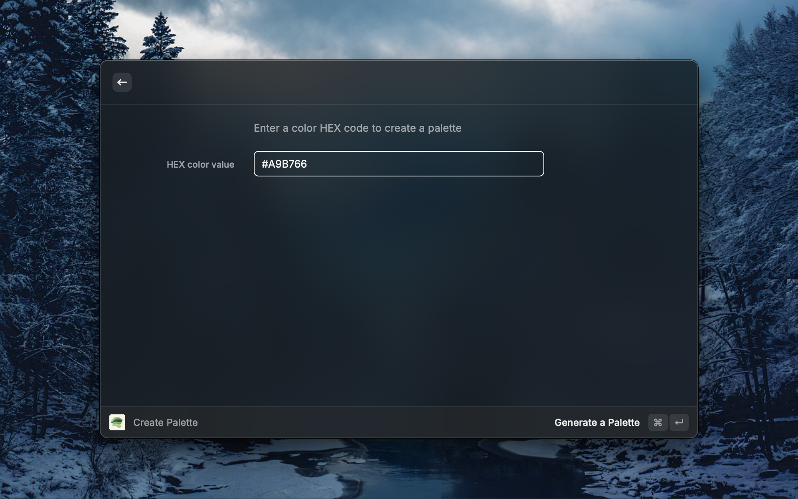
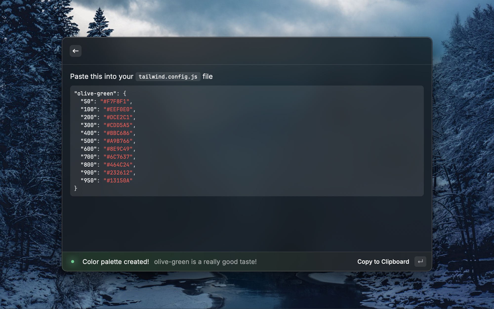

<p align="center">
    
</p>

<p align="center">
    by <a href="https://x.com/webpnk_dev">webpnk</a>
</p>

# Tailwind Palette Generator

A raycast extension that generates a color palette out of a given color, 





## Example output

```json
"olive-green": {
  "50": "#F7F8F1",
  "100": "#EEF0E0",
  "200": "#DCE2C1",
  "300": "#CDD5A5",
  "400": "#BBC686",
  "500": "#A9B766",
  "600": "#8E9C49",
  "700": "#6C7637",
  "800": "#464C24",
  "900": "#232612",
  "950": "#13150A"
}
```

## How to use

1. Paste color in HEX format into the form when prompted. _Example_: `#FF0000`
2. Click `Generate a Palette` action button or press `Cmd + Enter`
3. Copy generated palette JSON and paste it into your `tailwind.config.js` file

## Checklist

- [ ] Add tailwindcss v4 support
- [ ] Add colors preview (if that's even possible)