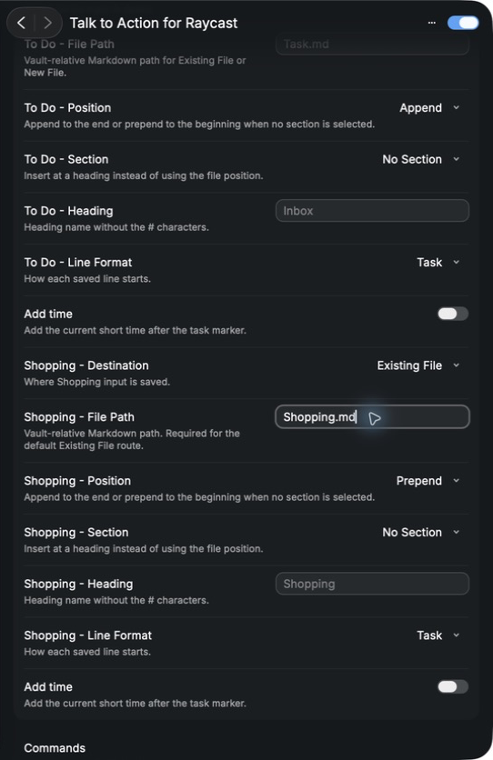

# Talk to Action for Raycast

Raycastから入力したテキストを、選択したObsidian Vault内のMarkdownへ直接保存するRaycast Extensionです。

専用のObsidianプラグイン、カスタムURI、同期サービスは必要ありません。

## この拡張の役割

これは汎用メモ作成やObsidian全体の操作ではなく、日常で繰り返す3種類の入力を、既存のVault運用へすばやく記録するための拡張です。

- Daily Note：その日のメモをDaily Noteへ直接追加
- To Do：タスク形式でDaily Noteや指定Markdownへ追加
- Shopping：買い物リスト用の既存Markdownの先頭または末尾へ追加

各入力先、行形式、追加位置、見出しはRaycast Preferencesで設定できます。新しいノートを増やすのではなく、すでに使っているMarkdownファイルと構成を保ったまま、キャプチャだけを短縮したい人向けです。

## できること

- Daily Note・To Do・Shoppingを⌘1 / ⌘2 / ⌘3で切り替え
- ⌘ Enterで保存
- Daily Noteの自動作成
- 既存Markdownへの追記・先頭追加
- 見出し直後・セクション末尾への挿入
- Bullet / Task / Plain形式
- Vault外のパス、Markdown以外のファイル、既存ファイル未検出の拒否
- 保存後にObsidianを開く設定（任意）

## 必要環境

- macOS
- Raycast
- ローカルに保存されたObsidian Vault

## 初回設定

1. Raycastで Talk to Action for Raycast のExtension Preferencesを開く。
2. Obsidian Vault にVaultのルートフォルダを選ぶ。
3. Daily Note - Folder と Daily Note - File Format を設定する。
4. Daily Note - ...、To Do - ...、Shopping - ... の各ルートを設定する。
5. 初回はバックアップ済みのテスト用Vaultで保存を確認する。

設定例（テスト用Vault）:

### 初期ルート

| 種類       | 保存先        | 追加位置 | 行形式 |
| ---------- | ------------- | -------- | ------ |
| Daily Note | Daily Note    | 末尾     | -      |
| To Do      | Daily Note    | 末尾     | - [ ]  |
| Shopping   | Existing File | 先頭     | - [ ]  |

Shoppingの File Path は利用者が設定するまで保存できません。個人環境のフォルダ名や絶対パスは初期値に含めていません。

## 安全な保存範囲

- 保存先は、設定したVaultの内側だけです。
- ../、絶対パス、Vault外へ向くシンボリックリンクは拒否します。
- Existing Fileは、対象が存在しない場合に作成しません。
- 既存内容を消すOverwrite操作はありません。
- 保存中にファイルが変更された場合は、最大1回だけ再読込してから保存します。

## 保存できないとき

- `Obsidian Vault was not found`：Extension Preferencesで存在するVaultのルートフォルダを選び直してください。
- `Existing file was not found`：Existing Fileを選んだ場合は、Vault内に対象のMarkdownファイルを先に作成してください。
- `File Path must stay inside the selected Vault`：絶対パスや`../`を使わず、Vaultからの相対パスを入力してください。
- `Input is empty`：保存する本文を入力してください。

## 任意の起動補助

daily-input-launcher.sh はRaycastのDeep Linkを開くだけの任意スクリプトです。Extension単体で入力・保存できます。

    ./daily-input-launcher.sh

## 開発

    npm install
    npm test
    npm run lint
    npm run build

単体・一時Vault結合テストでは、次を確認します。

- 入力整形
- 日付ファイル名
- 追記・先頭追加
- 見出し直後・セクション末尾
- Daily Note作成
- Existing File未作成
- Vault外パス・symlink・非Markdown拒否

## 参考文献

- Raycast Preferences: https://developers.raycast.com/api-reference/preferences
- Raycast Manifest: https://developers.raycast.com/information/manifest
- Raycast Form: https://developers.raycast.com/api-reference/user-interface/form
- Raycast Actions: https://developers.raycast.com/api-reference/user-interface/actions
- Prepare an Extension for Store: https://developers.raycast.com/basics/prepare-an-extension-for-store
- Obsidian URI: https://obsidian.md/help/uri

## 公開前の注意

これは公開候補の初版です。Raycast Storeへの公開申請、外部配布、実Vaultでの運用開始は、差分・権限・保存先設定を本人が最終確認してから行ってください。

### Store metadata check

Before a Store submission, run npm run lint:raycast. The package author field must be replaced with the valid Raycast username of the maintainer; Store submission is intentionally not performed by this project setup.
