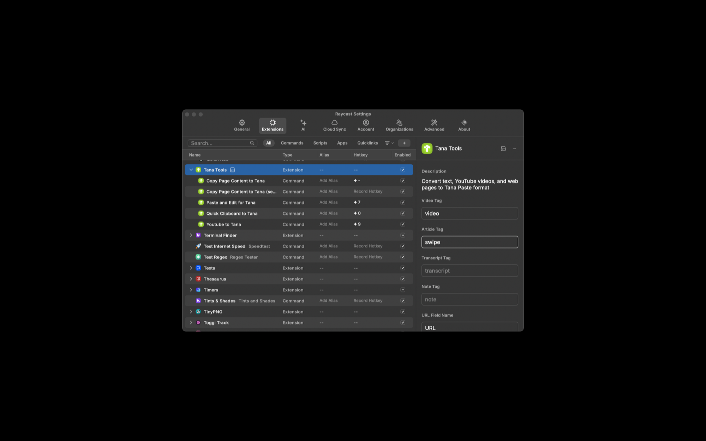
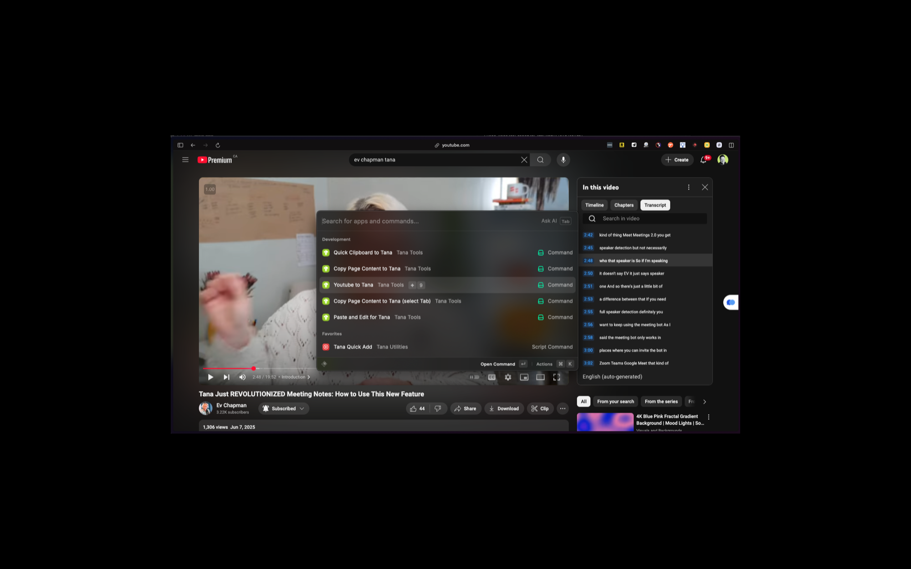
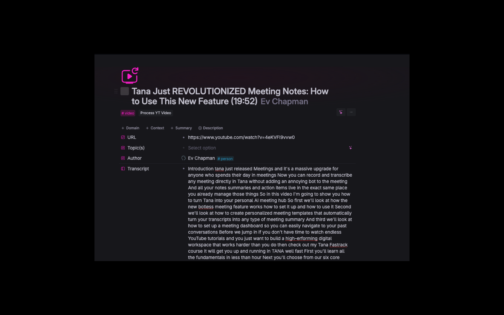
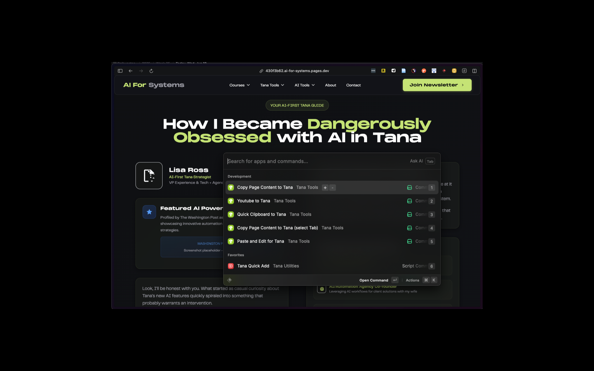
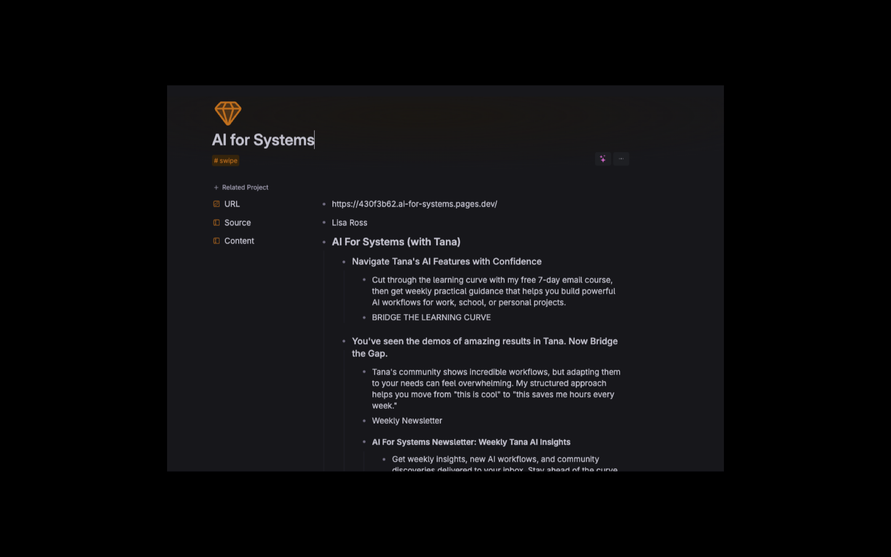
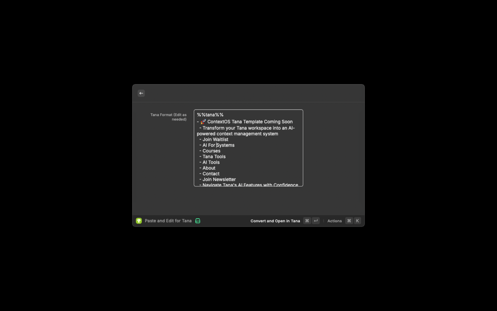

# Tana Tools for Raycast

🚀 **Instantly convert web pages, YouTube videos, and text (including Markdown) to Tana Paste format from Raycast**

Transform any content into Tana's structured format with just a few keystrokes. Perfect for knowledge workers, researchers, and anyone building their second brain in Tana.


> **💡 Tip:** Web-based commands require the [Raycast Browser Extension](https://raycast.com/browser-extension) - quick setup, works great!

## ✨ What This Extension Does

**Transform any content into Tana's structured format:**
- 📄 **Web pages** → Clean, formatted Tana nodes with metadata
- 🎥 **YouTube videos** → Title, description, transcript, and metadata
- 📝 **Text & clipboard** → Properly formatted Tana hierarchies
- 🎙️ **Limitless transcripts** → Smart chunking so Tana limits are respected, and ready for AI review.

**Everything automatically opens in Tana and copies to your clipboard** - just paste with ⌘+V!

## 🎯 Perfect For

- **Researchers** collecting web content and videos
- **Students** saving lectures and articles  
- **Knowledge workers** building their PKM system
- **Content creators** organizing research materials
- **Anyone** who wants seamless Tana integration

## 🛠 Commands

### 📋 Text & Clipboard
- **Quick Clipboard to Tana** - Instantly convert clipboard content (perfect for Limitless transcripts!)
- **Paste and Edit for Tana** - Review and edit text before converting

### 🌐 Web Content  
- **Copy Page Content to Tana** - Extract clean content from the active browser tab
- **Copy Page Content to Tana (Select Tab)** - Choose from any open browser tab

### 🎥 YouTube Integration
- **YouTube to Tana** - Extract video metadata, descriptions, and full transcripts (note: you'll need to open the Transcript on the Youtube page first 😭)

## 🎨 Customization

**10 User Preferences** let you personalize the output:
- **Custom Tags**: Set your own supertags for videos, articles, transcripts, and notes
- **Field Names**: Customize field names (URL, Author, Transcript, Content) to match your Tana setup
- **Content Control**: Toggle whether to include author and description fields
- **Perfect Integration**: Make the output fit seamlessly into your existing Tana workflow



## 🚀 Quick Start

### 1. Install Requirements

**Essential:** Install the [Raycast Browser Extension](https://raycast.com/browser-extension)
- Works with Chrome, Arc, and Safari
- Enables all web-based features

### 2. Basic Usage

1. **For web pages:** Open any article → Run "Copy Page Content to Tana" → Content appears in Tana
2. **For YouTube:** Open a video → Click "more..." → "Show transcript" → Then run "YouTube to Tana" → Paste full video info + transcript in Tana
3. **For text:** Copy anything → Run "Quick Clipboard to Tana" → Formatted content in Tana

### 3. Advanced Usage

**Edit Before Converting:** Use "Paste and Edit for Tana" to review and modify content first

## 📋 Detailed Setup

### For YouTube Transcripts

1. **Browser Setup:**
   - **Chrome/Arc:** Works immediately with Browser Extension
   - **Safari:** Additional setup required:
     ```
     Safari Settings → Advanced → ✓ "Show features for web developers"
     Safari Settings → Developer → ✓ "Allow JavaScript from Apple Events"
     ```
     Then reload the YouTube page

2. **Usage Steps:**
   - Open any YouTube video
   - **🔴 IMPORTANT:** Click "more → Show transcript" below the video first
   
   
   
   - Run the Raycast command
   - Get complete video info + clean transcript text
   
   

### For Web Content

- Works on any website with the Browser Extension
- Automatically extracts clean content using reader mode
- Filters out ads, navigation, and clutter
- Preserves article structure and formatting





**Tab Selection:** Use "Copy Page Content to Tana (Select Tab)" to choose from multiple open tabs

.png)



## 📖 Example Output

**Input:** A web article about productivity

**Output in Tana:**
```
%%tana%%
- How to Build Better Habits #article
  - URL::https://example.com/habits
  - Author::James Clear  
  - Description::Scientific approaches to habit formation
  - Content::
    - Introduction
      - Habits are the compound interest of self-improvement
      - Small changes compound into remarkable results
    - The Habit Loop
      - Cue triggers the behavior
      - Routine is the behavior itself
      - Reward reinforces the habit
```

**For Limitless Transcripts:**
Just copy your transcript to clipboard and run "Quick Clipboard to Tana" - it automatically detects and formats transcripts with smart chunking!

## 🎨 Features

✅ **Smart Content Detection** - Automatically handles different content types  
✅ **Clean Formatting** - Removes ads, navigation, and clutter  
✅ **Rich Metadata** - Captures titles, authors, descriptions, URLs  
✅ **Transcript Processing** - Smart chunking with proper boundaries  
✅ **Table Support** - Converts HTML tables to markdown format  
✅ **Link Preservation** - Maintains clickable links in content  
✅ **Auto Tana Opening** - Seamlessly opens Tana after conversion  
✅ **Cross-Browser** - Works with Chrome, Arc, and Safari  

## 💡 Pro Tips

- **For YouTube**: Always click "Show transcript" below the video first for best results
- **For Limitless**: Just copy your transcript text and use "Quick Clipboard to Tana"
- **Customization**: Check Raycast preferences to personalize tags and field names
- **Safari Users**: Enable developer features in Safari settings for web content extraction

## 📞 Support & Feedback

- **Issues:** [GitHub Issues](https://github.com/lisaross/tana-tools-for-raycast/issues)
- **Contact:** Lisa Ross via Slack DM or GitHub

> **Note:** This is an unofficial Tana tool created by Lisa Ross

## 📄 License

MIT License - see [LICENSE](LICENSE) for details

---

**Made with ❤️ for the Tana community**