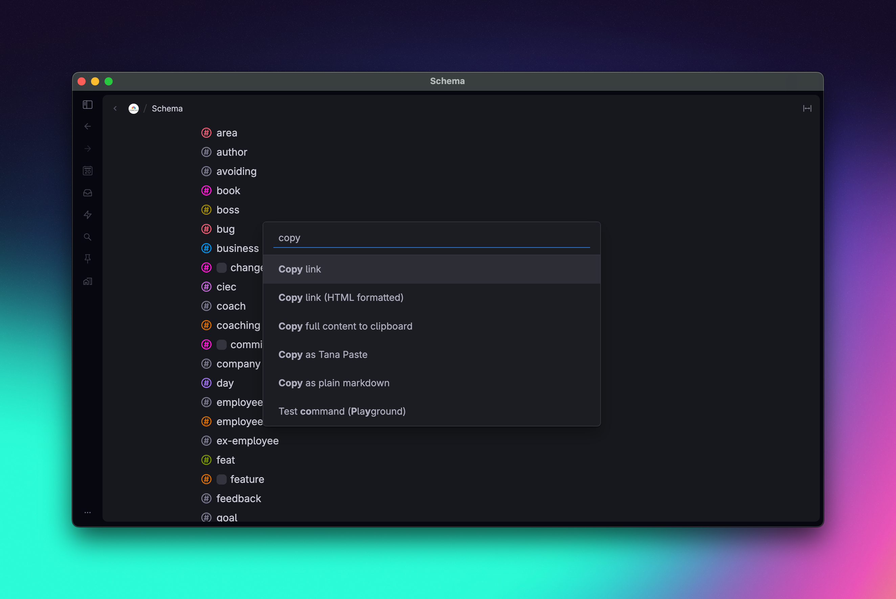
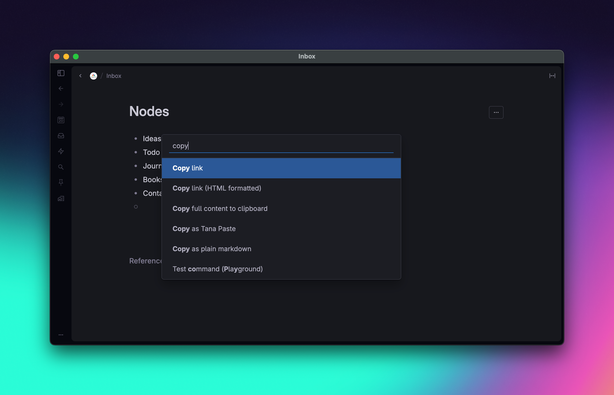
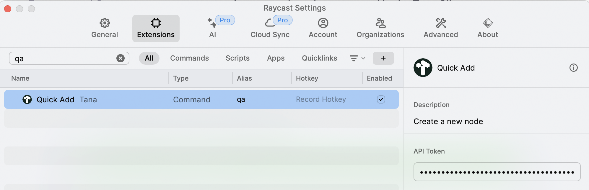

# Tana extension for Raycast

## Commands

### Quick Add

Write a note in Raycast and and send it to Tana!

The note may be customized by adding one or more supertags, or by setting a different target node (`Inbox` is the default).

### Manage Supertags

Supertags may be added to Raycast by their node ID in order to attach them to notes. This command
allows you you view, add, edit or delete Supertags within Raycast.

To add a supertag, you'll need its `nodeId`. This can be found in Tana by pressing `Cmd-K` on the
desired supertag, and selecting `Copy link`. The `nodeId` is contained in the copied URL, however,
the full URL may be pasted into the `Node ID` field for convenience.



### Manage Target Nodes

This command can be used if you want to send your note to a node other than **Inbox**. Here you can add,
update and delete target nodes.

To add a target node, you'll need the node's `nodeId`. This can be found in Tana by pressing `Cmd-K` on
the desired target node, and selecting `Copy link`. The `nodeId` is contained in the copied URL, however,
the full URL may be pasted into the `Node ID` field for convenience.



## Limitations

- Only single-node, plaintext notes are supported.
- Modifying fields within supertags is not yet supported.
- Supertags and target nodes are only added, modified, and deleted within Raycast. This extension does not
  modify these within your Tana workspace.

## Setup

### Generate API token in Tana

Please follow instructions in [Tana Documentation](https://tana.inc/docs/input-api#how-to-get-a-tana-api-token) to generate a token.
Once generated, paste the token into the corresponding configuration in Raycast.

If you have used this plugin before(in 2022), you also need to do the same thing since Tana have updated their API.


## Contribution

```bash
npm install
# dev
npm run dev
# publish
npm run publish
# pull contributions
npx raycast/api@latest pull-contributions
```

[Tana input api sample](https://github.com/tanainc/tana-input-api-samples)

[Tana import tool](https://github.com/tanainc/tana-import-tools)
